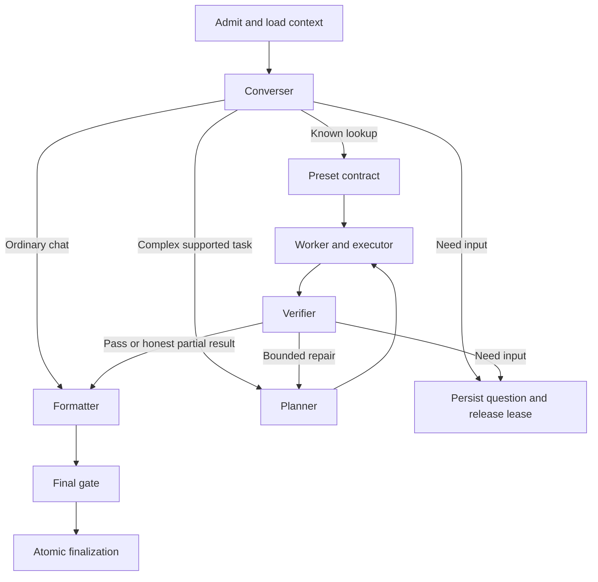

# LangGraph orchestrator

Status: **Bounded native read loop implemented; durable paused-task lifecycle proposed.**

**Implemented subset:** sales.graph.ts runs context → converser → planner → worker ↔ executor → formatter → verifier (direct chat skips planner and worker), with one possible formatting or evidence repair. The graph recursion limit is 76; the independent limits are 24 source proposals and 28 tool/recall steps. The planner returns a validated outcome contract, the worker owns a separate native Responses session, and execution is deterministic code. Request-local closures hold tool sessions and current authority. The existing queue journal supports whole-run restart and saved-output replay; intermediate checkpoints and interrupts remain deferred. See the [personal-assistant runbook](../sales-manager-agent.md) and [module 22](22-sales-manager-tool-loop.md) for the current contract. Production enablement remains separate. The richer role/task contracts and diagram below remain target design unless explicitly identified as implemented.

## Responsibility

Own one run's transitions, invoke role modules, enforce shared limits, and hand finalized output to persistence. The converser and optional planner provide decisions; application code decides whether transitions are permitted. This remains one worker deployment.

## Graph and runtime state

Serializable state contains run/epoch/contract references, normalized objective, current step, permitted evidence references, candidate result, verification result and usage totals. The runtime injects live service dependencies and actor binding outside persisted/model-editable state. Store no credentials or executable closures in a checkpoint.

The first read uses the preset branch and deterministic worker/verifier. Independent review and adaptive planning are later nodes. A role node does not necessarily perform an LLM call.

## Transition rules

Use the statuses in [shared contracts](00-shared-contracts.md). Only a current fenced run owner advances active work. Waiting input is persisted with its question and one outbound reply, then releases the inbound lease. A new matching inbound message resumes the run; an unrelated message creates another run.

Before resumption, re-resolve employee identity, current permissions, actor/audience binding and source freshness. Changed user intent increments the epoch and contract version. A late result from an old epoch is discarded, including a pending formatter result. Cancellation invalidates unsent output atomically where possible; a send already invoked remains governed by transport uncertainty.

LangGraph checkpoints support restoring execution; replay can rerun node code. Keep external effects behind idempotent application boundaries. The first lookup does not need a human interrupt, but later clarification/confirmation must not keep a process sleeping or a transaction open. [Persistence](https://docs.langchain.com/oss/javascript/langgraph/persistence), [interrupts](https://docs.langchain.com/oss/javascript/langgraph/interrupts)

## Budget and scheduling contract

Current ordinary chat uses its existing configured deadline. Proposed complex-read defaults are six steps, ten logical business calls, two repair passes and 60 seconds of active execution. Each path has an explicit recursion bound and cancellation signal. Waiting time does not consume active execution, but waiting runs have a separate expiry.

Reserve remaining time for formatting and finalization. Tool transport initialization and retries also consume elapsed time and network limits. Replanning, verifier rechecks and schema repair do not reset budgets. A deadline produces a truthful partial/unavailable outcome, not an automatic retry of the whole run indefinitely.

Retain the account-wide queue lock for the first pilot. The concurrency increment introduces per-conversation fencing and a bounded generation pool, while preserving one active sender and one socket owner per account. Independent reads within a step may run concurrently only through the executor's limits.

## Recovery and rollout

On startup, recover expired leases, find finalized runs before regenerating, and resume only compatible schema/prompt versions. Prefer an explicit failed/needs-input outcome when an incompatible checkpoint cannot be safely migrated. A disabled business feature keeps ordinary chat operational and prevents tool-bearing resume.

Feature enablement is code/config controlled and default closed through `BUSINESS_READS_ENABLED`. When enabled, `BUSINESS_READ_EMPLOYEE_IDS=all` admits active trusted employees; a numeric list is an optional rollout restriction. Context Engine still enforces each employee’s roles. Configuration requires the assistant, Supabase and signed MCP setup; startup checks migration `202610010004`. Current roster/source availability is checked on each operation rather than a startup business query.

Acceptance includes restart at each boundary, duplicate input, stale owner, source denial after pause, cancelled generation, failed finalization, unsupported checkpoint versions and isolation across chats. Integrate durable state and private delivery checks before production business reads; general planning is not a prerequisite.

## Implemented deadline refinement

The current read graph reserves the smaller of 60 seconds and one quarter of the
configured request timeout for formatter/verifier work. The live eval profile is
240 seconds overall, leaving 180 seconds for research. This is elapsed request
time, including model and source waits. A research cutoff enters finalization
with retained evidence and an explicit limitation; it never resets the budget.
Completed stage timings survive a later hard timeout. See
[module 33](33-eval-refinement.md) for regression cases and measured results.
