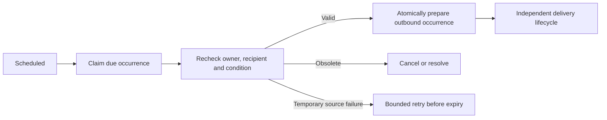

# Personal reminders

Status: **Proposed for the reminder milestone.** Depends on [executor](08-tool-executor.md), [persistence](13-supabase-persistence.md) and [delivery](14-outbound-delivery.md). A personal reminder is not a Twenty CRM task.

## Responsibility and tools

Provide narrow create, list, reschedule, snooze and cancel commands for an employee's reminders. The model extracts intent and proposes arguments; application code supplies owner, authorized recipient, normalized time, version and idempotency key.

The initial policy is reminders to the requesting active employee's DM. Sending to another employee requires a separately defined delegation policy. Unknown users retain ordinary chat but do not gain organizational reminder tools by providing a phone number in text.

## Schedule contract

`ramesh-reminders` stores reminder ID, owner binding, recipient reference, encrypted requested text/intent, optional entity reference, due instant, user timezone, status, version, occurrence key and timestamps. Business-linked reminders also store the condition to recheck and relevant source references. These are proposed fields and a future migration.

Store UTC instants and preserve the timezone used for interpretation, initially `Asia/Kolkata`. Server time resolves relative dates. Ask about a materially ambiguous time such as “at 8” when context cannot establish morning/evening. Do not invent recurring rules from a one-off request.

Creation succeeds only after the schedule is committed and verified. The acknowledgement states the resolved time. Replayed inbound requests reuse the same create key. Edits compare the expected version and invalidate pending deliveries for the old version.

## Lifecycle

The schedule is the source of truth for reminder intent. Outbound availability delays transport but does not replace schedule ownership, editing, cancellation or condition checking. A model process does not remain alive until due time.

At due time, resolve active identity, current access, schedule version and, for a business-linked reminder, current record ownership/condition. Use a template when possible. The scheduler needs explicit automation authority; it cannot borrow whichever employee last chatted with the bot. Recheck sensitive delivery through the sender as well.

## Recovery and product policy

Claim due schedules with fenced leases. Commit occurrence creation and schedule advancement atomically where possible. Uniqueness on reminder/version/occurrence prevents duplicate ticks from generating duplicate notifications. An uncertain send does not recreate the same occurrence automatically.

Quiet hours, missed-time catch-up, recurrence, maximum reminders and waiting-source expiry are explicit rollout decisions. If source health is unknown, defer a conditional business reminder rather than asserting the condition still holds. Snooze changes notification timing, not CRM activity or SLA clocks.

Acceptance includes duplicate creation, exact time interpretation, concurrent edit/cancel, restart after occurrence preparation, late ticks, inactive owners, reassignment, resolved conditions and delivery uncertainty. Begin with synthetic schedules and a non-sending preview before enabling real due processing.
