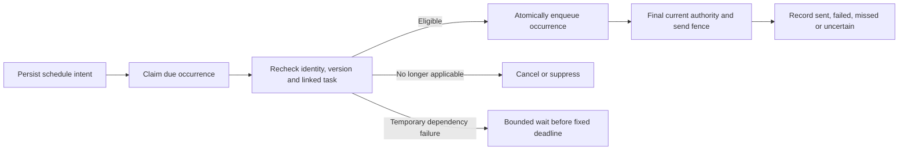

# Personal reminders

Status, 3 October 2026: **This release includes the scheduling review fixes. Production migration `202610030008` is applied and verified; both scheduling flags remain enabled and worker credentials are unchanged. Worker rollout uses CI/CD after pushing `main`; verify the exact release and runtime health.** Conditional business reminders and delegated recipients remain future work. See [current scope and operations](../personal-scheduling.md). Remaining sections retain the broader design contract; features outside that implementation summary are not promises of current behavior.

## Product contract

A reminder is durable notification intent owned by one employee. It can be due in ten minutes, six weeks or next year. There is no 24-hour scheduling limit and no requirement to keep a model run or chat session alive. An active future schedule survives deployments and message-history cleanup until it is cancelled, completed or reaches its explicit end.

A reminder does not create a CRM task, record a follow-up, satisfy an SLA or imply that its recipient completed the underlying work. A personal task can have explicit linked reminders; creating a task alone does not schedule a notification.

Initial access is an active verified employee's own private chat. Store the owner and intended recipient by stable employee ID, scoped to the Ramesh account. A phone/LID is a current delivery binding, not ownership. Reassignment of a phone must not transfer the old employee's reminders. Resolve current active identity on every command and again before delivery.

Unknown chat users retain ordinary conversation but cannot persist personal tasks/reminders under this initial policy. Group reminders, external recipients and delegation to another employee need separate authorization rules. A phone number in user text or a valid generic outbound API credential supplies none of that authority.

## Typed tools and commit boundary

Add application-owned tools to the dynamically discovered catalogue only when the feature and requesting identity permit them. These are separate from the current read-only Context Engine policy; that policy must not be weakened globally to admit writes.

| Tool                  | Model-visible proposal                                                | Application-enforced behavior                                                         |
| --------------------- | --------------------------------------------------------------------- | ------------------------------------------------------------------------------------- |
| `reminder_create`     | Text, explicit time/rule, optional selected task reference            | Normalize time, authorize ownership/linkage and stage creation.                       |
| `personal_list`       | Reminder kind, state and bounded continuation                         | Return only the owner's records and an ordered selection reference.                   |
| `personal_recall`     | Prior direct instructions or latest delivered reminder result         | Reauthorize source text or original delivered occurrence/record references.           |
| `reminder_reschedule` | Stable or selected reference, expected version, replacement time/rule | Compare revision and invalidate eligible unsent occurrences of the replaced revision. |
| `reminder_snooze`     | Selected occurrence, expected version, explicit new time              | Move that notification opportunity without silently rewriting the recurring rule.     |
| `reminder_cancel`     | Selected reference, expected version, explicit scope                  | Cancel the authorized schedule/occurrence and invalidate eligible unsent delivery.    |

The runtime supplies account, employee, recipient, admission timestamp, command identity, leases and authority. The model cannot choose these fields. Schemas reject extra authority fields and invalid times; instructions embedded in reminder text remain inert content.

`personal_list` and `personal_recall` are read-only. Mutation tools advertise `readOnlyHint: false`; create is not generally idempotent across separate user requests. Cancellation is not append-only. The server's replay protection is a separate guarantee from tool annotations. An explicit user request authorizes the scoped action; do not add a redundant confirmation unless selection, time or scope is materially ambiguous.

For the first implementation, tools stage proposals into **one bounded, server-validated atomic mutation batch per inbound turn**. One batch can create a task and its reminder together, or contain several explicitly requested additions. It must not commit a task and then independently attempt its requested reminder. Do not permit arbitrary successive write batches in the same turn.

Commit the normalized mutations and their result receipt atomically in `ramesh-assistant-commands`. Bind the receipt to trusted account/owner, admitted inbound identity and normalized argument fingerprints. A replay loads the committed result; changed arguments after commit fail reconciliation rather than cause another write. Before commit, a reviewed correction can replace the staged proposal. Model tool-call IDs alone are not stable business idempotency keys.

Success prose comes from the committed receipt, including exact saved time, affected count and send-boundary outcome. The verifier reviews a deterministic pending preview before application commit. It can revise the entire uncommitted proposal; only the final approved batch commits once. A storage error means no success acknowledgement. Queue handoff requires the exact stored command receipt if a mutation committed, so a late failure cannot become a generic retry invitation. Receipt and delivery reauthorization retries remain bounded.

The implemented tools are `personal_list`, `personal_recall` and `personal_apply`; reminder mutations are operation kinds in the latter. The personal-only route skips planner/formatter inference when it has a deterministic personal result, retaining the router, tool worker and verifier. Mixed requests keep the general graph and preserve their additional answer alongside the receipt, with both personal and business authorization when required.

`personal_recall` can resolve a delivered reminder occurrence for “snooze that”, even after its one-off schedule completed. It also exposes owner-authorized direct instructions from delivered own-chat turns for 24 hours to complete a clarification. Those instructions provide text provenance only; the current direct message still authorizes a change and supplies its time anchor. Forwarded text and retrieved business content do not acquire instruction authority through recall.

## Time interpretation in IST

Use `Asia/Kolkata` for initial interpretation and display. Store notification instants as UTC `timestamptz`, retaining the IANA timezone and the local rule needed for recurrence. Do not depend on the host timezone or store an ambiguous local timestamp as a due instant.

Resolve relative expressions from the server-captured admission timestamp of the command-bearing inbound member. For a grouped/debounced turn, this is the member containing the instruction, not an earlier unrelated member or the batch's first timestamp. Persist the member identity, clock and normalized result before execution. Recovery after midnight must not move “tomorrow” by a day; model retries must not move “in ten minutes” forward. If clarification is required, the accepted clarified command records its own explicit resolved instant and reference context.

| Request                                      | Expected interpretation                                                                                          |
| -------------------------------------------- | ---------------------------------------------------------------------------------------------------------------- |
| “Remind me on 10 October 2026 at 8 am.”      | Confirm `10 October 2026, 8:00 am IST`; store `2026-10-10T02:30:00Z`.                                            |
| “Remind me in six weeks to renew the quote.” | Accept a future date beyond 24 hours, resolved from the trusted admission clock, and confirm the full date/time. |
| “Tomorrow at 8.”                             | Ask morning/evening if the existing context does not resolve it.                                                 |
| “Sometime next month.”                       | Ask for a date/time; do not invent an appointment.                                                               |
| “At 2 am on Sunday.”                         | Honor the explicit nighttime request and confirm the full calendar date.                                         |
| “Today at 8 am” when that time has passed    | Clarify whether the user wants an immediate/late reminder or another date; do not silently choose tomorrow.      |

Validate calendar dates and bounds in application code. Confirm the year, date, time and IST; a relative phrase alone is not a sufficient acknowledgement. Exact-second delivery is not promised. If no material ambiguity remains, save directly rather than asking the user to repeat the request.

## Recurrence and snooze

The proposed recurrence vocabulary is daily, weekly on selected weekdays, monthly on a calendar date or last day, and weekdays Monday–Friday. Recurrence is explicitly requested, never inferred from a one-off reminder. Holiday exclusion needs a configured calendar and is outside the initial contract; “weekdays” does not mean all business holidays are excluded.

Store an immutable recurrence anchor and normalized local calendar rule separately from the next-slot cursor and user-facing definition version. Scheduler cursor advancement does not increment the definition version. Editing the requested time/rule does. Occurrence identity uses the original slot, definition version and explicit dispatch generation, never the retry or polling time.

Proposed monthly policy: skip months lacking the requested date. A reminder on the 31st does not silently become the 30th or 28th; “last day of each month” is a distinct rule. Disclose the skip behavior when it matters. An explicit elapsed interval such as “every 24 hours” must not be silently converted into a different local-calendar request.

Snooze changes the selected notification opportunity. It does not change task deadlines, CRM clocks, or the anchor of all future recurring slots. Normal slots start at `dispatch_generation = 0`. An explicit snooze atomically creates a replacement occurrence with the same original slot/definition version and a new positive generation allocated from a monotonic reminder counter retained independently of cleanup. Cancel the old eligible unsent occurrence and retain any sent history. Uniqueness, outbound job identity and the final send fence include the generation, so the cancelled old job cannot block or substitute for the new one. Ordinary retries never increment it, and replay of the same snooze returns its receipt rather than adding the duration or creating a generation again. Editing the schedule definition still increments its definition version.

“Cancel this reminder” cancels the selected schedule, including its future recurring slots. “Skip the next one” affects that occurrence only. Ask when context leaves this scope genuinely unresolved. A terminal uncertain occurrence is not a snooze/retry target that may be resent automatically; a newly requested notification must be treated as an explicit new user action.

## Persistence and lifecycle

| Table                         | Reminder responsibility                                                                                                                                                                                 |
| ----------------------------- | ------------------------------------------------------------------------------------------------------------------------------------------------------------------------------------------------------- |
| `ramesh-reminders`            | Stable ID, account/owner/recipient, encrypted requested text and provenance, optional task link, UTC due instant, timezone, recurrence anchor/rule/cursor, state, version, creation key and timestamps. |
| `ramesh-reminder-occurrences` | One versioned calendar slot, effective eligibility, fixed deadline, lease/retry state, outcome and outbound linkage.                                                                                    |
| `ramesh-assistant-commands`   | Accepted mutation batch and committed result, plus bounded encrypted ordered-list selection receipts.                                                                                                   |
| `ramesh-tasks`                | Optional linked personal commitment; its state governs whether linked reminders remain eligible.                                                                                                        |

Separate schedule state from occurrence outcome. A schedule can be `scheduled`, `completed` or `cancelled`; a recurring schedule can remain active after one missed or uncertain occurrence. Occurrence delivery states and terminal retention are defined in module 50. A one-off retains its consumed slot/final outcome independently of an occurrence row so cleanup cannot recreate it.

Keep long-future intent in the schedule table, not the messages queue. Materialize only the next needed occurrence. The deployed scheduler cadence is 30 seconds with a fixed one-hour lateness allowance. Retries cannot reset the deadline. A reminder too late becomes missed. The reviewed list rendering also retains the schedule's last outcome after terminal occurrence cleanup. Recurring downtime must not send a burst for every skipped slot; module 50 defines bounded catch-up.

Explicit nighttime requests keep their requested time. Personal quiet hours require an opt-in policy. Organization-generated notifications need their own approved timing rules. A fixed delivery grace is separate from how far into the future a user may schedule.

Retain active intent until it ends, independently of 30-day conversation cleanup. Proposed command/terminal occurrence receipt retention is 30 days after resolution; unresolved or leased work must first be reconciled. Allowed inbound replay must end before its receipt can be purged. Persisted creation identity and forward-only slot markers prevent cleanup from turning old work into a new reminder.

## Editing, cancellation and delivery races

Every edit is owner-scoped and compares an expected definition version. A conflict refreshes the current record and resolves changed intent; it must not silently overwrite another edit. Reminder changes, linked task completion and queue invalidation share the transaction/lock order in module 50.

The 100-active-reminder limit applies when rescheduling or snoozing a terminal reminder back into scheduled state, as well as on creation. A benign pause refunds its preparation attempt; genuine failures keep the five-attempt bound and original deadline. Due preparation allows at most three claims per owner in one scheduler tick, with 25 total claims and one materialization/reconciliation pass per tick.

The proposed `origin='reminder'` queue path must yield unsent notifications to pending human inbound turns in that chat. This includes releasing a claimed or pacing reminder before `SENDING` under the account lock. Human turns keep FIFO order. This priority applies to all pending human turns, without trying to recognize cancellation phrases, so “cancel”, “done” or “snooze” can reach normal authorized tools before the reminder sends. Fixed expiry bounds the delay.

If the mutation wins before the final `SENDING` transition, the old eligible delivery cannot invoke the SDK. If sending has already begun, report that the current notification may still arrive while confirming cancellation of future ones. Do not promise recall. Completing or cancelling a linked task atomically cancels its active linked schedules and eligible unsent occurrences; sent and uncertain history remains intact.

The generic outbound API does not provide this schedule/version fence or cancellation. Posting an immediate outbound job alone therefore cannot fulfill these guarantees. The internal scheduler uses the shared transactional queue adapter. External producers retain their own durable outbox, fixed request identity and status reconciliation; a repeated `POST` or `202` response is not proof of delivery.

`SENT` means transport acceptance, not delivery/read or task completion. An `UNCERTAIN` send must never be automatically recreated with a new job key. Separate future slots of an authorized recurring schedule may continue; the uncertain slot remains uncertain.

## Conversational selection

For “the second reminder”, use the exact ordered list previously presented to this owner: account, owner, selection reference, page/filter, reminder IDs and observed versions. Store that bounded snapshot in an encrypted list receipt linked to the finalized outbound presentation, not only in a model transcript. An unsent/failed newer list cannot replace the last presented selection; an uncertain presentation requires explicit disambiguation. A newly sorted database query cannot substitute for historical order.

Resolve the selected stable ID, recheck current owner and compare the observed version in the mutation transaction. A deleted, changed, expired or ambiguous selection requires a refreshed list or clarification. Never substitute whichever row is now second. The result receipt states the actual affected reminder and resolved time.

## Business-derived content and conditions

Ordinary personal reminder text is an instruction supplied by the requesting user and requires no CRM lookup. The application must preserve provenance: model-copied CRM, warehouse or analytics facts cannot be stored as unprotected personal text to bypass future permissions or freshness checks. The model cannot downgrade protected content. A source-derived reminder retains protected references and follows an authorized business-linked path, or the request waits until that capability exists.

“Remind me next week if the deal still has no follow-up” requires a typed source/entity/condition contract, live access and source-health checks at due time, and sensitive-delivery preflight. The initial unconditional reminder must not silently discard that condition. Resolved or reassigned records can suppress the occurrence; unavailable/stale evidence can wait only within its original deadline.

Business scheduling needs explicit service authority scoped to the recipient and source. It cannot borrow the last user's access or use the arbitrary-target outbound key as CRM authority. SLA clocks, qualifying activity, breach episodes and escalation recipients remain owned by CRM-Automations; see [SLA escalation](16-sla-escalation.md). Personal reminders never perform autonomous generic CRM writes.

## Observable acceptance outcomes

Use synthetic owners, a fake clock, local database and fake/capture transport before activation. No paid model evaluation is needed for these invariants.

| Scenario                                                                  | Required outcome                                                                               |
| ------------------------------------------------------------------------- | ---------------------------------------------------------------------------------------------- |
| Save a reminder six weeks away, restart and purge old chat history        | Intent remains listed; no early outbound job exists; it becomes eligible at the saved instant. |
| Replay “tomorrow at 9 am” after midnight or after acknowledgement failure | One reminder at the original normalized instant; the same committed receipt is returned.       |
| Database write fails                                                      | No claim that the reminder was saved.                                                          |
| Duplicate tool proposal or changed batch on recovery                      | Same accepted proposal resolves once; changed arguments do not create a second batch.          |
| Owner becomes inactive or their phone is reassigned                       | No ownership transfer or unauthorized send.                                                    |
| Two due workers claim the same slot                                       | One occurrence and one eligible outbound job.                                                  |
| Human cancellation arrives while a reminder is waiting/pacing             | Reminder yields; a cancellation committed before `SENDING` prevents SDK invocation.            |
| Task completes while its reminder waits                                   | Task state and unsent reminder cancellation commit together.                                   |
| Monthly day 31, a public holiday, or an explicit 2 am request             | Documented skip/weekday/nighttime semantics, with no invented calendar adjustment.             |
| One-off is 20 minutes late versus two hours late                          | First remains eligible under the proposed grace; second is visibly missed.                     |
| Crash after send invocation with unknown result                           | Occurrence is uncertain and is not automatically sent again.                                   |
| “Move the second reminder” after list order changes                       | Resolve the original displayed ID/version, or refresh on conflict; never move a different row. |
