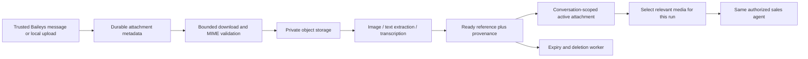

# Context and media reference from the logistics bot

Reviewed on **2 October 2026** at the user's request. This is a reference review and the proposed media contract, written before adding media code. This is a historical design review. The implemented replacement is [module 30](30-media-lifecycle.md), with encrypted Supabase bytes/extracts, 24-hour retention and up to eight same-owner attachments per turn, plus [module 32](32-inbound-debounce.md) for durable batching. Proposed object storage, one-file pins and the older expiry options below are not the current implementation.

## Reference implementation inspected

The sibling repository is `wareongo/whatsapp-logistics-bot`. These are observed source behaviors, not assumptions about its deployed configuration.

| Source                                | Existing pattern                                                                                                                                                                    | Application to Ramesh                                                                                                                                                                |
| ------------------------------------- | ----------------------------------------------------------------------------------------------------------------------------------------------------------------------------------- | ------------------------------------------------------------------------------------------------------------------------------------------------------------------------------------ |
| `src/services/conversationService.js` | Bot-owned Postgres history per sender; 16 turns, 1,200 characters per turn, 6,000 total; append after an exchange                                                                   | Keep app-owned, bounded context across provider restarts. Ramesh already reads encrypted queue history; do not create a second transcript store.                                     |
| `src/services/sessionService.js`      | 48-hour sticky agent routing, refreshed on messages; explicit exit commands                                                                                                         | A routing preference is distinct from identity, authorization and evidence freshness. Ramesh already admits DMs and group mentions, so it does not need `/bot` session gating.       |
| `src/services/mediaContextService.js` | One Postgres attachment pin per verified sender; 2-hour availability, 15-minute fresh window; image reference in R2, extracted document text inline                                 | Separate file lifetime, conversational relevance and authorization. Scope references to employee, chat and audience rather than phone alone.                                         |
| `src/services/openclawService.js`     | Fresh pin auto-attached; older pin only with a textual reference; image bytes fetched per call; model receives bot-owned history; temporary data turns excluded from stored history | Build a bounded context projection per run. Preserve native tool-result correlation, and refresh protected business facts rather than replaying them as authoritative history.       |
| `src/services/mediaService.js`        | Image/PDF/DOC classification; PDF and Word text extraction capped at 8,000 characters with truncation notice; transient image loading                                               | Route each supported content type through a bounded deterministic processor. Captions and extracted text are untrusted data.                                                         |
| `src/services/voiceService.js`        | Audio transcription becomes normal text input; transcript shown before the answer                                                                                                   | Preserve transcript provenance and permit correction; never treat transcription as confirmation of a write.                                                                          |
| `src/services/storageService.js`      | R2 object storage, separate `assistant-media/` prefix; URLs returned for retrieval                                                                                                  | Keep bytes outside queue rows and separate temporary attachments from warehouse assets. Private object keys and authorized retrieval are required for confidential Ramesh documents. |
| `src/routes/whatsapp.js`              | Acknowledge first; process media asynchronously; caption triggers a response, otherwise await a question; spreadsheets have a separate cleanup workflow                             | Normalize attachments into durable jobs. Generated exports/cleanup are a separate artifact workflow, not CRM writes or a general model execution tool.                               |

The old read loop uses bounded `[[DATA|...]]` text directives and named queries. Ramesh's equivalent is native function calls with schemas and the signed MCP catalogue. Do not bring its direct Twilio send helpers, arbitrary text directives, public attachment URLs or phone-only cache keys into the capture harness.

## Context assembly contract

Use application identity and persisted conversation boundaries, independent of OpenAI response IDs. Context keys include transport account/test namespace, chat, audience and current employee binding. Phone reassignment or scope revocation must never carry private context to a different employee. Group context does not establish personal business authority.

Assemble, in order: current request; trusted reply/reference metadata; bounded recent audience-safe turns; selected entity/attachment references; current tool catalogue. Retrieve business facts only through currently scoped tools. Treat stored assistant wording as history, not fresh proof. Never concatenate the whole receipt journal into a prompt.

Ramesh currently excludes protected business reply bodies from ordinary history. The general loop now keeps 32 messages and can recall the original answer/order only after fresh employee-scoped queries match its saved fingerprints. Changed results supply fresh evidence without exposing the old private answer. [Module 24](24-business-recall-and-deal-display.md) documents the implementation. A future finer-grained reference store can retain individual IDs and cursor lineage separately. “The second warehouse” must resolve against a specific displayed page, not a fresh sort whose ordering may have changed. Ambiguous references prompt clarification. A quoted message ID is only accepted when it belongs to the same authorized conversation.

Token/character budgets preserve the latest request, uncertainty and unresolved reference ambiguity. Any future summary records provenance and truncation; it cannot add a standing permission or convert source text into instructions. Reset clears the current conversation's references and media pins as well as conversational history. Only captured or transport-accepted replies count as prior assistant turns.

## Proposed attachment lifecycle and ports

Proposed `MediaIngestor`, `MediaProcessor`, `ActiveMediaRepository` and `ConversationContextAssembler` are separate application ports. They are not MCP business tools and cannot accept a different employee or arbitrary remote URL supplied by the model. Baileys supplies the trusted message key/media descriptor; the playground supplies an authenticated local upload to its own capture namespace.

An attachment reference contains a generated ID, ownership/conversation binding, source message ID, normalized MIME, byte count, content hash, storage object key, caption, creation/expiry times, processing state, extraction version and truncation indicators. Do not place file bytes, public URLs, signing keys or model data URIs in queue payloads or normal logs. Encrypt extracted confidential text and metadata as appropriate; fetch bytes only for the selected run.

States: `RECEIVED → FETCHING → PROCESSING → READY`, with `FAILED`, `EXPIRED` and `DELETED` terminal outcomes. Jobs use leases and attempt bounds, with atomic state transitions and content/message deduplication. A retry cannot create duplicate pins or unrelated warehouse assets. Bound bytes while streaming; check actual MIME/signature, decompression, image dimensions, extraction pages/text, transcription duration and processing wall time. Do not trust filename/MIME headers alone. File processors cannot execute macros or arbitrary source code.

Start with one active attachment per authorized conversation, preserving message-specific references for disambiguation. The old bot's 2-hour availability / 15-minute fresh window is a starting product policy, not a reason to attach a file to every unrelated message for fifteen minutes. Prefer explicit replies, captions or clear references; clarify if the target is uncertain. On expiry, ask for the relevant content again rather than pretending it remains visible. A generic media label from the current mapper is not the file's contents.

## Proposed storage and delivery boundaries

If dedicated tables are needed, use explicit application-owned names such as `ramesh-media-assets` and `ramesh-media-context`, with independent `ramesh-test-*` counterparts and private storage prefixes. These names are proposals; no such migration has been applied. Keep test and production credentials/delivery paths distinct. Add object lifecycle deletion and a reconciler for orphaned rows/objects; a logical pin expiry alone does not delete bytes.

Captured file outputs stay in the local GUI/capture sink. Production outbound artifacts require an authorized recipient, explicit artifact ownership and a constrained send adapter. Generating a draft or cleaned file does not authorize sending it to another person. Media facts do not authorize CRM writes, and hidden instructions in documents cannot change tools, policy or identity.

## Acceptance before connecting media

Test restart continuity, same-sender concurrent uploads, pin replacement, expired objects, malformed MIME, oversize streams, encrypted documents, corrupt extraction, transcript corrections, source prompt injection, group/DM separation, employee reassignment, quoted-message ownership and reset/delete behavior. Verify no cross-user pin, no private URL in logs, no private media reattached to an unrelated request and no WhatsApp send from the harness. Use synthetic files plus explicit authorized real documents, with bounded model evals for grounding and truncation honesty.

Implementation order: typed attachment metadata and test uploads; scoped storage/expiry; extraction/transcription; context selection; multimodal model adapter; captured artifact display; production transport only after the same boundaries pass. This is a separate increment from exposing existing sales tools.
