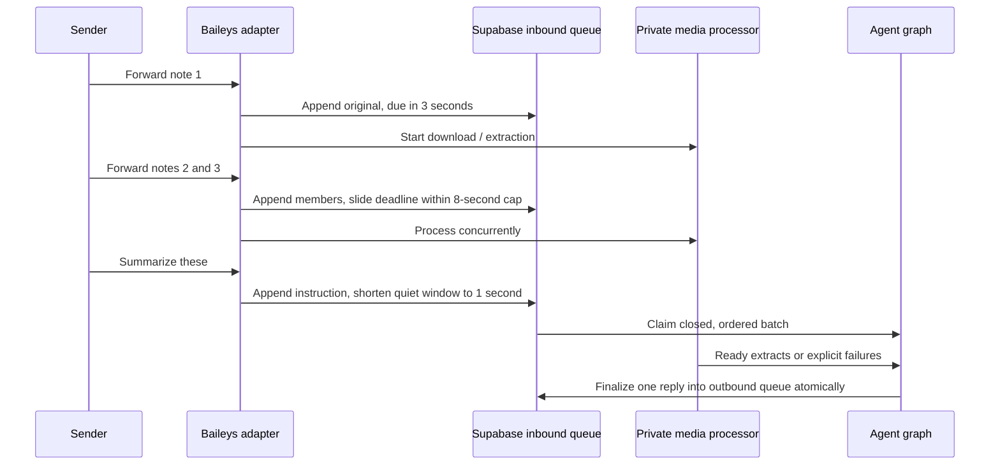

# Durable inbound turn batching

Status: implemented locally; validation results are in the [dated record](../../evals/results/2026-10-02-sol-graph-media.md). Spec precedes code.

## User-visible outcome

Forwarding three voice notes followed by “summarize these” should create one assistant turn with four ordered inputs. Normal single text messages incur only a short quiet window, not a long global delay.

## Policy

Use server receipt time and a sliding quiet window: 1 second for text, 3 seconds for media or a forwarded message, with an 8-second maximum collection period. A text instruction arriving after media/forwards shortens the remaining quiet window to 1 second. Do not rely on understanding the text to flush. These are configurable operational defaults, measured separately from transcription/model latency. Start attachment work on arrival; wait for that burst's processing to settle before generating a response. A slow/failed file is surfaced, not silently skipped.

The diagram's final arrow represents the repository transaction across the inbound journal and separate outbound table. Media extraction is independent of collection: three seconds is not a transcription deadline. A message arriving after claim starts a new turn; the maximum cap means an indefinitely slow forwarding session cannot remain one batch forever.

Partition by account + conversation + trusted sender. Different group senders never merge. Group mentions retain existing eligibility policy. Arrival order is deterministic, duplicates do not extend the window, and batches have bounded message/byte counts. New arrivals after a batch is claimed enter the next batch; do not silently cancel work or combine new messages into an already reviewed answer.

## Durability

Keep every original message row for inbox/history. Add explicit batch membership and receipt/deadline metadata to the inbound queue, claim all members atomically with fencing, and produce one outbound response linked to the batch anchor. No process-local timer is the source of truth. Restart/lease recovery reuses the same membership; duplicate delivery cannot create a second reply. Mark non-anchor members as absorbed/observed only after the batch handoff commits. Failures and expiration finalize every member consistently. Avoid duplicate current-batch text in the 32-message history by excluding its member IDs.

## Harness

The capture-only playground must let users submit multiple messages while an earlier turn is pending. It uses the same policy and stores batch membership durably in explicitly separate test tables. Show one assistant response for a batch, while retaining all user bubbles. No test queue can be read by Baileys. Include deterministic tests for text latency, sliding media, text-after-media, max wait, duplicate retries, cross-sender separation, restart, claim races and three notes plus instruction.

Baileys forwarding metadata (`contextInfo.isForwarded` or positive `forwardingScore`) selects the longer window for text as well as attachments. It is a batching hint, never identity or proof of original authorship. Copied text has no reliable forwarding marker. Source: https://github.com/WhiskeySockets/Baileys/blob/master/src/Utils/messages.ts.
