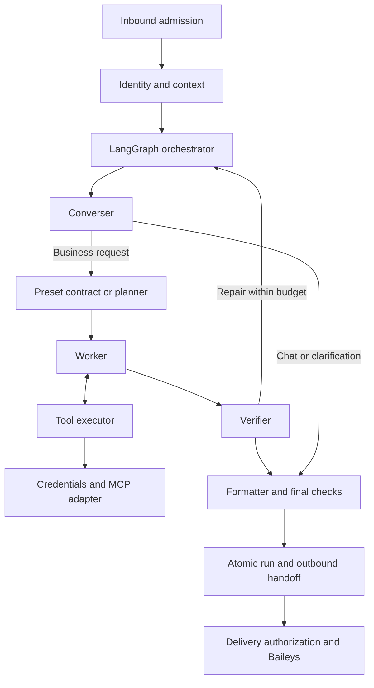

# Ramesh agent module specifications

The [reminders and tasks design](../reminders-and-tasks-design.md) expands module 15 and adds modules 49–51. Personal scheduling is deployed in `2bf91be`, with schema `202610030007` and both feature flags enabled. This release includes the review fixes; production migration `202610030008` was applied and verified on 3 October 2026, with worker credentials and enabled flags preserved. Worker rollout uses CI/CD after pushing `main`; verify the exact release and runtime health. Legacy import and conditional CRM/SLA work remain design contracts.

Updated: **3 October 2026**. Status: **The personal-assistant graph, media and batching are established capabilities. Per-chat concurrency and durable model-response replay are deployed in `e0b7232`; outbound automation in `3ad3408`; personal scheduling in `2bf91be`.** Unconfigured installations remain closed to business tools by default. SLA, indefinitely paused agent workflows and CRM writes remain specifications. This release includes the scheduling review and business follow-up recovery, with schema `202610030008` applied; exact worker deployment is verified separately through CI/CD and runtime status.

These files expand the [architecture plan](../assistant-architecture-plan.md#23-agent-architecture-draft-informed-by-the-factory-talk) into module contracts. They describe a target system, including changes to existing modules. A proposed interface, table, configuration option or test below does not exist merely because it is documented here.

The [2 October capability review](../capability-review-2026-10-02.md) records the deployed baseline: separate graph roles, employee-scoped CRM/supply/knowledge reads, private media and sliding debounce. This checkout additionally implements currency accounting, model-free readiness and the [3 October adversarial fixes](../adversarial-audit-2026-10-03.md); currency caps and automated readiness gating require separate configuration at rollout. The new [concurrency](46-per-chat-concurrency.md) and [replay](47-durable-model-checkpoints.md) increments add bounded parallel chats and recovery of completed model calls; durable paused-task snapshots and CRM writes remain proposed. Personal task/reminder scheduling is implemented with production migration `202610030007` applied; activation uses runtime flags; see [operations](../personal-scheduling.md). The concurrency/replay release [e0b7232](https://github.com/rs0125/ramesh-bot/commit/e0b723290478da646809af1542a343d49b913b07) passed [CI 37067044403](https://github.com/rs0125/ramesh-bot/actions/runs/37067044403) and [CD 37067181558](https://github.com/rs0125/ramesh-bot/actions/runs/37067181558); WhatsApp is connected, concurrency is three and schema health checks pass. Production migrations `202610020006`/`202610030004`/`202610030005` and independent capture `202610020003`/`202610030005` are applied. Runtime spending remains off; no paid evaluations were run for the release. The [outbound automation API](48-outbound-automation-api.md) is deployed in `3ad3408`. Production migration `202610030006` is applied and verified with the restricted runtime role; its API key is installed on the host and in SSM runtime version 11, and the proxy configuration is validated. CI and CD passed; authenticated HTTPS status probes passed without sending messages; see the [integration guide](../outbound-automation.md).

## Module map

| Spec                                                                   | Responsibility                                                         | Current foundation                                                     |
| ---------------------------------------------------------------------- | ---------------------------------------------------------------------- | ---------------------------------------------------------------------- |
| [00. Shared contracts](00-shared-contracts.md)                         | Cross-module data types, versions, outcomes and ownership              | Tool sessions/evidence/receipts; generic task contracts proposed       |
| [01. Inbound admission](01-inbound-admission.md)                       | Trusted transport events, eligibility, deduplication and run admission | Existing mapper and Supabase inbound queue                             |
| [02. Identity resolver](02-identity-resolver.md)                       | Phone/LID to one active employee                                       | Integrated for every tool and delivery                                 |
| [03. Context credentials](03-context-credentials.md)                   | Employee-bound service signatures and credential lifecycle             | Signed adapter integrated                                              |
| [04. Conversation context](04-conversation-context.md)                 | Audience-separated history, entity references and pending input        | 32-message inbox; freshly authorized private recall                    |
| [05. Converser](05-converser.md)                                       | Intent, ordinary chat, clarification and capability honesty            | Personal chief-of-staff router; direct chat or planned work            |
| [06. Planner](06-planner.md)                                           | Bounded plans and success assertions                                   | Implemented: structured outcome plan and schema/reference validation   |
| [07. Worker](07-worker.md)                                             | Task execution decisions and structured handoffs                       | Separate native worker session and deterministic executor              |
| [08. Tool executor](08-tool-executor.md)                               | Deterministic validation, budgets and recorded tool outcomes           | Schema-checked read executor and encrypted receipts                    |
| [09. Context Engine adapter](09-context-engine-adapter.md)             | MCP transport, domain methods and evidence envelopes                   | All permitted read tools integrated                                    |
| [10. Verifier](10-verifier.md)                                         | Operational checks and independent semantic review                     | Code checks and fresh semantic review                                  |
| [11. Formatter](11-formatter.md)                                       | Natural WhatsApp wording and factual preservation                      | Style model and final evidence review                                  |
| [12. LangGraph orchestrator](12-langgraph-orchestrator.md)             | Run lifecycle, routing, corrections, cancellation and resumption       | General bounded tool loop; paused resume deferred                      |
| [13. Supabase persistence](13-supabase-persistence.md)                 | Runs, events, checkpoints, transactions and recovery                   | Run/event journal and encrypted replay deployed                        |
| [14. Outbound delivery](14-outbound-delivery.md)                       | Saved replies, delivery authorization and uncertain sends              | Saved replies and protected-result preflight                           |
| [15. Reminders](15-reminders.md)                                       | Editable personal schedules and due-time notification preparation      | Review fixes in this release; production schema `202610030008` applied |
| [16. SLA escalation](16-sla-escalation.md)                             | CRM-owned breach episodes and recipient progression                    | Existing CRM-Automations context; bot delivery proposed                |
| [17. Business actions](17-business-actions.md)                         | Future typed writes, confirmations and reconciliation                  | Deferred                                                               |
| [18. Model runtime](18-model-runtime.md)                               | Provider adapter, structured outputs, prompts and usage limits         | Existing OpenAI Responses adapter                                      |
| [19. Evaluation harness](19-evaluation-harness.md)                     | Deterministic checks and repeated model evaluations                    | 85 multi-turn scenarios, protected CI and real-data capture smoke      |
| [20. Observability and playground](20-observability-and-playground.md) | Operator traces, fake-chat inspection and recovery visibility          | Synthetic CRM GUI and run-correlated traces                            |
| [21. Live-data playground](21-live-data-playground.md)                 | Real authorized reads with isolated Supabase capture queues            | Verified live as Raghav; no WhatsApp delivery                          |

Numbers are reading order, not a requirement to implement independent services for every specification. These are modules in the current worker, plus the existing Context Engine, CRM-Automations and separate admin application. The [live playground runbook](../live-data-playground.md) documents the implemented test boundary and commands.

- [22. General employee tool loop](22-sales-manager-tool-loop.md): implemented native tool orchestration, review and evidence contracts.
- [23. Logistics-bot context/media reference](23-context-and-media-reference.md): historical source review; module 30 defines the implemented media lifecycle.

## Shared decisions

- Production conversation, queue and agent-run state belongs in Supabase/Postgres. The real-data playground also uses Supabase, under separate test tables and a dedicated capture login. SQLite remains the existing device/admin store and optional synthetic chat/eval fixture.
- The selected identity path is trusted WhatsApp phone/LID → active `VerifiedNumber` employee → signed Context Engine request. No employee OAuth enrollment is required.
- Unknown, ambiguous or inactive identities may chat, but cannot access business data. Initial business tools are DM-only.
- Reuse Context Engine's bounded read tools. Direct domain-backend read endpoints remain deferred; arbitrary SQL and arbitrary HTTP tools are excluded.
- Model roles propose work. Code controls authority, budgets, side effects, records of execution and delivery destinations.
- Fast paths handle ordinary chat and known lookups. Complex tasks use contracts, scoped workers, independent verification and bounded correction.
- CRM SLA rules belong to CRM-Automations. Notify assignee(s), then existing CRM admins. Personal reminders and CRM activities remain different entities.
- Tests use captured delivery. Activating a real WhatsApp connection is not part of implementing or validating these module contracts.

## End-to-end dependency flow

Persistence, model runtime, evaluation and observability support this flow. Reminder and SLA producers join at the durable notification boundary, not by simulating employee chat messages.

## Implementation increments

| Increment                          | Modules                          | Required result                                                                                        |
| ---------------------------------- | -------------------------------- | ------------------------------------------------------------------------------------------------------ |
| A. Contract and fixture foundation | 00, 04, 18, 19                   | Shared schemas, synthetic identities/evidence, recorded outcomes and capture-only execution            |
| B. First CRM read                  | 01–05, 07–14, 20                 | Assigned-follow-ups preset, current identity/scope checks, verified private reply and durable recovery |
| C. Complex reads                   | 06–12, 19                        | Lead-to-supply workflow, independent verification and measured correction behavior                     |
| D. Concurrent conversations        | 01, 12–14, 20                    | Per-conversation fencing and independently paced delivery, with contention tests                       |
| E. Reminders and escalation        | 15–16 plus persistence/delivery  | Due processing, cancellation, active recipients and non-sending policy preview                         |
| F. Business writes                 | 17 plus relevant domain handlers | Narrow commands, scoped confirmation and authoritative reconciliation                                  |

For increment B, the worker can be a deterministic preset executor. A model-directed worker and general planner are not prerequisites for the first lookup. Increment D is deployed with deterministic contention test coverage: three active chats by default, one ordered turn per chat and one outbound lease per account. Durable storage and delivery authorization are prerequisites for production business replies even during the small pilot.

The general loop uses `ContextToolRun`, `ToolEvidence`, `ToolDelivery`, `BusinessReadService` and the existing message repository; the original preset types remain regression fixtures. It does not create every generic type in spec 00. Migration `202610010004` supplies minimal run/event tables and atomic finalization. In the deployed recovery implementation, a pre-handoff crash reconstructs the graph, reauthorizes identity/tools and rereads sources. Exact matching requests reuse encrypted completed model responses; changed data, permissions, schemas or retained source clocks invalidate the saved suffix. The original finite deadline and operation budgets remain in force. A post-handoff crash reuses saved output. Native LangGraph next-node snapshots, interrupts and indefinitely paused task resumption remain deferred; deterministic response replay does not implement those target contracts.

The inbox and run/event journal retain the existing 30-day encrypted message cascade. Recovery checkpoints instead expire by message expiry or 24 hours from start and are deleted atomically on handoff/terminal transition. Admin inboxes show a private placeholder. Model history contains only a content-free completion marker for delivered business replies. All active trusted employees are eligible by default when reads are enabled; an explicit employee list remains optional. per-person daily spend enforcement remains future work beyond the current bounded request and queue limits.

## Readiness and unresolved decisions

Each file gives its interface, state/failure rules, acceptance cases and dependencies. Acceptance cases are implementation requirements, not claims of tests already passing. Future test names are illustrative.

The following remain product or integration decisions, with a specific owner rather than a guessed default:

| Decision                                                      | Relevant spec | Effect                                                    |
| ------------------------------------------------------------- | ------------- | --------------------------------------------------------- |
| Production rollout and run/spend limits                       | 12, 18        | Required before enabling business reads                   |
| Evidence retention and operator access                        | 04, 13, 20    | Required before persisting business content in production |
| Reminder ambiguity, quiet hours and catch-up policy           | 15            | Required for scheduler rollout                            |
| SLA thresholds, grace, recurrence and recipient authorization | 16            | Required for automatic notifications                      |
| Command catalogue and confirmation policy                     | 17            | Required before business writes                           |
| Group-safe business scope and private handoff behavior        | 01, 04, 14    | Deferred; business reads remain DM-only                   |

Use the parent plan for product intent and this directory for detailed contracts. The [shared contracts](00-shared-contracts.md) define names used across specs. If implementation reveals a conflicting interface, update the affected contracts together before wiring the modules.

- [24. Business recall and deal display](24-business-recall-and-deal-display.md): protected selection/order recall, native CRM dates, compact shortlists and conversation evals.

- [25. Analytics and continuous evaluation](25-analytics-and-continuous-evaluation.md): source calendars, full scoped catalogue, editable prompts and CI reports.
- [26. Coworker loop and context](26-coworker-loop-and-context.md): personal chief-of-staff role, transcript/reference findings, repair routing and remaining architecture limits.

- [27. Adversarial review](27-adversarial-review-and-response-contracts.md): bounded recovery, per-record display checks and requested-versus-confirmed facts.
- [28. Model and effort comparison](28-model-and-effort-comparison.md): Responses compatibility, explicit planning references and a fixed-judge Sol/Terra experiment.

## New graph, media and batching contracts

- [29. Planner, worker and verifier](29-planner-worker-verifier.md): separate model roles and deterministic executor.
- [30. Media lifecycle](30-media-lifecycle.md): encrypted same-owner image/PDF/voice extracts, 24-hour expiry and cleanup.
- [31. Private outcome evals](31-private-outcome-evals.md): real-data operator tests, excluded from git and CI artifacts.
- [32. Inbound debounce](32-inbound-debounce.md): forwarded text/media use a sliding 3-second window; ordinary text uses 1 second; total collection capped at 8 seconds.

Earlier media/message and usage migrations remain prerequisites. Production `202610020006`/`202610030004`/`202610030005` and independent capture `202610020003`/`202610030005` are applied for the deployed concurrency/replay release. Outbound automation additionally requires production `202610030006`, now applied and verified; its code is deployed in `3ad3408`. Runtime monetary metering remains off and needs separate configuration. Audio is uploaded directly to STT, so the worker does not require `ffmpeg`. The local real-data playground uses Sol at medium tool effort. No WhatsApp connection or production queue migration is performed by its setup.

- [33. Evaluation refinement](33-eval-refinement.md): calibrated per-turn judgments,
  consistent fixtures and clocks, semantic query checks, and bounded research with
  time reserved for verified finalization.
- [34. Tool extensibility](34-tool-extensibility.md): current compatibility,
  adapter boundaries for reads/documents/writes, and outcome-oriented regression
  coverage without prescribing one business workflow.

- [35. Voice transcripts](35-voice-transcripts.md): exact quoted/italic audio text before one batch answer, expiring references, independent STT credentials.
- [36. Transcription evaluation](36-transcription-evaluation.md): current model/pricing research and repeatable synthetic audio comparisons.
- [37. Production evaluation](37-production-evaluation.md): primary-source research, current harness gaps, outcome contracts, private holdouts, judge calibration and proposed release/monitoring practices.
- [38. Direct audio transcription](38-direct-audio-transcription.md): original-byte uploads, Ogg compatibility evidence and removal of the runtime transcoding dependency.
- [39. Paginated research](39-paginated-research.md): unique coverage, cursor progress, broad-search outcomes and the production roster access correction.
- [40. Delivery acknowledgements](40-delivery-acknowledgements.md): concurrent LID resolution, durable failure notices and normal WhatsApp delivery receipts.

- [41. Recall and source labels](41-recall-and-source-labels.md): changed-result recovery, current-source continuations and inert labels across CRM, knowledge and analytics.
- [42. Evaluation spending](42-evaluation-spend-controls.md): Luna defaults, bounded case selection, explicit Sol approval and manual-only paid CI.
- [43. Usage ledger and budgets](43-usage-ledger-and-budgets.md): HTTP-attempt reservations, operator-reviewed pricing, atomic currency caps, isolated capture accounting and retained unknown usage. Deployed; optional runtime metering remains off.
- [44. Capability readiness](44-capability-readiness.md): bounded checks of a configured employee's actual source and receipt path, without model calls or WhatsApp delivery. Deployed and used for production verification; not automatically added to deployment.
- [45. Dynamic tool discovery](45-dynamic-tool-discovery.md): live employee-scoped catalogues, schemas and guidance; generic read evidence and request binding; independent Context Engine tool development.

- [46. Per-chat concurrency](46-per-chat-concurrency.md): deployed ordered conversation heads, three active chats by default, one outbound lease and 30-second renewable ownership.
- [47. Durable model checkpoints](47-durable-model-checkpoints.md): deployed encrypted exact-request response replay, original deadline, live reauthorization and source reads, bounded recovery and isolated capture persistence.
- [48. Outbound automation API](48-outbound-automation-api.md): authenticated direct text/JPEG/PNG/PDF delivery, producer idempotency and encrypted media, without agent invocation. Deployed; migration `202610030006`, API key and proxy prerequisites are complete. Code is deployed in `3ad3408`; WhatsApp is connected and HTTPS authorization probes pass. See the [integration guide](../outbound-automation.md).

See the [2 October production capability review](../capability-review-2026-10-02.md) for the earlier baseline, remaining work and AI Engineer research; the release status above supersedes its concurrency/recovery status.

- [49. Personal tasks](49-personal-tasks.md): durable commitments, owned mutations, ordered selection and linked reminder cancellation. Implemented; schema applied, activation via flags.
- [50. Reminder scheduler](50-reminder-scheduler.md): due occurrences, leases, fixed deadlines, command receipts and final delivery fences. Implemented; schema applied, activation via flags.
- [51. Reminder migration and evaluation](51-reminder-migration-and-evaluation.md): shared-table assessment, optional legacy import, outcome tests and phased rollout. New schema implemented; legacy import deferred.
