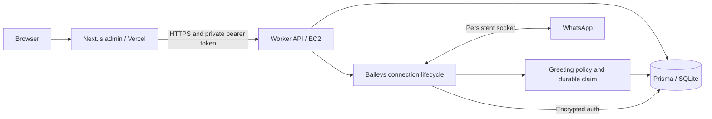

# Architecture and API

The worker and Next.js admin are independent projects. The worker owns WhatsApp, SQLite, login-limit/session records, and the control API. The admin owns browser authentication UI, signed cookies and the server-side HTTP client. They share a documented protocol, not source code or npm dependencies.

## Worker modules

| Module                    | Responsibility                                                                        |
| ------------------------- | ------------------------------------------------------------------------------------- |
| `app`                     | Construct adapters, expose readiness, order shutdown and maintenance                  |
| `config`                  | Validate secrets, limits, listener settings and release ID once                       |
| `modules/greetings`       | Determine eligibility, claim before sending, preserve uncertain claims                |
| `infrastructure/whatsapp` | Map SDK events, resolve bot identities, manage retries and bounded work               |
| `infrastructure/database` | Atomic dedupe, encrypted credentials/keys, sessions, login limits and operator intent |
| `infrastructure/http`     | Authenticate and validate fixed commands; expose no arbitrary-send tool               |
| `contracts`               | Describe v1 response shapes; consumers independently validate them                    |

Auth writes use AES-256-GCM with a random IV and row identity as additional authenticated data. Keys are encrypted before queued writes, then committed transactionally. The encryption key is outside the DB. SQLite plus a singleton systemd service fits the current one-account deployment; multiple replicas require explicit session ownership and a different storage design.

## HTTP boundary

Every `/v1` endpoint requires `Authorization: Bearer <WORKER_API_TOKEN>`. Responses are JSON with `Cache-Control: private, no-store`. The server binds to loopback; Caddy exposes only the four exact API paths over HTTPS.

| Endpoint                 | Body / response                                                                                                                         |
| ------------------------ | --------------------------------------------------------------------------------------------------------------------------------------- |
| `GET /healthz`           | Loopback readiness only: `{ "status": "ok", "release": "<SHA>" }`; 503 when not ready. Caddy does not expose it.                        |
| `GET /v1/status`         | State, transient QR or null, timestamps, metrics and up to 30 sanitized event descriptions                                              |
| `POST /v1/control`       | `{ "action": "connect" \| "disconnect" \| "reconnect" }`; returns status                                                                |
| `POST /v1/admin/attempt` | `{ "key": "<64 lowercase hex>" }`; returns `allowed` and positive `retryAfter` seconds                                                  |
| `POST /v1/admin/session` | `{ "action": "create" \| "verify" \| "revoke", "tokenHash": "<SHA256>", "expiresAt": 0 }`; expiry milliseconds required only for create |

Create/revoke return `{ "ok": true }`; verify returns `{ "active": true/false }`. Sessions last at most eight hours. Login attempts are limited to 10 per 60-second bucket. The admin supplies an HMAC of the trusted client IP; raw IPs are not persisted. Outside Vercel, requests share one bucket until a trusted proxy policy is explicitly implemented.

States: `stopped`, `connecting`, `pairing`, `connected`, `reconnecting`, `disconnecting`, `error`. Metrics: `received`, `replied`, `duplicates`, `errors`, `dropped`. Event fields: `at`, `level` (`info` or `error`), `message`. Counters/activity reset when the process restarts; credentials, claims and disconnect preference persist.

Control bodies are at most 1 KiB; session/login bodies at most 2 KiB. Controls are serialized with a maximum backlog of eight. Unauthenticated requests return 401; invalid input 400, excessive bodies 413, unsupported content type 415, and unavailable/busy storage or controls 503.

## Independent releases

The admin defines its own API types and validates worker responses at runtime. Preserve existing fields/semantics in `/v1`; deploy additive worker capabilities before clients use them. Introduce `/v2` for incompatible changes and maintain a transition period. Each project's CI runs without the other checkout. An optional browser integration suite exercises both over localhost before coordinated protocol changes.

Browser requests reach Next.js, which verifies the signed cookie and its persisted session hash before calling the worker. Secrets stay in server modules. Origin checks protect mutations; cookies are HttpOnly, SameSite=Strict, and Secure on HTTPS. Logout revokes the stored token, including copied cookies. Password/signing-key rotation also invalidates sessions.

The shared admin password is for the small operations surface. It does not implement employee identity or CRM scopes. The sender-to-employee mapping and organization-safe group policy remain in [CONTEXT.md](../CONTEXT.md). Reminder scheduling, CRM tools, LLM calls and proactive DMs are not implemented.
