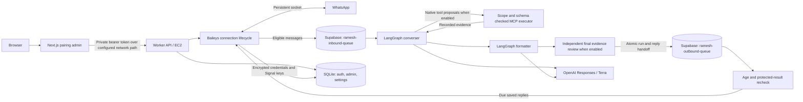

# Architecture and API

Current local increment (2 October 2026): separate converser → planner → worker/tool-executor → formatter → verifier roles; ordinary chat skips planning. Images, PDFs and voice notes use encrypted owner-scoped media records with 24-hour expiry. Forwarded messages and media use durable sliding inbound batching (1-second ordinary text, 3-second burst window, 8-second cap). The capture GUI accepts attachments and overlapping messages, with one response per batch. See [module specifications](agent-modules/README.md) for current contracts and deployment prerequisites. Real-data private outcome cases and transcripts remain only under gitignored `.local/private-evals/`; `npm run eval:private` refuses CI.

Reviewed **2 October 2026** through the personal-assistant tool loop and real-data capture harness (production pilot activation remains separate). The worker and Next.js admin are independent projects. The worker owns WhatsApp, ordinary two-node chat or the enabled conversational tool loop, durable Supabase message queues, local linked-device/admin state and the control API. They share a documented protocol, not source code or npm dependencies.

Supabase also holds the message ledger, transactional state history, and migration checksums. Both queue stages run in the existing worker and share one active lease per account; a long model run can delay other chats. The outbound sender uses saved text without regenerating it. Without an OpenAI key, the same delivery boundary uses `hello`.

The opt-in MCP boundary is `createSignedEmployeeContextAccess` → trusted phone/LID and live roster → signed employee-scoped request → Context Engine `/mcp/ramesh`. The server verifies the signature, replay nonce and current employee permissions. Unknown users can chat without business access; group reads are denied. The lower-level factory defaults to no credential. See [signed access operations](signed-context-auth.md). The personal-assistant converser chooses among all permitted reads; code executes them and checks evidence. A fresh model verifier reviews the formatted answer with one bounded repair. Separate planner/worker roles are implemented locally; durable paused-task checkpoints remain future work. See [current personal-assistant behavior](sales-manager-agent.md).

`npm run dev:chat` uses the same graph with isolated SQLite and captured browser replies at port 3012. It opens neither a WhatsApp socket nor a Supabase connection. The separate PostgreSQL integration suite verifies the production queue logic with fake delivery.

`npm run dev:chat:live` uses real Supabase and signed Context Engine as the server-configured Raghav. Its path is browser → `ramesh-test-inbound-queue` → shared graph/read/verifier → `ramesh-test-outbound-queue` → authorization recheck → browser. A dedicated login and capture-only composition separate it from WhatsApp delivery. No SQLite or production queue consumer is used. See the [live-data design and runbook](live-data-playground.md).

## Worker modules

| Module                          | Responsibility                                                                             |
| ------------------------------- | ------------------------------------------------------------------------------------------ |
| `app`                           | Construct adapters, expose readiness, order shutdown and maintenance                       |
| `config`                        | Validate secrets, limits, listener settings and release ID once                            |
| `modules/greetings`             | Determine eligibility, claim before sending, preserve uncertain claims                     |
| `modules/assistant`             | Typed LangGraph state, converser/formatter prompts, bounded memory, and style guard        |
| `modules/context-engine`        | Employee credential port, read-tool allowlist, and CRM/supply/knowledge/analytics services |
| `modules/identity`              | Canonical phone resolution to one active VerifiedNumber employee; no cached permissions    |
| `infrastructure/whatsapp`       | Map SDK events, resolve bot identities, manage retries and bounded work                    |
| `infrastructure/database`       | SQLite auth/admin and PostgreSQL message ledger, queues, leases, and atomic reply handoff  |
| `infrastructure/openai`         | Responses API, model deadlines, cancellation, and safe errors                              |
| `infrastructure/context-engine` | MCP discovery, employee checks, bounded transport, and evidence envelopes                  |
| `infrastructure/http`           | Authenticate and validate fixed commands; expose no arbitrary-send tool                    |
| `contracts`                     | Describe v1 response shapes; consumers independently validate them                         |

Auth writes use AES-256-GCM with a random IV and row identity as additional authenticated data. Supabase pending input, inbox content, and finalized replies use distinct authenticated categories. The key is outside both databases. Terminal transport payloads are cleared, while encrypted inbox text and metadata expire after 30 days. Keep one active worker per linked account: queue leases do not implement distributed WhatsApp session ownership.

Signed access requires no per-user token storage. Context Engine uses a private Supabase nonce-hash/expiry table for replay rejection. The previous three encrypted SQLite OAuth tables remain only for the optional OAuth adapter. The live worker roster adapter uses its existing restricted PostgreSQL connection; business reads go through Context Engine.

With Supabase configured, recent context comes from the persistent inbox: the last 32 messages within 48,000 characters (selected from up to 40 preceding rows), partitioned by account/chat. All group participants share history, including untagged messages; DMs and other groups stay separate. Only successfully sent conversation replies enter context. Private bodies remain outside ordinary model history. A completion marker identifies a protected turn; `recall_business_context` can restore its original selection/order after fresh employee checks and matching scoped source reads. Changed results withhold the historical body and supply only fresh evidence. Operators see a private placeholder. The isolated SQLite playground retains bounded process-local memory. Minimal encrypted agent-run receipts and finalized output live in Supabase; general LangGraph checkpoints remain deferred. Migration `202610020005` must precede this worker deployment even with business reads disabled.

## HTTP boundary

Every `/v1` endpoint requires `Authorization: Bearer <WORKER_API_TOKEN>`. Responses are JSON with `Cache-Control: private, no-store`. The server binds to loopback. Production HTTPS at `https://wareongo-ramesh.duckdns.org` terminates at Caddy on the same EC2 instance; the security group opens only TCP 80/443. The Caddy template allowlists the control, session, and inbox paths while keeping `/healthz` private. SSM provides operator access and an optional local tunnel. The geocoder instance is not part of this request path.

| Endpoint                 | Body / response                                                                                                                         |
| ------------------------ | --------------------------------------------------------------------------------------------------------------------------------------- |
| `GET /healthz`           | Loopback readiness only: `{ "status": "ok", "release": "<SHA>" }`; 503 when not ready. Caddy does not expose it.                        |
| `GET /v1/status`         | State, transient QR or null, timestamps, metrics and up to 30 sanitized event descriptions                                              |
| `POST /v1/control`       | `{ "action": "connect" \| "disconnect" \| "reconnect" }`; returns status                                                                |
| `POST /v1/admin/attempt` | `{ "key": "<64 lowercase hex>" }`; returns `allowed` and positive `retryAfter` seconds                                                  |
| `POST /v1/admin/session` | `{ "action": "create" \| "verify" \| "revoke", "tokenHash": "<SHA256>", "expiresAt": 0 }`; expiry milliseconds required only for create |

Create/revoke return `{ "ok": true }`; verify returns `{ "active": true/false }`. Sessions last at most eight hours. Login attempts are limited to 10 per 60-second bucket. The admin supplies an HMAC of the trusted client IP; raw IPs are not persisted. Outside Vercel, requests share one bucket until a trusted proxy policy is explicitly implemented.

The inbox adds `GET /v1/inbox/conversations`, `GET /v1/inbox/messages?chatId=...` (both cursor-paginated), and `POST /v1/inbox/send` with `{ requestId, chatId, text }`. Sending requires an existing received chat, connected WhatsApp, a UUID, and 1–4,000 characters. It goes straight to the durable outbound queue. See [inbox behavior and rollout](supabase-message-queue.md#inbox-context-and-operator-sends).

States: `stopped`, `connecting`, `pairing`, `connected`, `reconnecting`, `disconnecting`, `error`. Metrics: `received`, `replied`, `duplicates`, `errors`, `dropped`. Event fields: `at`, `level` (`info` or `error`), `message`. Counters/activity reset when the process restarts; credentials, claims and disconnect preference persist.

Control bodies are at most 1 KiB; session/login bodies at most 2 KiB. Controls are serialized with a maximum backlog of eight. Unauthenticated requests return 401; invalid input 400, excessive bodies 413, unsupported content type 415, and unavailable/busy storage or controls 503.

## Independent releases

The admin defines its own API types and validates worker responses at runtime. Preserve existing fields/semantics in `/v1`; deploy additive worker capabilities before clients use them. Introduce `/v2` for incompatible changes and maintain a transition period. Each project's CI runs without the other checkout. An optional browser integration suite exercises both over localhost before coordinated protocol changes.

Browser requests reach Next.js, which verifies the signed cookie and its persisted session hash before calling the worker. Secrets stay in server modules. Origin checks protect mutations; cookies are HttpOnly, SameSite=Strict, and Secure on HTTPS. Logout revokes the stored token, including copied cookies. Password/signing-key rotation also invalidates sessions.

The shared admin password is for the small operations surface. It does not implement employee identity or CRM scopes. The default graph can chat and draft text; the opt-in sales graph and separately configured live harness expose all employee-permitted CRM, supply, knowledge and shortlist read tools. Reminders and writes are unavailable. MCP permits scoped reads in DMs only with a valid employee resolver, read-only tool discovery and server identity verification. The local harness is an explicit operator test binding, not an employee login or public API.

See [current implementation](current-implementation.md) for the full reference, [queue semantics](supabase-message-queue.md) for recovery and migration limits, and [EC2 operations](ec2-operations.md) for the live deployment layout.

The current agent/eval refinements are specified in
[bounded completion and evaluation](agent-modules/33-eval-refinement.md) and
[tool extensibility](agent-modules/34-tool-extensibility.md). The graph plans from
permitted schemas, while registered adapters own authorization, result validation
and effects. New writes cannot use the read retry or delivery-replay path. A
research cutoff reserves time for verified finalization; it does not change the
hard request deadline or delivery authorization.
