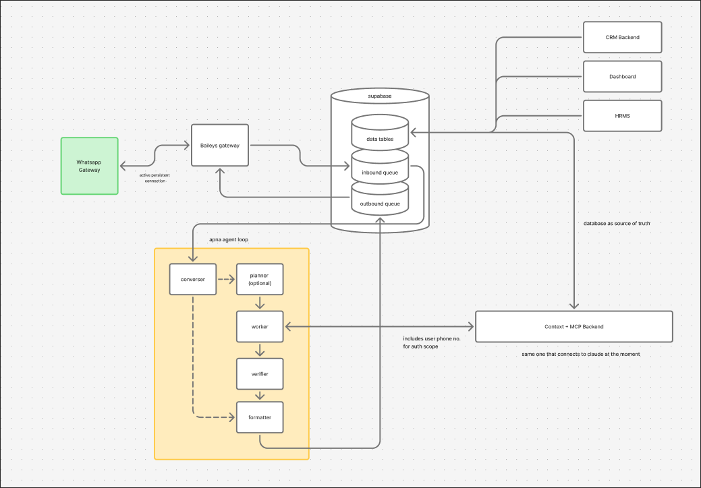
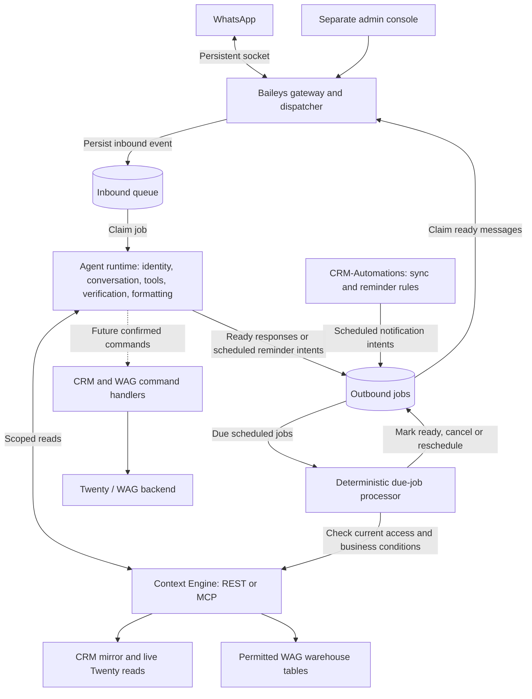
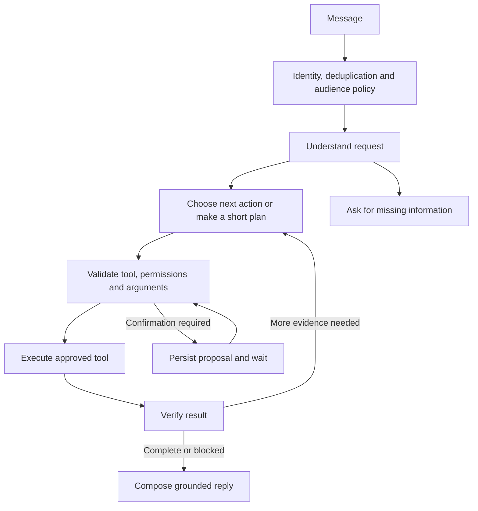

# Ramesh: assistant architecture and implementation plan

Date: **1 October 2026**

Status: **Draft proposal, based on repository inspection and primary-source research**

This document consolidates the discussion about moving WareOnGo's basic OpenClaw assistant functions into the in-house Baileys bot. It covers CRM and supply reads, the conversational agent loop, reminders and escalation, later writes, migration, and evaluation.

Repository observations refer to the local working copies inspected during the discussion. Production deployments, credentials, scheduled jobs, and live source behaviour were not independently verified. Proposed modules, contracts, tables, and commands below are future work unless explicitly described as existing.

## 1. Requirements and recommended decisions

### Confirmed requirements

- Build on the existing Ramesh Baileys worker, which currently replies to DMs and genuine group mentions.
- Provide CRM reads first, with controlled CRM writes later.
- Interface with the supply database represented by WAG Dashboard listings.
- Support lead reminders, SLA breach alerts, and escalation reminders.
- **Escalate to the lead's assignee(s) first, then the existing CRM admin recipients.** The user explicitly selected this over introducing a team-manager hierarchy.
- **Defer dedicated domain-backend read endpoints.** Reuse Context Engine's existing scoped database and live-source reads for the first version; migrating those reads behind CRM/WAG/HRMS backend APIs is later integration hygiene.
- **Identify employees from their WhatsApp phone identity and the active employee roster.** Apply current employee permissions to every business operation; recognising a phone number does not grant organisation-wide access.
- Preserve the employee-scoped access and organisation-safe group-output direction recorded in [CONTEXT.md](../CONTEXT.md).

### Recommended architecture

| Decision         | Recommendation                                                                                          | Reason                                                                          |
| ---------------- | ------------------------------------------------------------------------------------------------------- | ------------------------------------------------------------------------------- |
| Read integration | Use Context Engine's REST API initially                                                                 | It already enforces employee scopes, record access, projection, and freshness.  |
| Agent runtime    | One conversational agent inside an explicit workflow                                                    | Supports multiple tool turns while keeping evaluation and debugging manageable. |
| Planning         | Add a short explicit plan for complex requests                                                          | Simple lookups can choose their next tool directly.                             |
| Execution        | Application code executes approved tools                                                                | Identity, permissions, destinations, and side effects remain enforceable.       |
| Verification     | Code checks every tool outcome; optional model review for complex answers                               | Persisted state and source evidence establish operational success.              |
| Reminder rules   | Keep CRM rules in CRM-Automations                                                                       | Reuse the existing sync, ownership logic, and activity clocks.                  |
| Delivery         | A durable notification queue consumed by Ramesh                                                         | Supports restarts, deduplication, failure tracking, and controlled retries.     |
| Future writes    | Narrow commands through Twenty and the WAG backend                                                      | Preserve the systems that own business validation and records.                  |
| Deployment       | Extend the existing worker with modules; retain the separate admin app                                  | These boundaries do not initially require more independently deployed services. |
| Persistence      | Keep SQLite for WhatsApp session state initially; use private Postgres tables for shared workflow state | CRM-Automations and the bot need durable coordination.                          |

These are design recommendations, not a record that every implementation choice has been approved or built. Model/provider selection, exact notification cadence, and write policies remain open.

The deferred endpoint refactor applies to the internal implementation of business reads. Ramesh still calls bounded, employee-scoped Context Engine tools. Later CRM writes must use Twenty, and supply changes must preserve WAG's validation and review paths. HRMS remains a future integration whose capabilities and permissions need mapping.

## 2. Organisational context

WareOnGo connects warehouse supply with demand. Field teams capture property details; the supply and operations teams review listings; salespeople work requirements, shortlists, proposals, visits, negotiations, and follow-ups.

Ramesh's useful end-to-end journey is:

> What needs my attention? → Understand the lead → Find suitable supply → Follow up → Record the outcome.

The authoritative systems remain:

| Information                                                                           | Authority                               |
| ------------------------------------------------------------------------------------- | --------------------------------------- |
| Employee identity and current application capabilities                                | Shared `VerifiedNumber` roster          |
| CRM opportunities and CRM activities                                                  | Twenty CRM                              |
| CRM mirror, observed transitions, sync checkpoints, and compliance calculations       | CRM-Automations                         |
| Warehouse listings and their review/write workflows                                   | WAG backend and shared warehouse tables |
| Sanitised, employee-authorised read interface                                         | Context Engine                          |
| Conversation state, action proposals, personal reminders, and WhatsApp delivery state | Ramesh                                  |

An employee's personal bot task is distinct from a Twenty CRM task. A reminder acknowledgement is distinct from recording sales activity or completing a CRM task.

## 3. Current implementation and reusable components

### 3.1 Baileys Ramesh worker

The existing TypeScript worker provides:

- DM and genuine group-mention eligibility, including bot phone/LID mention handling.
- Encrypted Baileys credentials and Signal-key storage in SQLite through Prisma.
- Durable greeting claims, reconnect handling, bounded queues, send deadlines, and cancellation of unsent replies.
- A separate Next.js admin application for pairing, status, and connection controls.
- One send attempt per claimed greeting; uncertain sends retain the claim. This is not a delivery guarantee.

The latest inspected working copy also contains an optional PostgreSQL message/job repository, encrypted inbound payloads, leases, restart recovery, and explicit uncertain-send handling. It is wired into the existing greeting flow and still sends the literal `hello`. These local changes are a foundation for durable processing, not an implemented conversational inbox/outbox or general reminder dispatcher; their production deployment was not verified.

The domain handler receives a `GreetingCandidate`, now extended with text and the transport sender ID for the first conversational implementation. Its reply callback is bound to the original chat. The optional two-node LangGraph flow and bounded in-process conversation history are described in section 18. Employee authorisation, business tools, durable conversation checkpoints, and proactive notification delivery remain future work.

Processing is currently serialised, including the durable greeting consumer. Once model calls are added, a slow request would hold up other conversations unless per-conversation processing and outbound pacing are separated.

Sources: [composition root](../src/app/application.ts), [message mapper](../src/infrastructure/whatsapp/message.mapper.ts), [greeting contract](../src/modules/greetings/greeting.types.ts), [WhatsApp client](../src/infrastructure/whatsapp/baileys-client.ts), [session adapter](../src/infrastructure/whatsapp/baileys-session.ts), [current implementation](current-implementation.md).

### 3.2 Context Engine

Context Engine already exposes read-only REST and MCP interfaces for:

- Reviewed organisational knowledge.
- Warehouse filters, search, detail, and summaries.
- CRM filters, search, detail, summaries, briefings, and related notes/tasks/company/stage history.
- `assess_shortlist`: a requirement checklist and comparison against up to five selected warehouses.

Current access rules distinguish ordinary employees from Analysts and roster admins. Standard employee CRM visibility is based on verified creation or assignment; Analysts/admins can have all-lead access. Warehouse access requires the appropriate dashboard/admin capability. Credentials narrow current permissions.

The REST API accepts employee context keys. The MCP endpoint accepts employee OAuth access tokens; using MCP requires grant provisioning, token refresh, expiry, and revocation handling. A raw REST key is not interchangeable with an MCP access token.

The service also returns source status, bounded results, redacted narrative context, and uncertainty evidence. The inspected implementation refuses CRM reads when the opportunity sync is unhealthy or older than 30 minutes; note/task stream degradation is reported separately.

Sources: [README and API catalogue](../../Context_Engine/README.md), [authentication](../../Context_Engine/src/lib/auth.ts), [API dispatch/freshness](../../Context_Engine/src/lib/api.ts), [MCP catalogue](../../Context_Engine/src/lib/mcp.ts), [shortlist assessment](../../Context_Engine/docs/shortlist-assessment.md).

### 3.3 CRM-Automations

The existing Express service handles RFQ intake and sales compliance. Its documented schedules use Supabase `pg_cron` and `pg_net` to invoke HTTP workers, with delta sync every ten minutes and a nightly reconciliation.

It mirrors opportunities and polls notes/tasks as separate streams. It calculates `lastMeaningfulUpdateAt` because Twenty's generic `updatedAt` is not a reliable signal of sales activity. It also tracks `stageEnteredAt`, observed stage transitions, and per-stream checkpoints.

Morning briefings use assignee-based ownership. Admin briefings include SLA breaches. Existing recipient resolution provides a starting point for the agreed assignee-to-admin escalation path.

Sources: [README](../../../CRM-Automations/README.md), [sync service](../../../CRM-Automations/src/services/sync.service.js), [SLA rules](../../../CRM-Automations/src/lib/sla.js), [recipients](../../../CRM-Automations/src/lib/recipients.js), [morning briefing](../../../CRM-Automations/src/services/morning-briefing.service.js), [admin briefing](../../../CRM-Automations/src/services/admin-briefing.service.js).

### 3.4 WAG backend

The WAG backend already owns warehouse validation, capability checks, audit, staging, review, and promotion. Future bot submissions and changes should enter its appropriate business path. Current staging supports a configured auto-approval path, so the bot must not assume every submission necessarily waits for manual review.

For reads, use Context Engine's permitted warehouse projections. Raw dashboard responses and database rows contain fields beyond the assistant's current read contract.

Sources: [schema](../../Backend_Repository/prisma/schema.prisma), [warehouse routes](../../Backend_Repository/src/routes/warehouse.js), [staging routes](../../Backend_Repository/src/routes/staging.js), [staging service](../../Backend_Repository/src/services/stagingService.js), [capability resolution](../../Backend_Repository/src/utils/access.js).

### 3.5 Existing logistics/OpenClaw bot

The current code has moved warehouse data entry to Scout, although its README still describes the earlier ingestion flow. The OpenClaw bridge already implements bot-owned conversation history, sticky sessions, personal tasks, reminders, media/voice handling, and named supply queries.

Reuse the product behaviour selectively. The existing implementation parses action directives from generated prose; the in-house runtime should use structured tool calls with validated results. The old reminder implementation imposes a 24-hour scheduling cap and marks reminders sent before the provider call. Neither behaviour should be copied into the new domain design without review.

Sources: [current routing](../../../whatsapp-logistics-bot/src/routes/whatsapp.js), [OpenClaw bridge](../../../whatsapp-logistics-bot/src/services/openclawService.js), [conversation storage](../../../whatsapp-logistics-bot/src/services/conversationService.js), [reminders](../../../whatsapp-logistics-bot/src/services/reminderService.js), [tasks](../../../whatsapp-logistics-bot/src/services/taskService.js), [named database queries](../../../whatsapp-logistics-bot/src/services/dbReadService.js).

## 4. Proposed system boundaries

### System design from the discussion

The diagram below was supplied during the discussion on 1 October 2026. It captures the first-version direction: durable inbound/outbound queues, one agent runtime, and employee-scoped business reads through the existing Context Engine. Dedicated domain-backend read endpoints remain deferred.



Interpret the diagram's shorthand as follows:

- **User phone number for auth scope:** application code resolves the trusted WhatsApp sender to an active employee and supplies that employee's authenticated Context credential. A phone number passed as a tool argument alone does not establish access.
- **Database as source of truth:** Supabase holds the shared read data and bot workflow state. CRM records in that store are a mirror; Twenty remains authoritative for CRM records and writes. HRMS is a future integration, not a claim that its data is already available here. The ownership table in section 2 defines the current authorities.
- **Converser-to-formatter shortcut:** use it for greetings, help, and clarification. Business facts and actions follow the scoped tool and verification path; simple tool requests can skip explicit planning.
- **Outbound queue:** it can hold both immediate responses and scheduled reminder intents. The due-time checks and ready-to-send distinction are expanded below and in section 9.

### Processing and delivery details



Baileys owns the persistent WhatsApp connection for both incoming and outgoing messages. The agent runtime claims inbound work, applies identity/audience policy, executes bounded tools, verifies results, and queues responses. Context Engine owns read authorisation and projection. CRM-Automations owns CRM compliance decisions. Source-system handlers own writes.

The queues, conversation/run state, and scheduled reminders can share private tables in the existing Supabase/Postgres instance. Keep their database permissions separate from business-data access. The diagram shows logical responsibilities: the agent runtime and due-job processor can start as modules in the existing worker rather than separate deployments. A scheduled intent is claimed by the due-job processor; Baileys only claims messages that are ready and due for transport.

Keep Context Engine's current database access underneath its approved tools for now. Dedicated backend read endpoints are deferred and do not block the first CRM assistant milestone.

Keep the worker and admin repositories independent, communicating through versioned HTTP contracts as they do today. Additive worker API changes should precede admin features that depend on them.

## 5. Identity, credentials, and conversation policy

### Inbound identity

Extend the message contract to carry message ID, bot account, chat ID, sender identifiers, text, timestamp, mention information, and reply reference. Preserve transport metadata needed to distinguish a DM sender from a group participant.

Resolve:

`Trusted WhatsApp sender → verified phone/LID mapping → active VerifiedNumber.id → current capabilities → employee Context Engine credential`

Use immutable employee IDs internally. A name in a message, WhatsApp display name, or model-generated phone number cannot establish identity. Resolve phone/LID aliases using trustworthy protocol information, and reject ambiguous or missing mappings. Baileys v7 documents separate phone/LID identifiers and alternate sender fields; group resolution must use the participant identity. [Baileys v7 migration guidance](https://github.com/WhiskeySockets/baileys.wiki-site/blob/main/docs/migration/to-v7.0.0.md)

The bot needs a narrow roster-resolution integration; this is new work. Use a normalised phone number matched to exactly one active roster entry. In groups, resolve the sending participant rather than the group JID. A stored identity link must not become a permanent cached permission grant. Revalidate active status and relevant permissions when executing work and delivering sensitive results.

### Employee credentials

For an initial pilot, associate each employee with their own Context Engine credential through a secure setup flow. Verify that `/api/v1/context` returns the resolved employee ID. Store credentials encrypted, keep them out of messages/prompts/logs, and support expiry, replacement, revocation, and offboarding.

The employee-facing sign-in is the verified WhatsApp sender identity. Provision the matching Context Engine credential on the server; do not ask employees to paste API keys into WhatsApp. Phone recognition does not itself create a Context Engine credential, so this binding is required before the first scoped CRM request. A later authenticated delegation mechanism can replace per-employee credential provisioning while retaining the same authorisation boundary.

Do not reuse one administrator credential for everyone's interactive requests. If MCP is adopted later, implement the full employee OAuth lifecycle. Background notification jobs use a separately authorised automation capability limited to their workflow and intended recipients.

### DM and group boundaries

- Personal CRM/supply results and reminder details go to the authorised employee's DM.
- Group responses are limited to generic acknowledgements/help and explicitly approved group-safe knowledge.
- An employee's access to a record does not authorise publishing that record to everyone in a group.
- Organisation-wide knowledge is not automatically safe for groups with external or unverified members.
- A personal request received in a group can acknowledge there and continue privately after identity resolution.
- Application code chooses the destination. Model tool arguments cannot substitute a different employee or arbitrary chat destination.

Partition conversation state by employee and audience. Do not replay personal history into a group context. Keep business facts short-lived, retain record references where useful, and refresh permissions/source facts before reusing them after access changes.

## 6. Conversational → planner → executor → verifier loop

These are logical stages. They do not require four independent agents, four model providers, or a fixed number of model calls for every message. A single conversational agent can plan and use tools over several turns.



| Stage        | Implementation                               | Contract                                                                                        |
| ------------ | -------------------------------------------- | ----------------------------------------------------------------------------------------------- |
| Conversation | LLM                                          | Identify the objective, constraints, references, and missing information.                       |
| Planner      | Same agent, used explicitly for complex work | Produce short steps, dependencies, and expected outcomes; revise them from tool evidence.       |
| Executor     | Application code                             | Validate arguments and permissions, call approved adapters, and record structured outcomes.     |
| Verifier     | Code plus optional model review              | Check operational success and evidence; optionally review completeness and explanation quality. |
| Response     | LLM or template                              | Report supported facts, completed actions, uncertainty, and any unresolved work.                |

The plan is an operational artifact, not a reasoning transcript. Store tool names, validated inputs, dependencies, and expected outcomes. Employee identity, grants, approval state, and delivery destinations are runtime-controlled fields.

### Route by task complexity

| Request                                                   | Recommended path                                                                                             |
| --------------------------------------------------------- | ------------------------------------------------------------------------------------------------------------ |
| Greeting or help                                          | Conversation or template → reply                                                                             |
| “What follow-ups do I have today?”                        | Interpret → scoped CRM query → validate assignment/date/coverage → reply                                     |
| “Find options for this lead and explain the best matches” | Read lead → establish requirements → search supply → assess shortlist → investigate material gaps → reply    |
| “Move this follow-up to tomorrow”                         | Resolve record/date → prepare change → apply confirmation policy → execute → verify persisted result → reply |
| Scheduled SLA breach                                      | Rules → durable alert/notification → dispatch → track delivery and escalation                                |

Dependent steps run sequentially. Independent authorised reads can run concurrently. Preserve order within each conversation while allowing bounded concurrency between conversations. Use a separate global outbound limiter so model latency does not occupy the send queue.

### Bounded execution and failure behaviour

- Set limits on tool steps, elapsed time, retries, response size, and model spend.
- A permission denial stops the denied operation; it does not trigger attempts through another credential or interface.
- A transient read failure may receive a bounded retry. An ambiguous record or date requires clarification.
- Empty, partial, stale, and unavailable results are distinct outcomes.
- A write timeout enters reconciliation because failure to receive a response does not establish that nothing changed.
- Retrieved notes, documents, group text, and tool output are untrusted data. They cannot expand permissions or rewrite the execution policy.
- Completion, waiting for input, cancellation, failure, and reconciliation must be explicit persisted states.

Keep the incoming-message freshness rule separate from workflow deadlines and reminder due times. An accepted job and a future scheduled reminder have different lifecycles from historical WhatsApp messages.

## 7. Tool interface and read workflows

Use a focused catalogue over Context Engine, exposing relevant capabilities for the current employee and task. Each tool needs a distinct purpose, input validation, bounded output, consistent errors, and documented interpretation limits.

| Capability                          | Existing Context Engine interface                                        |
| ----------------------------------- | ------------------------------------------------------------------------ |
| Identity/capability discovery       | `GET /api/v1/context`                                                    |
| CRM search/filter/summary           | `/api/v1/crm/opportunities`, `/crm/filters`, `/crm/summary`              |
| Lead detail and history             | `/api/v1/crm/opportunities/{id}` and its `/context` endpoint             |
| CRM briefing                        | `GET /api/v1/crm/my-briefing`                                            |
| Supply search/filter/summary/detail | `/api/v1/warehouses` and its related endpoints                           |
| Lead-to-property comparison         | `/api/v1/crm/opportunities/{id}/assessment`; MCP tool `assess_shortlist` |
| Reviewed company guidance           | `/api/v1/wiki/search` and `/wiki/pages/{id}`                             |

The table's abbreviated related paths share the `/api/v1` prefix. REST is the recommended first adapter; MCP is an alternative adapter over the same read boundary.

The executor injects the actor, credential, run ID, and audience. Model-selected arguments contain domain inputs such as lead ID, city, area, or date filters. Do not expose arbitrary SQL, arbitrary HTTP destinations, shell execution, or a general send-message tool.

Preserve source timestamps, record references, pagination/coverage, field evidence, and verification flags. Counts must use full summaries or completed pagination; a page length is not a total. Warehouse area options are alternatives, not additive space. Missing units and approximate specifications remain uncertain.

### Personal briefing requires a narrower view

The existing `my-briefing` uses accessible records. For Analysts, that can include the organisation's whole pipeline. For standard employees, visibility can include records they created but are no longer assigned to.

Responsibility and read visibility therefore need separate treatment. Use `view=assigned` for supported search/summary requests and add an explicit assigned-only briefing mode before presenting the current briefing as “my work”. This mode is not implemented in the inspected briefing endpoint.

## 8. Verification design

### Operational verification

Use code and source observations to establish:

- Correct actor, authorised record, and permitted output audience.
- Successful tool execution with a valid response schema.
- Source freshness and sufficient coverage for the requested claim.
- Matching dates, units, filters, and recorded facts for deterministic comparisons.
- Persisted state matching the approved change after a mutation.
- A recorded reminder/job before telling the employee it has been scheduled.

Verify writes against the authoritative system. A successful Twenty write can precede the CRM mirror update; a stale mirror must not trigger a duplicate write. Separate committed-but-not-yet-verified, confirmed, failed, and uncertain outcomes.

### Answer-quality review

A second model pass can review complex answers for unsupported conclusions, omitted requirements, and clarity. Give it the request, selected evidence, and a specific rubric. Treat its verdict as advisory: it cannot grant access or prove that a record changed.

Use a separate model reviewer only where evaluations show that its improvement justifies the additional latency and cost. Simple reads still receive code-based validation.

## 9. Reminders, SLA breaches, and escalation

### Separate clocks

| Clock                     | Meaning                                                    |
| ------------------------- | ---------------------------------------------------------- |
| `nextFollowUp`            | A CRM follow-up date becoming due or overdue               |
| `stageEnteredAt`          | Time in the current CRM stage                              |
| `lastMeaningfulUpdateAt`  | Qualifying recorded activity for inactivity/hygiene checks |
| Personal reminder `dueAt` | The time requested in “remind me tomorrow at 11”           |

Store instants in UTC and interpret employee-facing dates with `Asia/Kolkata`. Date-only follow-ups and time-specific personal reminders need explicit, different due-time semantics. Resolve relative dates using server time; clarify genuinely ambiguous requests.

Acknowledging or snoozing an alert changes notification state. It does not itself change CRM, count as sales activity, or reset the stage clock. A qualifying note can resolve an inactivity condition while a stage SLA breach remains open.

### Reminder tools and scheduled outbound jobs

Creating, listing, changing, snoozing, and cancelling personal reminders are bot-owned tool operations. A simple request can invoke the tool directly after clarification; the optional planner is useful when the request spans several steps. Persist the reminder before confirming that it is set. These operations do not require CRM write access unless they also change a CRM record.

For the first version, scheduled reminders and immediate replies can use the same physical outbound store with explicit job kind and phase. A scheduled job contains a stable ID, the requesting employee, an authorised recipient reference, linked business record/rule where relevant, `scheduled_for`, deduplication key, status, and version. The server supplies identity and routing fields. Reminder edits or cancellations must invalidate any prepared delivery for the older version.

`SCHEDULED → due-time checks → READY → SENDING → SENT`

The due-job processor claims due work under a lease and can cancel, reschedule, or mark it ready. CRM-linked reminders retain their intent and record references so current ownership, access, source freshness, and the outstanding condition can be checked at delivery time. A personal reminder may keep the employee's requested text. Baileys consumes only ready, due messages; a timestamp in a row needs an active processor to cause delivery.

Conversational tools and scheduled CRM-Automations evaluations are two producers for this store. Automatic SLA discovery must run without an incoming chat message. Delivery and due-time checking use deterministic code and do not require a new model conversation for each tick.

### Deterministic evaluation

CRM-Automations should evaluate CRM conditions using its existing sync and scheduler. Reuse `pg_cron`/`pg_net` or an equivalent durable invocation path for business scheduling; avoid creating another independent Twenty poller inside Ramesh.

1. Check relevant source-stream health and freshness.
2. Evaluate the current rule and identify a stable alert episode.
3. Resolve current assignee(s) through unambiguous roster/CRM mappings.
4. Persist alert state and a notification intent durably before delivery.
5. Notify the assignee(s).
6. Re-evaluate after the configured grace period and escalate unresolved episodes to the existing CRM admins.
7. Cancel or resolve obsolete work after a stage change, reassignment, closure, relevant activity, or other rule-specific resolution.

Use the existing admin-recipient policy as the starting point, but resolve WhatsApp destinations to active, authorised roster identities. The existing email fallback list is not itself a WhatsApp identity or permission grant. Surface missing/ambiguous recipient mappings as routing issues rather than guessing a phone number or first-name match.

Notification cadence, quiet hours, grace periods, and caps remain configurable product decisions. Existing morning-email schedules do not by themselves define WhatsApp escalation timing. Later-stage deals without an SLA timer must not acquire one implicitly.

### Alert state and delivery state

An alert episode represents the underlying business condition. Its acknowledgement, snooze, resolution, and escalation level are independent of individual delivery attempts.

Use a stable notification key incorporating the rule, entity, episode, recipient, escalation step, occurrence, and policy version. Repeated evaluator ticks should find the same occurrence; a new daily reminder or a genuinely new breach episode can create a different one.

Delivery needs phases such as `SCHEDULED`, `READY`, `SENDING`, `SENT`, `FAILED`, `DELIVERY_UNCERTAIN`, `CANCELLED`, and `EXPIRED`, with lease ownership and expiry for claimed work. Record provider message IDs and receipts where available. Provider acceptance, delivery, and reading are distinct facts.

Use leases for worker recovery. Retry demonstrably safe failures with backoff. A timeout or crash around an external send may leave an uncertain outcome; reconcile or require an explicit recovery decision instead of blindly resending. A queue alone cannot promise exactly-once external delivery.

Keep WhatsApp transport policy inside the delivery adapter. The old bot's 24-hour cap is not the domain model for reminders. Any future official-provider adapter needs its own verified session/template rules; a provider switch is not part of this proposal.

## 10. Existing inconsistencies to resolve

| Finding                                                                                                                              | Required treatment                                                                      |
| ------------------------------------------------------------------------------------------------------------------------------------ | --------------------------------------------------------------------------------------- |
| SLA thresholds are duplicated in CRM-Automations and Context Engine                                                                  | Centralise or version the policy and test consumers against the same fixtures.          |
| Missing stage timestamps become green in CRM-Automations but unknown in Context Engine                                               | Choose an explicit unknown/data-quality policy before sending breach alerts.            |
| SLA grading floors elapsed days, while the displayed deadline adds a day threshold directly                                          | Define the exact breach instant and align grading, labels, and scheduled notifications. |
| First-observed stage dates can be approximate baselines                                                                              | Preserve uncertainty; do not describe observed history as complete source history.      |
| Current briefing scope is accessible records                                                                                         | Add an assigned-only responsibility view for personal work lists.                       |
| Human changes made through an API do not currently advance the meaningful-activity clock                                             | Add trusted human-action attribution and reconciliation before enabling CRM writes.     |
| Old reminders mark sent before provider execution and may return prose after a persistence failure                                   | Report success only from recorded outcomes; add durable send/recovery states.           |
| Current `/rfq` route has no route-level authentication                                                                               | Harden it before reusing it as a bot command entry point.                               |
| Manual admin flags and automatic closure-checklist triggers depend on absent Twenty fields, according to the inspected CRM code/docs | Define and implement the source fields/triggers before promising those workflows.       |

Current SLA configuration uses the following integer-day thresholds. These are existing grading parameters, not newly approved deadlines:

| Stage           | Green maximum | Yellow maximum |
| --------------- | ------------- | -------------- |
| New Lead        | 1             | 2              |
| RFQ Received    | 1             | 2              |
| Proposal Shared | 3             | 5              |
| Follow-ups      | 3             | 5              |
| Site Visit      | 1             | 3              |

Negotiation, Agreement Work, and Money Collection have no SLA timer in the current rules. Irrelevant, lost, closed, and on-hold stages are excluded from active tracking. Because the current calculation floors elapsed days and uses inclusive comparisons, the threshold numbers must not be casually translated into exact-hour deadlines.

Sources: [SLA calculation and labels](../../../CRM-Automations/src/lib/sla.js), [Context Engine briefing](../../Context_Engine/src/lib/data.ts), [RFQ route](../../../CRM-Automations/src/routes/rfq.routes.js), [closure checklist](../../../CRM-Automations/src/services/closure-checklist.service.js).

## 11. Future writes

Keep Context Engine's current read-only boundary. Introduce narrow authenticated commands in CRM-Automations and the WAG backend, with distinct write permissions.

Suggested first CRM commands are `add_lead_note`, `set_next_follow_up`, and `log_contact_outcome`. Stage changes, reassignment, and warehouse edits can follow after the command mechanism is proven. These names describe proposed capabilities, not existing endpoints.

For the initial rollout:

`Interpret → resolve exact record → prepare proposed change → employee confirmation → revalidate → execute → verify → report`

Persist the proposal with the actor, target, exact payload, expected source state/version, expiry, and operation ID. Bind confirmation to that proposal. A changed payload or material source conflict requires a new preview; a stale “yes” must not authorise another action.

Before execution, recheck active identity and write authorisation, validate fields, and detect stale proposals. Verify the deployed Twenty API's conditional-update/concurrency capabilities before claiming atomic conflict protection. Serialising bot writes alone cannot prevent conflicting edits from the CRM UI or another integration.

Use stable idempotency keys and retain command outcomes across retries and duplicate WhatsApp events. Reconcile uncertain writes before repeating them. Multi-command requests need explicit partial-success reporting; cross-system operations should not be described as one transaction unless they actually are.

Write through Twenty, never directly into the opportunity mirror. Refresh through the owning sync path as appropriate, and tell the user if a verified write is still waiting to appear in mirrored reads. Supply writes use the appropriate WAG validation, audit, and review path.

### Human activity attribution

CRM sync currently recognises `updatedBy.source === MANUAL` for meaningful activity, including note/task streams. A genuine employee update submitted through Ramesh will travel through an API.

Add a trusted action ledger recording the employee, confirmed command, source object ID, operation ID, timestamp, and verified result. CRM-Automations should recognise qualifying successful employee actions through this ledger. Do not simply count every API write as meaningful or mislabel API traffic as manual source activity.

Automated notifications, counter maintenance, and acknowledgement/snooze operations must not advance the sales activity clock. Preserve separate rules for stage ageing and inactivity. Source: [sync service](../../../CRM-Automations/src/services/sync.service.js).

## 12. Persistence, modules, and operations

### Suggested worker modules

```text
src/modules/
  identity/          Sender links, roster resolution, employee credential binding
  conversations/     Conversation state, audience separation, pending input
  assistant/         Model adapter, bounded loop, optional planning, response composition
  tools/             Approved tool catalogue and validated execution
  verification/      Result contracts, evidence checks, optional quality review
  notifications/     Personal reminders, queue consumption, delivery and recovery
  actions/           Proposals, confirmations, command dispatch and reconciliation

src/infrastructure/
  whatsapp/          Existing connection adapter plus controlled outbound delivery
  context-engine/    Scoped REST client; optional MCP client later
  database/          Bot-owned repositories and migrations
  http/              Versioned operational and integration contracts
```

These are proposed locations, not files created by this document. Keep business logic in the system that owns it; the worker's action module dispatches CRM/WAG commands rather than duplicating their validation.

### Minimum durable entities

| Entity                                 | Purpose / proposed owner                                                                      |
| -------------------------------------- | --------------------------------------------------------------------------------------------- |
| Identity link and credential reference | Employee-to-WhatsApp association; bot-owned, with current roster revalidation                 |
| Inbound message / run                  | Duplicate admission, run status, deadlines, and safe resumption; bot-owned                    |
| Conversation                           | Bounded context separated by employee and audience; bot-owned                                 |
| Tool/action event                      | Operation, actor, record references, result, and verification status; executing service       |
| Personal reminder                      | Due time, owner, linked entity, and cancellation state; bot-owned                             |
| Alert episode                          | Rule condition, acknowledgement/snooze, resolution, and escalation state; CRM-Automations     |
| Notification intent / delivery attempt | Durable handoff, deduplication, lease, provider reference, and outcome; bot delivery boundary |
| Action proposal                        | Exact pending change, confirmation binding, expiry, and source preconditions; bot-owned       |

These are logical entities, not a requirement for one table per row. In particular, scheduled personal reminder intents and prepared messages may share the outbound store as long as their phases, ownership, versions, and delivery attempts remain explicit.

Use additive private Postgres tables and explicit producer/consumer contracts. Assign one migration owner per table; do not apply an introspected shared Prisma schema as a bot migration.

Persist alert transitions and their notification intents atomically where the shared database permits it. If the handoff crosses an HTTP/service boundary, use a producer outbox and an idempotent consumer so a process failure cannot silently lose the notification.

Retain encrypted Baileys auth in the current local store initially, with existing backup/recovery practices. Keep one active socket owner per linked account. Durable workflow storage does not replace the persistent WhatsApp process.

### Admin and observability

Extend the existing admin console with employee links and credential health, active runs, pending confirmations, queue age, failed/uncertain sends, alert state, and attributable action history. The operator login remains separate from employee CRM authority.

Record correlation IDs, selected tools, permitted record IDs, errors, latency, token/cost usage, source freshness, and delivery outcomes. Keep secrets and unnecessary contact/record bodies out of logs. Define retention and access for conversation data and audit records.

Operational metrics should distinguish model failures, tool/source failures, stale sync, denied access, queue backlog, and transport disconnection. A useful first recovery view shows jobs waiting longest and commands with uncertain outcomes.

## 13. Migration from OpenClaw

Port behaviour incrementally: scoped reads, supply assistance, personal reminders/tasks, then controlled CRM writes. Media, voice, content-generation specialists, and spreadsheet cleanup can remain separate later work.

For pilot employees, establish the new immutable identity mapping before moving phone-keyed data. Decide which pending personal reminders and open bot tasks to migrate; conversation history and attachments do not need automatic wholesale migration.

Use legacy IDs as migration deduplication keys and define a cutover point. Each reminder must have one delivery owner so the old Twilio poller and the new Baileys dispatcher cannot both fire it. Keep the Scout entry path available throughout the transition.

Replace text-embedded action directives with structured tool calls. Report scheduling or task changes only after persistence succeeds. Current bot tasks remain separate from CRM tasks unless the employee explicitly invokes a CRM command.

## 14. Research informing the design

Primary sources were reviewed during the discussion on 1 October 2026. Their recommendations and benchmark findings inform this design; the proposed Ramesh architecture still needs evaluation on WareOnGo's own tasks.

- **Start with a capable single agent and distinct tools.** OpenAI recommends increasing orchestration complexity after instruction complexity or tool confusion demonstrates a need. This supports testing one conversational agent first. [A practical guide to building agents](https://openai.com/business/guides-and-resources/a-practical-guide-to-building-ai-agents/)
- **Combine fixed workflows with dynamic planning.** Anthropic distinguishes predefined execution paths from model-directed tool use and recommends evaluator–optimizer loops when criteria are clear and refinement measurably helps. This supports direct paths for common lookups and planning for involved requests. [Building effective agents](https://www.anthropic.com/engineering/building-effective-agents)
- **Match coordination to task structure.** Google's January 2026 study of 180 configurations found benefits for parallelisable work and degradation on tightly sequential planning benchmarks. It is evidence for measuring architectural fit, not a universal prediction for CRM assistants. [Towards a science of scaling agent systems](https://research.google/blog/towards-a-science-of-scaling-agent-systems-when-and-why-agent-systems-work/)
- **Planning and verification can help complex analysis.** Google's DS-STAR uses iterative planning, execution, and an LLM verifier for data-science tasks. This motivates experimenting with such a path for involved Ramesh analysis, while recognising the different domain. [DS-STAR](https://research.google/blog/ds-star-a-state-of-the-art-versatile-data-science-agent/)
- **Design tools around useful work.** Anthropic recommends distinct workflow-oriented tools, relevant bounded results, and evaluation-driven refinement. The existing shortlist assessment is a useful local example. [Writing effective tools for agents](https://www.anthropic.com/engineering/writing-tools-for-agents)
- **Separate the model loop, execution, and durable session state.** Anthropic's April 2026 managed-agent engineering account describes these as independently replaceable interfaces. This supports modular boundaries without requiring a matching deployment topology. [Scaling Managed Agents](https://www.anthropic.com/engineering/managed-agents)
- **Pause/resume needs explicit side-effect handling.** LangGraph documents durable checkpoints and warns that resumed nodes can rerun preceding code. Persistence does not remove the need for idempotency and external-operation reconciliation. [Persistence](https://docs.langchain.com/oss/javascript/langgraph/persistence), [interrupts](https://docs.langchain.com/oss/javascript/langgraph/interrupts)
- **Evaluate the actual outcome.** Anthropic distinguishes claimed success from final environment state and recommends code, model, and human graders according to the task. [Demystifying evals for AI agents](https://www.anthropic.com/engineering/demystifying-evals-for-ai-agents)

The resulting recommendation is one agent with an explicit executor and verifier, optional short planning, and a separate deterministic notification workflow. A framework such as LangGraph becomes worth evaluating if branching and durable pause/resume become difficult to maintain in the existing TypeScript implementation.

## 15. Evaluation and acceptance checks

Create a small initial suite of realistic, sanitised conversations and failure cases. Around 20–50 tasks is a useful starting point, consistent with the evaluation guidance above; run repeated trials to expose variability.

Compare:

1. A direct tool loop with code-based verification.
2. The same loop with explicit planning on complex requests.
3. The same loop with an additional model quality reviewer.

Measure task completion, grounded factual accuracy, correct record selection, appropriate clarification, unauthorised disclosure/action attempts, duplicate mutations/sends, latency, tool errors, and cost. Judge valid outcomes rather than forcing one exact sequence of tool calls. Keep held-out cases for architectural/prompt comparisons.

| Area            | Representative acceptance checks                                                                                                                                                          |
| --------------- | ----------------------------------------------------------------------------------------------------------------------------------------------------------------------------------------- |
| Identity/access | Unknown sender, LID-only sender, ambiguous mapping, inactive employee, revoked credential, ordinary versus Analyst access                                                                 |
| Conversation    | Two employees asking concurrently, group-to-DM handoff, ambiguous “that lead”, a delayed confirmation, unrelated new request while a proposal waits                                       |
| CRM reads       | Assigned versus created records, IST day boundary, pagination, empty results, stale mirror, degraded notes/tasks, source permission change during a read                                  |
| Supply          | City aliases, uncertain dimensions, missing fields, alternative area options, incomplete budget units, candidate availability requiring verification                                      |
| Agent behaviour | Wrong tool arguments, misleading CRM notes, tool outage, repeated recovery failure, bounded run termination                                                                               |
| Notifications   | Repeated evaluation tick, duplicate inbound request, restart before send, crash after possible send, inactive/reassigned recipient, resolved breach, snooze, assignee-to-admin escalation |
| Writes          | Exact proposal confirmation, expired/changed proposal, source conflict, duplicate event, uncertain upstream result, source read-back, human-action clock attribution                      |

Code-based checks establish deterministic conditions. Model rubrics assess explanation quality and nuanced completeness, with periodic human calibration. Any model/provider change should run against the same scenario set.

## 16. Delivery milestones

| Milestone                   | Deliverable                                                                                                   | Exit evidence                                                                                                                   |
| --------------------------- | ------------------------------------------------------------------------------------------------------------- | ------------------------------------------------------------------------------------------------------------------------------- |
| 1. Scoped CRM assistant     | Inbound identity, employee credential binding, bounded tool loop, personal CRM reads in DMs                   | Pilot employees can retrieve their assigned follow-ups and lead history; access, duplicates, and group routing pass checks      |
| 2. Supply assistance        | Warehouse search and lead-to-property comparison through Context Engine                                       | Supported answers preserve requirements, uncertainty, and source references                                                     |
| 3. Reminders and escalation | Personal reminders, assigned-lead digests, durable delivery, SLA alert episodes, assignee-to-admin escalation | Preview runs produce correct recipients/timing; restart, duplicate, stale-data, and resolution cases pass before enabling sends |
| 4. Controlled CRM writes    | Confirmed notes, follow-up updates, and contact outcomes through Twenty                                       | Verified source changes, audit, idempotency/reconciliation, and meaningful-activity attribution behave correctly                |

Extend operational visibility with each milestone rather than waiting until the final release. New notification schedules should begin in a non-sending preview mode for review of actual rule outcomes and recipients.

The first complete interaction to implement is:

> A verified salesperson DMs “What follow-ups do I have today?” and receives their assigned leads through Context Engine, with the correct IST date interpretation and private delivery.

This establishes the identity, authorisation, execution, evidence, and response path used by the later capabilities.

## 17. Decisions still needed

The architecture is sufficient to begin the first CRM-read milestone. The remaining implementation contracts are:

| Contract                   | Initial direction                                                                                                                              |
| -------------------------- | ---------------------------------------------------------------------------------------------------------------------------------------------- |
| Identity and permissions   | Resolve trusted sender phone/LID to an active employee, bind that employee's Context credential, and enforce record scope and DM/group policy. |
| Conversation state         | Keep context per employee and audience, retain referenced record IDs for follow-ups, and serialise work within each conversation.              |
| Tool and response contract | Use a small typed catalogue, preserve freshness and coverage, verify tool outcomes, and give explicit clarification/unavailable responses.     |
| Runtime limits             | Choose one model/provider for the pilot; configure step, deadline, retry and spend bounds, with optional planning and code-based verification. |
| Durable processing         | Separate inbound processing from outbound transport; persist run outcomes, deduplicate events, lease jobs and distinguish uncertain sends.     |
| Scheduled notifications    | Implement reminder tools and due-job checking; reuse CRM-Automations for breach discovery and assignee-to-admin escalation.                    |
| Operational evidence       | Trace message to employee, tools, response and delivery; evaluate permissions, stale data, duplicate events and recovery before expansion.     |

The following product and rollout choices remain open; notification-specific choices need resolution before that milestone, not before basic CRM reads:

- Pilot employee cohort and secure credential enrolment/renewal flow.
- Exact permitted group-knowledge scope and treatment of groups containing external members.
- Whether personal briefing ownership uses strict current assignment only or an explicit unassigned-lead fallback.
- Consistent SLA boundary semantics, missing-clock handling, and the policy distribution/versioning mechanism.
- Notification grace periods, repetition, quiet hours, and maximum daily volume per recipient.
- Which first write commands require confirmation, who can use them, and how conflicts are handled by the deployed Twenty version.
- Retention periods and access controls for conversation data, tool evidence, and audit.
- Which legacy reminders/tasks to migrate and the per-employee cutover plan.
- Model/provider choice and whether evaluation demonstrates a benefit from explicit planning or a separate reviewer.

The escalation destination order is already settled: **assignee(s), then existing CRM admins**.

The dedicated domain-backend read-endpoint refactor is explicitly deferred. The first implementation should preserve the existing Context Engine boundary rather than wait for that cleanup.

## 18. Implemented conversational pilot

The first small implementation is `START → converser → formatter → END` using LangGraph's typed state schema and OpenAI Responses with `gpt-5.6-terra`. The graph prepares text only; the existing reply service or durable consumer owns delivery. Both transport paths use the same assistant service. The OpenAI key is server-side, and normal logs contain stage metrics rather than prompts or message bodies.

The converser handles the request with limited recent context. The formatter preserves facts and capability limits while producing short, natural WhatsApp language. A code guard removes em dashes. No CRM, supply, HRMS, reminder, browsing or write tools are connected yet, and the prompts explicitly state those limits. Recognising a transport sender is not the employee authorisation implementation planned in section 5.

Runtime controls include a total generation deadline, input/output limits, one SDK retry, a fixed two-node graph with a recursion cap, session cancellation, and a durable lease sized for the full generation/send budget. Memory is partitioned by chat and sender, bounded to six turns and 16,000 characters across at most 200 contexts, and expires after 30 idle minutes. It only records replies accepted by the transport and resets on process restart. Graph checkpoints and durable conversation memory are deferred; pending durable queue work may repeat model generation after a restart before the send boundary.

Per the latest testing decision, local tests use the SQLite path. `npm run dev:chat` opens a loopback-only dummy chat interface at `http://127.0.0.1:3012` with its own `.local/playground.db` and a capture-only sender. It does not start a WhatsApp socket, load linked-device credentials, or use Supabase. Existing production queue configuration is left intact.

`npm run eval:agent -- --trials 3` runs repeated synthetic conversations through a separate SQLite database and the real model. Thirteen scenarios cover tone, Hinglish, drafting, follow-up context, missing tools, adversarial instructions, group privacy and factual preservation. Mechanical checks and a schema-validated model judge produce per-trial reports, prompt/dataset hashes, usage and latency in `.local/evals/`. Reports retain both drafts and final replies for human review; same-model judging and synthetic coverage have limits. Unit/integration tests use model fakes and cover cancellation, isolation, duplicates, failure handling and transport acceptance.

Implementation and commands: [README](../README.md#safe-local-chat-playground). API references: [OpenAI Terra](https://developers.openai.com/api/docs/models/gpt-5.6-terra), [OpenAI text generation](https://developers.openai.com/api/docs/guides/text), and [LangGraph Graph API](https://docs.langchain.com/oss/javascript/langgraph/graph-api).
