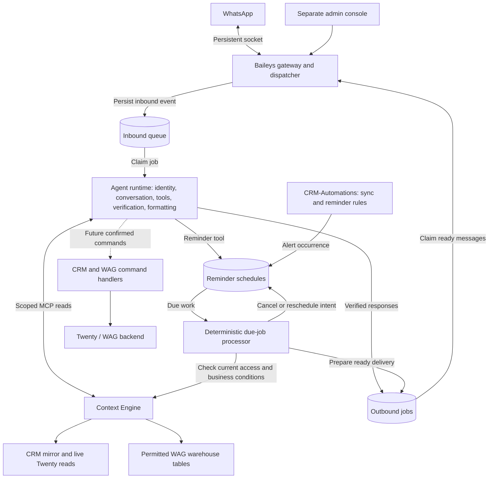
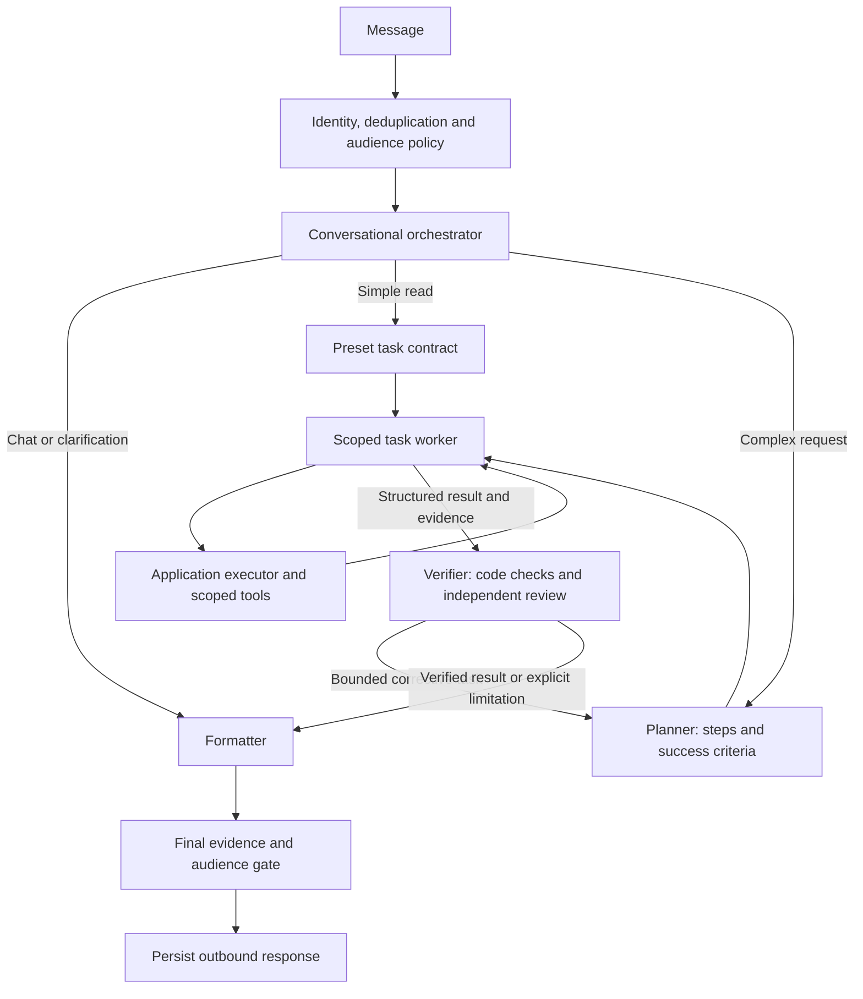
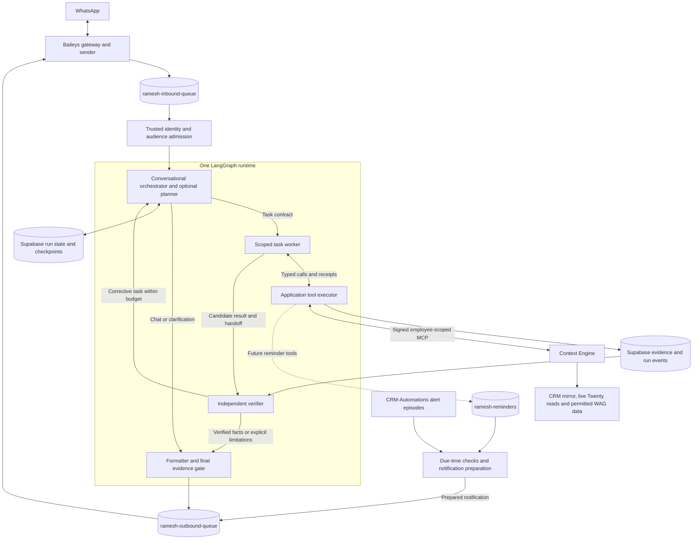

# Ramesh: assistant architecture and implementation plan

Updated: **2 October 2026**

Status: **Living design informed by the Factory talk; module specifications prepared first, personal-assistant tool loop implemented, and real-data capture harness verified. The production read pilot remains disabled by default.**

This document consolidates the discussion about moving WareOnGo's basic OpenClaw assistant functions into the in-house Baileys bot. It covers CRM and supply reads, the conversational agent loop, reminders and escalation, later writes, migration, and evaluation.

The conversational pilot, separate inbound/outbound queues and MCP services are implemented. Sections 18–20 describe those foundations. Section 21 preserves the optional OAuth adapter; section 22 defines the preferred signed first-party integration with no employee enrollment. The current checkout adds a personal chief-of-staff tool loop with employee-scoped company tools, deterministic source checks, independent final answer review and a Supabase run journal; see [the personal-assistant runbook](sales-manager-agent.md) and section 25. Separate planner/worker/verifier roles, private media and inbound batching are implemented locally in modules 29–32. Durable paused tasks, reminders and writes remain proposed. Repository observations do not establish current live CRM or scheduler behavior.

The current test choice is real Supabase and Context Engine as Raghav, with isolated capture queues and no Baileys delivery. Section 24 and the [live-data runbook](live-data-playground.md) document that implemented path. The synthetic SQLite GUI/evaluations remain optional fixtures.

**Latest architecture draft:** [section 23](#23-agent-architecture-draft-informed-by-the-factory-talk) adapts the linked video's transcript to Ramesh, with a system diagram, role boundaries, task contracts, persistence, recovery, and an implementation sequence. Sections 6 and 8 incorporate that direction. This revision documents a proposal; it does not activate business tools or change production behavior.

The [module specifications](agent-modules/README.md) expand this design into separate interfaces, ownership, lifecycle, failure handling, acceptance cases and implementation dependencies for each sub-module. They were prepared before starting the first CRM-read implementation.

## 1. Requirements and recommended decisions

### Confirmed requirements

- Build on the existing Ramesh Baileys worker, which currently replies to DMs and genuine group mentions.
- Provide CRM reads first, with controlled CRM writes later.
- Interface with the supply database represented by WAG Dashboard listings.
- Support lead reminders, SLA breach alerts, and escalation reminders.
- **Escalate to the lead's assignee(s) first, then the existing CRM admin recipients.** The user explicitly selected this over introducing a team-manager hierarchy.
- **Defer dedicated domain-backend read endpoints.** Reuse Context Engine's existing scoped database and live-source reads for the first version; migrating those reads behind CRM/WAG/HRMS backend APIs is later integration hygiene.
- **Identify employees from their WhatsApp phone identity and the active employee roster.** Apply current employee permissions to every business operation; recognising a phone number does not grant organisation-wide access.
- Preserve the employee-scoped access and organisation-safe group-output direction recorded in [CONTEXT.md](../CONTEXT.md).
- Use **OpenAI `gpt-5.6-terra` with LangGraph**, initially only a converser and formatter. Build planner, worker, and verifier agents later.
- Keep local conversation tests and the fake chat GUI on isolated **SQLite with captured delivery**. Test queue SQL separately against local PostgreSQL; do not send real WhatsApp test messages.
- Keep explicit Supabase table names **`ramesh-inbound-queue`** and **`ramesh-outbound-queue`**. Scaffold Context Engine MCP services now without activating business reads.
- Escalate SLA reminders to **assignee(s), then existing CRM admins**; no manager hierarchy is required for the first version.

### Recommended architecture

| Decision         | Recommendation                                                                                          | Reason                                                                                               |
| ---------------- | ------------------------------------------------------------------------------------------------------- | ---------------------------------------------------------------------------------------------------- |
| Read integration | Scaffold Context Engine MCP services now; connect the worker later                                      | Reuses employee scopes, record access, projection, and freshness through the existing MCP catalogue. |
| Agent runtime    | One LangGraph runtime with a conversational orchestrator, scoped workers and an independent verifier    | Shared task state keeps delegation and recovery inspectable without extra services.                  |
| Planning         | A preset contract for simple reads; an explicit plan and contract for complex requests                  | Define successful outcomes before execution without adding a planning call to every message.         |
| Execution        | Application code executes approved tools                                                                | Identity, permissions, destinations, and side effects remain enforceable.                            |
| Verification     | Code checks every tool outcome; a fresh model context reviews complex business answers                  | Source evidence establishes facts; independent review checks whether the request was fulfilled.      |
| Reminder rules   | Keep CRM rules in CRM-Automations                                                                       | Reuse the existing sync, ownership logic, and activity clocks.                                       |
| Delivery         | A durable notification queue consumed by Ramesh                                                         | Supports restarts, deduplication, failure tracking, and controlled retries.                          |
| Future writes    | Narrow commands through Twenty and the WAG backend                                                      | Preserve the systems that own business validation and records.                                       |
| Deployment       | Extend the existing worker with modules; retain the separate admin app                                  | These boundaries do not initially require more independently deployed services.                      |
| Persistence      | Keep SQLite for WhatsApp session state initially; use private Postgres tables for shared workflow state | CRM-Automations and the bot need durable coordination.                                               |

OpenAI Terra/LangGraph, the queue split and MCP reads are selected. Ordinary chat has two stages. This checkout adds a disabled-by-default personal-assistant tool loop with trusted identity, signed requests, source validation, independent answer review and durable private delivery. See the [personal-assistant runbook](sales-manager-agent.md) for the implemented subset. Service-key setup and future worker integration replace employee OAuth enrollment. Exact notification cadence and write policies remain open.

The deferred endpoint refactor applies to the internal implementation of business reads. Ramesh still calls bounded, employee-scoped Context Engine tools. Later CRM writes must use Twenty, and supply changes must preserve WAG's validation and review paths. HRMS remains a future integration whose capabilities and permissions need mapping.

## 2. Organisational context

WareOnGo connects warehouse supply with demand. Field teams capture property details; the supply and operations teams review listings; salespeople work requirements, shortlists, proposals, visits, negotiations, and follow-ups.

Ramesh's useful end-to-end journey is:

> What needs my attention? → Understand the lead → Find suitable supply → Follow up → Record the outcome.

The authoritative systems remain:

| Information                                                                           | Authority                               |
| ------------------------------------------------------------------------------------- | --------------------------------------- |
| Employee identity and current application capabilities                                | Shared `VerifiedNumber` roster          |
| CRM opportunities and CRM activities                                                  | Twenty CRM                              |
| CRM mirror, observed transitions, sync checkpoints, and compliance calculations       | CRM-Automations                         |
| Warehouse listings and their review/write workflows                                   | WAG backend and shared warehouse tables |
| Sanitised, employee-authorised read interface                                         | Context Engine                          |
| Conversation state, action proposals, personal reminders, and WhatsApp delivery state | Ramesh                                  |

An employee's personal bot task is distinct from a Twenty CRM task. A reminder acknowledgement is distinct from recording sales activity or completing a CRM task.

## 3. Current implementation and reusable components

### 3.1 Baileys Ramesh worker

The existing TypeScript worker provides:

- DM and genuine group-mention eligibility, including bot phone/LID mention handling.
- Encrypted Baileys credentials and Signal-key storage in SQLite through Prisma.
- Separate durable inbound/outbound queues, reconnect handling, bounded admission, send deadlines, and cancellation of unsent replies.
- OpenAI Terra converser/formatter nodes, bounded process-local memory, an isolated SQLite chat GUI, and a live-model evaluation harness.
- Context Engine MCP services with signed employee binding and read-only discovery; the current composition exposes all employee-permitted reads when explicitly enabled.
- Trusted phone/LID resolution to the active roster and a signed request adapter; the earlier OAuth lifecycle implementation remains optional.
- A separate Next.js admin application for pairing, status, and connection controls.
- One send attempt per claimed greeting; uncertain sends retain the claim. This is not a delivery guarantee.

Production uses PostgreSQL message state, encrypted inbound/outbound payloads, leases, restart recovery, and explicit uncertain-send handling. The agent atomically saves the final reply in `ramesh-outbound-queue`; the sender delivers the stored text without another model call. The original `hello` remains only the no-key fallback. This supports immediate quoted replies, not yet general reminders or proactive notifications. Both queue migrations are provisioned and the implementation has deployed successfully.

The domain handler receives a `GreetingCandidate`, now extended with text and the transport sender ID for the first conversational implementation. Its reply callback is bound to the original chat. The optional two-node LangGraph flow and bounded in-process conversation history are described in section 18; the Supabase inbox now supplies persistent recent context in the running worker. Employee authority is injected outside model state into the opt-in first CRM-read route. General checkpoints and proactive notification delivery remain future work.

Processing is currently serialised per account across the two queue stages. A slow model request can hold up other conversations. Separate table responsibilities do not yet introduce independent processes or concurrent agent runs; per-conversation ordering with bounded concurrency is a later extension.

Sources: [composition root](../src/app/application.ts), [message mapper](../src/infrastructure/whatsapp/message.mapper.ts), [greeting contract](../src/modules/greetings/greeting.types.ts), [WhatsApp client](../src/infrastructure/whatsapp/baileys-client.ts), [session adapter](../src/infrastructure/whatsapp/baileys-session.ts), [current implementation](current-implementation.md).

### 3.2 Context Engine

Context Engine already exposes read-only REST and MCP interfaces for:

- Reviewed organisational knowledge.
- Warehouse filters, search, detail, and summaries.
- CRM filters, search, detail, summaries, briefings, and related notes/tasks/company/stage history.
- `assess_shortlist`: a requirement checklist and comparison against up to five selected warehouses.

Current access rules distinguish ordinary employees from Analysts and roster admins. Standard employee CRM visibility is based on verified creation or assignment; Analysts/admins can have all-lead access. Warehouse access requires the appropriate dashboard/admin capability. Credentials narrow current permissions.

The REST API accepts employee context keys. Claude retains OAuth at `/mcp`. Ramesh uses a parallel `/mcp/ramesh` route with signed employee-scoped requests, current roster authorization and a Supabase nonce cache. A raw REST key is not an MCP credential.

The service also returns source status, bounded results, redacted narrative context, and uncertainty evidence. The inspected implementation refuses CRM reads when the opportunity sync is unhealthy or older than 30 minutes; note/task stream degradation is reported separately.

Sources: [README and API catalogue](../../Context_Engine/README.md), [authentication](../../Context_Engine/src/lib/auth.ts), [API dispatch/freshness](../../Context_Engine/src/lib/api.ts), [MCP catalogue](../../Context_Engine/src/lib/mcp.ts), [shortlist assessment](../../Context_Engine/docs/shortlist-assessment.md).

### 3.3 CRM-Automations

The existing Express service handles RFQ intake and sales compliance. Its documented schedules use Supabase `pg_cron` and `pg_net` to invoke HTTP workers, with delta sync every ten minutes and a nightly reconciliation.

It mirrors opportunities and polls notes/tasks as separate streams. It calculates `lastMeaningfulUpdateAt` because Twenty's generic `updatedAt` is not a reliable signal of sales activity. It also tracks `stageEnteredAt`, observed stage transitions, and per-stream checkpoints.

Morning briefings use assignee-based ownership. Admin briefings include SLA breaches. Existing recipient resolution provides a starting point for the agreed assignee-to-admin escalation path.

Sources: [README](../../../CRM-Automations/README.md), [sync service](../../../CRM-Automations/src/services/sync.service.js), [SLA rules](../../../CRM-Automations/src/lib/sla.js), [recipients](../../../CRM-Automations/src/lib/recipients.js), [morning briefing](../../../CRM-Automations/src/services/morning-briefing.service.js), [admin briefing](../../../CRM-Automations/src/services/admin-briefing.service.js).

### 3.4 WAG backend

The WAG backend already owns warehouse validation, capability checks, audit, staging, review, and promotion. Future bot submissions and changes should enter its appropriate business path. Current staging supports a configured auto-approval path, so the bot must not assume every submission necessarily waits for manual review.

For reads, use Context Engine's permitted warehouse projections. Raw dashboard responses and database rows contain fields beyond the assistant's current read contract.

Sources: [schema](../../Backend_Repository/prisma/schema.prisma), [warehouse routes](../../Backend_Repository/src/routes/warehouse.js), [staging routes](../../Backend_Repository/src/routes/staging.js), [staging service](../../Backend_Repository/src/services/stagingService.js), [capability resolution](../../Backend_Repository/src/utils/access.js).

### 3.5 Existing logistics/OpenClaw bot

The current code has moved warehouse data entry to Scout, although its README still describes the earlier ingestion flow. The OpenClaw bridge already implements bot-owned conversation history, sticky sessions, personal tasks, reminders, media/voice handling, and named supply queries.

Reuse the product behaviour selectively. The existing implementation parses action directives from generated prose; the in-house runtime should use structured tool calls with validated results. The old reminder implementation imposes a 24-hour scheduling cap and marks reminders sent before the provider call. Neither behaviour should be copied into the new domain design without review.

Sources: [current routing](../../../whatsapp-logistics-bot/src/routes/whatsapp.js), [OpenClaw bridge](../../../whatsapp-logistics-bot/src/services/openclawService.js), [conversation storage](../../../whatsapp-logistics-bot/src/services/conversationService.js), [reminders](../../../whatsapp-logistics-bot/src/services/reminderService.js), [tasks](../../../whatsapp-logistics-bot/src/services/taskService.js), [named database queries](../../../whatsapp-logistics-bot/src/services/dbReadService.js).

## 4. Proposed system boundaries

### System design from the discussion

The diagram below was supplied on 1 October 2026. It captures durable queues, one agent runtime and employee-scoped reads through Context Engine. The queues, converser, formatter, identity resolver and signed credential adapter are implemented, along with one fixed CRM read and deterministic verifier. General tool-using agents remain deferred. Dedicated domain read endpoints remain deferred.


Interpret the diagram's shorthand as follows:

- **User phone number for auth scope:** application code resolves the trusted WhatsApp sender to an active employee and supplies that employee's authenticated Context credential. A phone number passed as a tool argument alone does not establish access.
- **Database as source of truth:** Supabase holds the shared read data and bot workflow state. CRM records in that store are a mirror; Twenty remains authoritative for CRM records and writes. HRMS is a future integration, not a claim that its data is already available here. The ownership table in section 2 defines the current authorities.
- **Converser-to-formatter shortcut:** use it for greetings, help, and clarification. Business facts and actions follow the scoped tool and verification path; simple tool requests can skip explicit planning.
- **Outbound queue:** holds prepared delivery work and supports delayed availability. The proposed reminder service keeps editable schedules separately and prepares delivery after due-time checks, as expanded in section 9.

### Processing and delivery details



Baileys owns the persistent WhatsApp connection for both incoming and outgoing messages. The agent runtime claims inbound work, applies identity/audience policy, executes bounded tools, verifies results, and queues responses. Context Engine owns read authorisation and projection. CRM-Automations owns CRM compliance decisions. Source-system handlers own writes.

The queues, conversation/run state, and scheduled reminders can share the existing Supabase/Postgres instance, using tables restricted to their application roles. Keep their database permissions separate from business-data access. The diagram shows logical responsibilities: the agent runtime and due-job processor can start as modules in the existing worker rather than separate deployments. A scheduled intent is claimed by the due-job processor; Baileys only claims messages that are ready and due for transport. A cancellation or reschedule updates the schedule and invalidates any obsolete pending delivery.

Keep Context Engine's current database access underneath its approved tools for now. Dedicated backend read endpoints are deferred and do not block the first CRM assistant milestone.

Keep the worker and admin repositories independent, communicating through versioned HTTP contracts as they do today. Additive worker API changes should precede admin features that depend on them.

## 5. Identity, credentials, and conversation policy

### Inbound identity

Extend the message contract to carry message ID, bot account, chat ID, sender identifiers, text, timestamp, mention information, and reply reference. Preserve transport metadata needed to distinguish a DM sender from a group participant.

Resolve:

`Trusted WhatsApp sender → verified phone/LID mapping → active VerifiedNumber.id → current capabilities → employee Context Engine credential`

Use immutable employee IDs internally. A name in a message, WhatsApp display name, or model-generated phone number cannot establish identity. Resolve phone/LID aliases using trustworthy protocol information, and reject ambiguous or missing mappings. Baileys v7 documents separate phone/LID identifiers and alternate sender fields; group resolution must use the participant identity. [Baileys v7 migration guidance](https://github.com/WhiskeySockets/baileys.wiki-site/blob/main/docs/migration/to-v7.0.0.md)

The roster-resolution adapter is implemented: a normalized phone must match exactly one active employee. LIDs require reciprocal mappings already persisted by Baileys; group identity uses the participant. The PostgreSQL adapter selects only four roster columns. Credential use rechecks immutable employee ID, current phone/email, and active status. No persistent identity cache grants permission. The first-read sender now revalidates identity, scope and the saved result before sensitive delivery.

### Employee credentials

For the first-party pilot, use `createSignedEmployeeContextAccess`. A service private key signs each request with the trusted employee identity, body, endpoint, time window and nonce. Context Engine verifies the public key and independently checks the live employee and current permissions. Verify `get_context.employee_id` before business tools. No employee OAuth grant, callback or refresh-token table is required.

The employee-facing identity is the trusted WhatsApp sender. Phone recognition alone cannot authenticate an arbitrary API caller: a valid service signature is also required. The signing key stays on the worker and is inaccessible to the model. The public key is registered only for bounded read scopes. A compromised service key can assert employees, so this design trusts the gateway and requires protected hosts, key rotation and live permission checks.

Claude keeps its existing employee OAuth flow; the older Ramesh OAuth adapter remains optional. Supabase stores only nonce hashes and expiry for signed replay protection. Current identity is checked on each request. Background reminders still need a separately authorized automation workflow, due-time recipient checks and delivery policy; service authentication alone does not authorize proactive sends.

### DM and group boundaries

- Personal CRM/supply results and reminder details go to the authorised employee's DM.
- Group responses are limited to generic acknowledgements/help and explicitly approved group-safe knowledge.
- An employee's access to a record does not authorise publishing that record to everyone in a group.
- Organisation-wide knowledge is not automatically safe for groups with external or unverified members.
- A personal request received in a group can acknowledge there and continue privately after identity resolution.
- Application code chooses the destination. Model tool arguments cannot substitute a different employee or arbitrary chat destination.

Partition conversation state by employee and audience. Do not replay personal history into a group context. Keep business facts short-lived, retain record references where useful, and refresh permissions/source facts before reusing them after access changes.

## 6. Conversational → planner → executor → verifier loop

Use one LangGraph runtime with distinct responsibilities. The converser and optional planner form the **orchestrator**: understand the request, choose a preset workflow or create a bounded plan, and decide what to do with verified results. Workers receive a task-specific context and tool subset. The executor is application code. A verifier evaluates completed work independently. The formatter remains the final language stage.

These roles do not require separate deployments or model providers. Greetings retain the current two-node path. Simple reads use a preset contract and deterministic checks. Complex business requests use explicit planning and a separate verifier model call, with its value measured against the simpler path. The detailed proposed design is in section 23.



| Role                     | Owns                                                                             | Must not own                                                             |
| ------------------------ | -------------------------------------------------------------------------------- | ------------------------------------------------------------------------ |
| Converser / orchestrator | Intent, missing information, routing, task lifecycle and shared state            | Employee authority or WhatsApp destination selection                     |
| Planner                  | Typed steps, dependencies, expected evidence and success assertions              | Changing server policy or removing failed assertions to claim completion |
| Worker                   | Bounded tool selection and a structured result for one assigned task             | Other workers' private context, credentials or raw database access       |
| Executor                 | Tool allowlist, argument validation, current access checks, budgets and receipts | Treating a model's approval as authorization                             |
| Verifier                 | Assertion outcomes, evidence gaps and a scoped correction request                | Granting permissions, sending messages or repeating uncertain writes     |
| Formatter                | Clear WhatsApp wording from an authorized result bundle                          | Adding business facts or changing names, dates, amounts and caveats      |

Persist the plan, contract version, concise decisions, evidence references and handoffs. Do not store private model reasoning. Employee identity, credentials, approval state and delivery destinations remain runtime-controlled fields. Worker and verifier prompts are assembled separately; the verifier receives the request, contract and source evidence without the worker's reasoning history.

### Route by task complexity

| Request                                                   | Recommended path                                                                                             |
| --------------------------------------------------------- | ------------------------------------------------------------------------------------------------------------ |
| Greeting or help                                          | Conversation or template → reply                                                                             |
| “What follow-ups do I have today?”                        | Interpret → scoped CRM query → validate assignment/date/coverage → reply                                     |
| “Find options for this lead and explain the best matches” | Read lead → establish requirements → search supply → assess shortlist → investigate material gaps → reply    |
| “Move this follow-up to tomorrow”                         | Resolve record/date → prepare change → apply confirmation policy → execute → verify persisted result → reply |
| Scheduled SLA breach                                      | Rules → durable alert/notification → dispatch → track delivery and escalation                                |

Dependent steps run sequentially. Independent authorised reads can run concurrently. Preserve order within each conversation while allowing bounded concurrency between conversations. Use a separate global outbound limiter so model latency does not occupy the send queue.

### Bounded execution and failure behaviour

- Set limits on tool steps, elapsed time, retries, response size, and model spend.
- A permission denial stops the denied operation; it does not trigger attempts through another credential or interface.
- A transient read failure may receive a bounded retry. An ambiguous record or date requires clarification.
- Empty, partial, stale, and unavailable results are distinct outcomes.
- A write timeout enters reconciliation because failure to receive a response does not establish that nothing changed.
- Retrieved notes, documents, group text, and tool output are untrusted data. They cannot expand permissions or rewrite the execution policy.
- Completion, waiting for input, cancellation, failure, and reconciliation must be explicit persisted states.

Keep the incoming-message freshness rule separate from workflow deadlines and reminder due times. An accepted job and a future scheduled reminder have different lifecycles from historical WhatsApp messages.

## 7. Tool interface and read workflows

Use a focused catalogue over Context Engine, exposing relevant capabilities for the current employee and task. Each tool needs a distinct purpose, input validation, bounded output, consistent errors, and documented interpretation limits.

| Capability                          | Existing Context Engine interface                                               |
| ----------------------------------- | ------------------------------------------------------------------------------- |
| Identity/capability discovery       | `get_context`                                                                   |
| CRM search/filter/summary           | `search_crm_leads`, `crm_filters`, `crm_summary`                                |
| Lead detail and history             | `read_crm_lead`, `read_crm_lead_context`                                        |
| CRM briefing                        | `crm_briefing`                                                                  |
| Supply search/filter/summary/detail | `search_warehouses`, `warehouse_filters`, `warehouse_summary`, `read_warehouse` |
| Lead-to-property comparison         | `assess_shortlist`                                                              |
| Reviewed company guidance           | `search_knowledge`, `read_knowledge`                                            |

These are the MCP tools represented by the repository's read-only service scaffold. Context Engine also exposes related REST endpoints, but MCP is the selected Ramesh adapter. The general read graph is connected behind the feature flag; the fixed query is now a regression preset; see section 20 for discovery, employee binding, and the callable service contract.

The executor injects the actor, credential, run ID, and audience. Model-selected arguments contain domain inputs such as lead ID, city, area, or date filters. Do not expose arbitrary SQL, arbitrary HTTP destinations, shell execution, or a general send-message tool.

Preserve source timestamps, record references, pagination/coverage, field evidence, and verification flags. Counts must use full summaries or completed pagination; a page length is not a total. Warehouse area options are alternatives, not additive space. Missing units and approximate specifications remain uncertain.

### Personal briefing requires a narrower view

The existing `my-briefing` uses accessible records. For Analysts, that can include the organisation's whole pipeline. For standard employees, visibility can include records they created but are no longer assigned to.

Responsibility and read visibility therefore need separate treatment. Use `view=assigned` for supported search/summary requests and add an explicit assigned-only briefing mode before presenting the current briefing as “my work”. This mode is not implemented in the inspected briefing endpoint.

## 8. Verification design

### Operational verification

Use code and source observations to establish:

- Correct actor, authorised record, and permitted output audience.
- Successful tool execution with a valid response schema.
- Source freshness and sufficient coverage for the requested claim.
- Matching dates, units, filters, and recorded facts for deterministic comparisons.
- Persisted state matching the approved change after a mutation.
- A recorded reminder/job before telling the employee it has been scheduled.

Verify writes against the authoritative system. A successful Twenty write can precede the CRM mirror update; a stale mirror must not trigger a duplicate write. Separate committed-but-not-yet-verified, confirmed, failed, and uncertain outcomes.

### Independent task verification

Define success assertions before the worker starts. For a simple read, use an application-owned preset contract. For a complex request, the planner adds request-specific assertions to mandatory server rules. Workers cannot edit those rules. If clarification changes the objective, version the contract and keep the change attributable.

The complex path uses a separate model context to assess unsupported conclusions, missing requirements and uncertainty against that contract. Its input is the request, contract, candidate result and executor-recorded evidence. It does not inherit the worker's reasoning or accept the worker's claim of success as proof. The proposed verdict is `pass`, `repair`, `needs_input`, or `blocked`, with assertion IDs and evidence references.

Application checks remain authoritative for identity, scope, freshness, pagination coverage, persisted effects and delivery audience. A model can reject an incomplete answer; it cannot override a failed access check or prove a write succeeded. When independent source rechecks are needed, the runtime grants only bounded, read-only tools under the same employee authority.

Allow at most a configured number of corrective passes. Unavailable data leads to an explicit limitation, and ambiguous entities lead to clarification. Do not repeatedly regenerate an answer until a judge happens to pass it. Compare this path with deterministic-only verification in the evaluation harness before broad rollout.

Formatting happens after task verification, so it needs its own final gate. Render IDs, dates, amounts and immutable fact fields from the verified bundle; check scope, length and style in code. Open-ended wording that introduces a new factual claim must return to evidence review. A pre-format verifier cannot guarantee a later model preserved meaning.

## 9. Reminders, SLA breaches, and escalation

### Separate clocks

| Clock                     | Meaning                                                    |
| ------------------------- | ---------------------------------------------------------- |
| `nextFollowUp`            | A CRM follow-up date becoming due or overdue               |
| `stageEnteredAt`          | Time in the current CRM stage                              |
| `lastMeaningfulUpdateAt`  | Qualifying recorded activity for inactivity/hygiene checks |
| Personal reminder `dueAt` | The time requested in “remind me tomorrow at 11”           |

Store instants in UTC and interpret employee-facing dates with `Asia/Kolkata`. Date-only follow-ups and time-specific personal reminders need explicit, different due-time semantics. Resolve relative dates using server time; clarify genuinely ambiguous requests.

Acknowledging or snoozing an alert changes notification state. It does not itself change CRM, count as sales activity, or reset the stage clock. A qualifying note can resolve an inactivity condition while a stage SLA breach remains open.

### Reminder tools and scheduled outbound jobs

Creating, listing, changing, snoozing, and cancelling personal reminders are bot-owned tool operations. A simple request can invoke the tool directly after clarification; the optional planner is useful when the request spans several steps. Persist the reminder before confirming that it is set. These operations do not require CRM write access unless they also change a CRM record.

The selected draft uses a separate `ramesh-reminders` schedule store and the existing `ramesh-outbound-queue` for prepared delivery. A schedule contains a stable ID, the requesting employee, an authorised recipient reference, linked business record/rule where relevant, due time, deduplication key, status, and version. The server supplies identity and routing fields. Reminder edits or cancellations invalidate any prepared delivery for the older version. This is a future migration, not an existing table.

`SCHEDULED → due-time checks → READY → SENDING → SENT`

The due-job processor claims due work under a lease and can cancel, reschedule, or mark it ready. CRM-linked reminders retain their intent and record references so current ownership, access, source freshness, and the outstanding condition can be checked at delivery time. A personal reminder may keep the employee's requested text. Baileys consumes only ready, due messages; a timestamp in a row needs an active processor to cause delivery.

Conversational tools and scheduled CRM-Automations evaluations are two producers of notification intents. CRM-Automations remains the owner of SLA alert episodes; the bot's schedule references the episode and occurrence rather than duplicating the rule state. Automatic SLA discovery must run without an incoming chat message. Delivery and due-time checking use deterministic code and do not require a new model conversation for each tick.

The outbound queue can still delay a prepared message until its availability time. That timestamp alone does not provide reminder edits, cancellation, recurrence, access rechecks or breach resolution. Separating the schedule keeps these business decisions visible. Current immediate-reply expiry rules also need an explicit reminder job kind before long-lived notifications can be enabled.

### Deterministic evaluation

CRM-Automations should evaluate CRM conditions using its existing sync and scheduler. Reuse `pg_cron`/`pg_net` or an equivalent durable invocation path for business scheduling; avoid creating another independent Twenty poller inside Ramesh.

1. Check relevant source-stream health and freshness.
2. Evaluate the current rule and identify a stable alert episode.
3. Resolve current assignee(s) through unambiguous roster/CRM mappings.
4. Persist alert state and a notification intent durably before delivery.
5. Notify the assignee(s).
6. Re-evaluate after the configured grace period and escalate unresolved episodes to the existing CRM admins.
7. Cancel or resolve obsolete work after a stage change, reassignment, closure, relevant activity, or other rule-specific resolution.

Use the existing admin-recipient policy as the starting point, but resolve WhatsApp destinations to active, authorised roster identities. The existing email fallback list is not itself a WhatsApp identity or permission grant. Surface missing/ambiguous recipient mappings as routing issues rather than guessing a phone number or first-name match.

Notification cadence, quiet hours, grace periods, and caps remain configurable product decisions. Existing morning-email schedules do not by themselves define WhatsApp escalation timing. Later-stage deals without an SLA timer must not acquire one implicitly.

### Alert state and delivery state

An alert episode represents the underlying business condition. Its acknowledgement, snooze, resolution, and escalation level are independent of individual delivery attempts.

Use a stable notification key incorporating the rule, entity, episode, recipient, escalation step, occurrence, and policy version. Repeated evaluator ticks should find the same occurrence; a new daily reminder or a genuinely new breach episode can create a different one.

Delivery needs phases such as `SCHEDULED`, `READY`, `SENDING`, `SENT`, `FAILED`, `DELIVERY_UNCERTAIN`, `CANCELLED`, and `EXPIRED`, with lease ownership and expiry for claimed work. Record provider message IDs and receipts where available. Provider acceptance, delivery, and reading are distinct facts.

Use leases for worker recovery. Retry demonstrably safe failures with backoff. A timeout or crash around an external send may leave an uncertain outcome; reconcile or require an explicit recovery decision instead of blindly resending. A queue alone cannot promise exactly-once external delivery.

Keep WhatsApp transport policy inside the delivery adapter. The old bot's 24-hour cap is not the domain model for reminders. Any future official-provider adapter needs its own verified session/template rules; a provider switch is not part of this proposal.

## 10. Existing inconsistencies to resolve

| Finding                                                                                                                              | Required treatment                                                                      |
| ------------------------------------------------------------------------------------------------------------------------------------ | --------------------------------------------------------------------------------------- |
| SLA thresholds are duplicated in CRM-Automations and Context Engine                                                                  | Centralise or version the policy and test consumers against the same fixtures.          |
| Missing stage timestamps become green in CRM-Automations but unknown in Context Engine                                               | Choose an explicit unknown/data-quality policy before sending breach alerts.            |
| SLA grading floors elapsed days, while the displayed deadline adds a day threshold directly                                          | Define the exact breach instant and align grading, labels, and scheduled notifications. |
| First-observed stage dates can be approximate baselines                                                                              | Preserve uncertainty; do not describe observed history as complete source history.      |
| Current briefing scope is accessible records                                                                                         | Add an assigned-only responsibility view for personal work lists.                       |
| Human changes made through an API do not currently advance the meaningful-activity clock                                             | Add trusted human-action attribution and reconciliation before enabling CRM writes.     |
| Old reminders mark sent before provider execution and may return prose after a persistence failure                                   | Report success only from recorded outcomes; add durable send/recovery states.           |
| Current `/rfq` route has no route-level authentication                                                                               | Harden it before reusing it as a bot command entry point.                               |
| Manual admin flags and automatic closure-checklist triggers depend on absent Twenty fields, according to the inspected CRM code/docs | Define and implement the source fields/triggers before promising those workflows.       |

Current SLA configuration uses the following integer-day thresholds. These are existing grading parameters, not newly approved deadlines:

| Stage           | Green maximum | Yellow maximum |
| --------------- | ------------- | -------------- |
| New Lead        | 1             | 2              |
| RFQ Received    | 1             | 2              |
| Proposal Shared | 3             | 5              |
| Follow-ups      | 3             | 5              |
| Site Visit      | 1             | 3              |

Negotiation, Agreement Work, and Money Collection have no SLA timer in the current rules. Irrelevant, lost, closed, and on-hold stages are excluded from active tracking. Because the current calculation floors elapsed days and uses inclusive comparisons, the threshold numbers must not be casually translated into exact-hour deadlines.

Sources: [SLA calculation and labels](../../../CRM-Automations/src/lib/sla.js), [Context Engine briefing](../../Context_Engine/src/lib/data.ts), [RFQ route](../../../CRM-Automations/src/routes/rfq.routes.js), [closure checklist](../../../CRM-Automations/src/services/closure-checklist.service.js).

## 11. Future writes

Keep Context Engine's current read-only boundary. Introduce narrow authenticated commands in CRM-Automations and the WAG backend, with distinct write permissions.

Suggested first CRM commands are `add_lead_note`, `set_next_follow_up`, and `log_contact_outcome`. Stage changes, reassignment, and warehouse edits can follow after the command mechanism is proven. These names describe proposed capabilities, not existing endpoints.

For the initial rollout:

`Interpret → resolve exact record → prepare proposed change → employee confirmation → revalidate → execute → verify → report`

Persist the proposal with the actor, target, exact payload, expected source state/version, expiry, and operation ID. Bind confirmation to that proposal. A changed payload or material source conflict requires a new preview; a stale “yes” must not authorise another action.

Before execution, recheck active identity and write authorisation, validate fields, and detect stale proposals. Verify the deployed Twenty API's conditional-update/concurrency capabilities before claiming atomic conflict protection. Serialising bot writes alone cannot prevent conflicting edits from the CRM UI or another integration.

Use stable idempotency keys and retain command outcomes across retries and duplicate WhatsApp events. Reconcile uncertain writes before repeating them. Multi-command requests need explicit partial-success reporting; cross-system operations should not be described as one transaction unless they actually are.

Write through Twenty, never directly into the opportunity mirror. Refresh through the owning sync path as appropriate, and tell the user if a verified write is still waiting to appear in mirrored reads. Supply writes use the appropriate WAG validation, audit, and review path.

### Human activity attribution

CRM sync currently recognises `updatedBy.source === MANUAL` for meaningful activity, including note/task streams. A genuine employee update submitted through Ramesh will travel through an API.

Add a trusted action ledger recording the employee, confirmed command, source object ID, operation ID, timestamp, and verified result. CRM-Automations should recognise qualifying successful employee actions through this ledger. Do not simply count every API write as meaningful or mislabel API traffic as manual source activity.

Automated notifications, counter maintenance, and acknowledgement/snooze operations must not advance the sales activity clock. Preserve separate rules for stage ageing and inactivity. Source: [sync service](../../../CRM-Automations/src/services/sync.service.js).

## 12. Persistence, modules, and operations

### Suggested worker modules

```text
src/modules/
  identity/          Sender links, roster resolution, employee credential binding
  conversations/     Conversation state, audience separation, pending input
  assistant/         Model adapter, bounded loop, optional planning, response composition
  tools/             Approved tool catalogue and validated execution
  verification/      Result contracts, evidence checks, optional quality review
  notifications/     Personal reminders, queue consumption, delivery and recovery
  actions/           Proposals, confirmations, command dispatch and reconciliation

src/infrastructure/
  whatsapp/          Existing connection adapter plus controlled outbound delivery
  context-engine/    Scoped MCP client and read-only domain services
  database/          Bot-owned repositories and migrations
  http/              Versioned operational and integration contracts
```

These are proposed locations, not files created by this document. Keep business logic in the system that owns it; the worker's action module dispatches CRM/WAG commands rather than duplicating their validation.

### Minimum durable entities

| Entity                                 | Purpose / proposed owner                                                                      |
| -------------------------------------- | --------------------------------------------------------------------------------------------- |
| Identity link and credential reference | Employee-to-WhatsApp association; bot-owned, with current roster revalidation                 |
| Inbound message / run                  | Duplicate admission, run status, deadlines, and safe resumption; bot-owned                    |
| Conversation                           | Bounded context separated by employee and audience; bot-owned                                 |
| Tool/action event                      | Operation, actor, record references, result, and verification status; executing service       |
| Personal reminder                      | Due time, owner, linked entity, and cancellation state; bot-owned                             |
| Alert episode                          | Rule condition, acknowledgement/snooze, resolution, and escalation state; CRM-Automations     |
| Notification intent / delivery attempt | Durable handoff, deduplication, lease, provider reference, and outcome; bot delivery boundary |
| Action proposal                        | Exact pending change, confirmation binding, expiry, and source preconditions; bot-owned       |

These are logical entities, not a requirement for one table per row. The latest draft separates reminder schedules from prepared outbound messages and adds explicit task-run and event records; section 23 names those proposed tables. Alert episodes remain owned by CRM-Automations.

Use additive private Postgres tables and explicit producer/consumer contracts. Assign one migration owner per table; do not apply an introspected shared Prisma schema as a bot migration.

Persist alert transitions and their notification intents atomically where the shared database permits it. If the handoff crosses an HTTP/service boundary, use a producer outbox and an idempotent consumer so a process failure cannot silently lose the notification.

Retain encrypted Baileys auth in the current local store initially, with existing backup/recovery practices. Keep one active socket owner per linked account. Durable workflow storage does not replace the persistent WhatsApp process.

### Admin and observability

Extend the existing admin console with employee links and credential health, active runs, pending confirmations, queue age, failed/uncertain sends, alert state, and attributable action history. The operator login remains separate from employee CRM authority.

Record correlation IDs, selected tools, permitted record IDs, errors, latency, token/cost usage, source freshness, and delivery outcomes. Keep secrets and unnecessary contact/record bodies out of logs. Define retention and access for conversation data and audit records.

Operational metrics should distinguish model failures, tool/source failures, stale sync, denied access, queue backlog, and transport disconnection. A useful first recovery view shows jobs waiting longest and commands with uncertain outcomes.

## 13. Migration from OpenClaw

Port behaviour incrementally: scoped reads, supply assistance, personal reminders/tasks, then controlled CRM writes. Media, voice, content-generation specialists, and spreadsheet cleanup can remain separate later work.

For pilot employees, establish the new immutable identity mapping before moving phone-keyed data. Decide which pending personal reminders and open bot tasks to migrate; conversation history and attachments do not need automatic wholesale migration.

Use legacy IDs as migration deduplication keys and define a cutover point. Each reminder must have one delivery owner so the old Twilio poller and the new Baileys dispatcher cannot both fire it. Keep the Scout entry path available throughout the transition.

Replace text-embedded action directives with structured tool calls. Report scheduling or task changes only after persistence succeeds. Current bot tasks remain separate from CRM tasks unless the employee explicitly invokes a CRM command.

## 14. Research informing the design

Primary sources were reviewed during the discussion on 1 October 2026. Their recommendations and benchmark findings inform this design; the proposed Ramesh architecture still needs evaluation on WareOnGo's own tasks.

- **Start with a capable single agent and distinct tools.** OpenAI recommends increasing orchestration complexity after instruction complexity or tool confusion demonstrates a need. This supports testing one conversational agent first. [A practical guide to building agents](https://openai.com/business/guides-and-resources/a-practical-guide-to-building-ai-agents/)
- **Combine fixed workflows with dynamic planning.** Anthropic distinguishes predefined execution paths from model-directed tool use and recommends evaluator–optimizer loops when criteria are clear and refinement measurably helps. This supports direct paths for common lookups and planning for involved requests. [Building effective agents](https://www.anthropic.com/engineering/building-effective-agents)
- **Match coordination to task structure.** Google's January 2026 study of 180 configurations found benefits for parallelisable work and degradation on tightly sequential planning benchmarks. It is evidence for measuring architectural fit, not a universal prediction for CRM assistants. [Towards a science of scaling agent systems](https://research.google/blog/towards-a-science-of-scaling-agent-systems-when-and-why-agent-systems-work/)
- **Planning and verification can help complex analysis.** Google's DS-STAR uses iterative planning, execution, and an LLM verifier for data-science tasks. This motivates experimenting with such a path for involved Ramesh analysis, while recognising the different domain. [DS-STAR](https://research.google/blog/ds-star-a-state-of-the-art-versatile-data-science-agent/)
- **Design tools around useful work.** Anthropic recommends distinct workflow-oriented tools, relevant bounded results, and evaluation-driven refinement. The existing shortlist assessment is a useful local example. [Writing effective tools for agents](https://www.anthropic.com/engineering/writing-tools-for-agents)
- **Separate the model loop, execution, and durable session state.** Anthropic's April 2026 managed-agent engineering account describes these as independently replaceable interfaces. This supports modular boundaries without requiring a matching deployment topology. [Scaling Managed Agents](https://www.anthropic.com/engineering/managed-agents)
- **Pause/resume needs explicit side-effect handling.** LangGraph documents durable checkpoints and warns that resumed nodes can rerun preceding code. Persistence does not remove the need for idempotency and external-operation reconciliation. [Persistence](https://docs.langchain.com/oss/javascript/langgraph/persistence), [interrupts](https://docs.langchain.com/oss/javascript/langgraph/interrupts)
- **Evaluate the actual outcome.** Anthropic distinguishes claimed success from final environment state and recommends code, model, and human graders according to the task. [Demystifying evals for AI agents](https://www.anthropic.com/engineering/demystifying-evals-for-ai-agents)

LangGraph is already selected and used by the two-node pilot. The updated recommendation is a conversational orchestrator, bounded workers, application-controlled execution, independent verification for complex requests, and a deterministic notification workflow. Section 23 records the additional video source and its application to this design.

## 15. Evaluation and acceptance checks

Create a small initial suite of realistic, sanitised conversations and failure cases. Around 20–50 tasks is a useful starting point, consistent with the evaluation guidance above; run repeated trials to expose variability.

Compare:

1. A direct tool loop with code-based verification.
2. The same loop with explicit planning on complex requests.
3. The same loop with an additional model quality reviewer.

Measure task completion, grounded factual accuracy, correct record selection, appropriate clarification, unauthorised disclosure/action attempts, duplicate mutations/sends, latency, tool errors, and cost. Judge valid outcomes rather than forcing one exact sequence of tool calls. Keep held-out cases for architectural/prompt comparisons.

| Area            | Representative acceptance checks                                                                                                                                                          |
| --------------- | ----------------------------------------------------------------------------------------------------------------------------------------------------------------------------------------- |
| Identity/access | Unknown sender, LID-only sender, ambiguous mapping, inactive employee, revoked credential, ordinary versus Analyst access                                                                 |
| Conversation    | Two employees asking concurrently, group-to-DM handoff, ambiguous “that lead”, a delayed confirmation, unrelated new request while a proposal waits                                       |
| CRM reads       | Assigned versus created records, IST day boundary, pagination, empty results, stale mirror, degraded notes/tasks, source permission change during a read                                  |
| Supply          | City aliases, uncertain dimensions, missing fields, alternative area options, incomplete budget units, candidate availability requiring verification                                      |
| Agent behaviour | Wrong tool arguments, misleading CRM notes, tool outage, repeated recovery failure, bounded run termination                                                                               |
| Notifications   | Repeated evaluation tick, duplicate inbound request, restart before send, crash after possible send, inactive/reassigned recipient, resolved breach, snooze, assignee-to-admin escalation |
| Writes          | Exact proposal confirmation, expired/changed proposal, source conflict, duplicate event, uncertain upstream result, source read-back, human-action clock attribution                      |

Code-based checks establish deterministic conditions. Model rubrics assess explanation quality and nuanced completeness, with periodic human calibration. Any model/provider change should run against the same scenario set.

## 16. Delivery milestones

Delivered foundation: two-node Terra/LangGraph conversation, isolated SQLite GUI/evals, separate Supabase queues, MCP services, trusted employee identity and signed credentials. The current checkout implements the first fixed read and run journal, disabled by default; deployment is separate. General worker/verifier integration remains an expansion milestone. Employee OAuth enrollment is not required for the selected path. Section 23 breaks down the first two milestones into implementation increments.

| Milestone                   | Deliverable                                                                                                   | Exit evidence                                                                                                                   |
| --------------------------- | ------------------------------------------------------------------------------------------------------------- | ------------------------------------------------------------------------------------------------------------------------------- |
| 1. Scoped CRM assistant     | Inbound identity, employee credential binding, bounded tool loop, personal CRM reads in DMs                   | Pilot employees can retrieve their assigned follow-ups and lead history; access, duplicates, and group routing pass checks      |
| 2. Supply assistance        | Warehouse search and lead-to-property comparison through Context Engine                                       | Supported answers preserve requirements, uncertainty, and source references                                                     |
| 3. Reminders and escalation | Personal reminders, assigned-lead digests, durable delivery, SLA alert episodes, assignee-to-admin escalation | Preview runs produce correct recipients/timing; restart, duplicate, stale-data, and resolution cases pass before enabling sends |
| 4. Controlled CRM writes    | Confirmed notes, follow-up updates, and contact outcomes through Twenty                                       | Verified source changes, audit, idempotency/reconciliation, and meaningful-activity attribution behave correctly                |

Extend operational visibility with each milestone rather than waiting until the final release. New notification schedules should begin in a non-sending preview mode for review of actual rule outcomes and recipients.

The first business interaction to implement is:

> A verified salesperson DMs “What follow-ups do I have today?” and receives their assigned leads through Context Engine, with the correct IST date interpretation and private delivery.

This establishes the identity, authorisation, execution, evidence, and response path used by the later capabilities.

## 17. Decisions still needed

The architecture is sufficient to begin the first CRM-read milestone. The remaining implementation contracts are:

| Contract                   | Initial direction                                                                                                                                                                             |
| -------------------------- | --------------------------------------------------------------------------------------------------------------------------------------------------------------------------------------------- |
| Identity and permissions   | Resolve trusted sender phone/LID to an active employee, bind that employee's Context credential, and enforce record scope and DM/group policy.                                                |
| Conversation state         | Keep context per employee and audience, retain referenced record IDs for follow-ups, and serialise work within each conversation.                                                             |
| Tool and response contract | Use a small typed catalogue, preserve freshness and coverage, verify tool outcomes, and give explicit clarification/unavailable responses.                                                    |
| Runtime limits             | Terra and the two-node graph are selected; generation deadlines, output bounds, cancellation, and bounded retries exist. Add tool-step and per-person spend budgets when tools are connected. |
| Durable processing         | Inbound/outbound queues, deduplication, leases, finalized replies, and uncertain sends are implemented. Durable conversational/tool-run checkpoints remain future work.                       |
| Scheduled notifications    | Implement reminder tools and due-job checking; reuse CRM-Automations for breach discovery and assignee-to-admin escalation.                                                                   |
| Operational evidence       | Trace message to employee, tools, response and delivery; evaluate permissions, stale data, duplicate events and recovery before expansion.                                                    |

The following product and rollout choices remain open; notification-specific choices need resolution before that milestone, not before basic CRM reads:

- Pilot employee cohort and rollout limits; the selected signed path does not require an employee OAuth callback or enrollment.
- Exact permitted group-knowledge scope and treatment of groups containing external members.
- Whether personal briefing ownership uses strict current assignment only or an explicit unassigned-lead fallback.
- Consistent SLA boundary semantics, missing-clock handling, and the policy distribution/versioning mechanism.
- Notification grace periods, repetition, quiet hours, and maximum daily volume per recipient.
- Which first write commands require confirmation, who can use them, and how conflicts are handled by the deployed Twenty version.
- Retention periods and access controls for conversation data, tool evidence, and audit.
- Which legacy reminders/tasks to migrate and the per-employee cutover plan.
- Which complex request classes justify explicit planning and independent model review at the measured latency and cost.

The escalation destination order is already settled: **assignee(s), then existing CRM admins**.

The dedicated domain-backend read-endpoint refactor is explicitly deferred. The first implementation should preserve the existing Context Engine boundary rather than wait for that cleanup.

## 18. Implemented conversational pilot

The first small implementation is `START → converser → formatter → END` using LangGraph's typed state schema and OpenAI Responses with `gpt-5.6-terra`. The graph prepares text only; the existing reply service or durable consumer owns delivery. Both transport paths use the same assistant service. The OpenAI key is server-side, and normal logs contain stage metrics rather than prompts or message bodies.

The worker's protected EC2 environment and SSM SecureString backup contain the OpenAI configuration. The admin needs no model key. The initial live-model evaluation passed 26/26 trials across 13 synthetic cases; this evidence does not establish future CRM/tool quality.

The converser handles the request with limited recent context. The formatter preserves facts and capability limits while producing short, natural WhatsApp language. A code guard removes em dashes. No CRM, supply, HRMS, reminder, browsing or write tools are connected yet, and the prompts explicitly state those limits. Recognising a transport sender in conversation is separate from the employee authorization adapter in sections 5 and 21.

Runtime controls include a total generation deadline, input/output limits, one SDK retry, a fixed two-node graph with a recursion cap, session cancellation, and a durable lease sized for the full generation/send budget. Memory is partitioned by chat and sender, bounded to 32 messages and 48,000 characters across at most 200 contexts, and expires after 30 idle minutes. It only records replies accepted by the transport and resets on process restart. Graph checkpoints and durable conversation memory are deferred; inbound work may repeat generation after a restart before the atomic handoff, while saved outbound replies survive restarts without regeneration.

The original synthetic path remains `npm run dev:chat`: a loopback dummy chat interface at `http://127.0.0.1:3012` with its own `.local/playground.db` and a capture-only sender. It does not start a WhatsApp socket, load linked-device credentials, or use Supabase. The newer `dev:chat:live` path deliberately uses real Supabase and Context Engine through separate test queues, as described in section 24. Existing production queue configuration is left intact.

`npm run eval:agent -- --trials 3` runs repeated synthetic conversations through a separate SQLite database and the real model. Thirteen scenarios cover tone, Hinglish, drafting, follow-up context, missing tools, adversarial instructions, group privacy and factual preservation. Mechanical checks and a schema-validated model judge produce per-trial reports, prompt/dataset hashes, usage and latency in `.local/evals/`. Reports retain both drafts and final replies for human review; same-model judging and synthetic coverage have limits. Unit/integration tests use model fakes and cover cancellation, isolation, duplicates, failure handling and transport acceptance.

Implementation and commands: [README](../README.md#safe-local-chat-playground). API references: [OpenAI Terra](https://developers.openai.com/api/docs/models/gpt-5.6-terra), [OpenAI text generation](https://developers.openai.com/api/docs/guides/text), and [LangGraph Graph API](https://docs.langchain.com/oss/javascript/langgraph/graph-api).

## 19. Implemented inbound and outbound queues

The production Supabase path now has explicit `ramesh-inbound-queue` and `ramesh-outbound-queue` tables. Baileys persists eligible input with its deduplication record; the agent claims inbound work and atomically stores an encrypted final reply while completing the inbound row. The sender claims due outbound work and sends that exact text. The message lifecycle is `QUEUED → PROCESSING → READY_TO_SEND → SENDING → SENT`. Lease recovery before sending preserves the saved reply; an ambiguous send becomes `UNCERTAIN` and is not retried automatically. Both stages currently share the same connected worker process.

Migration `202610010002` preserves the old job rows by renaming the table. The former `ramesh-message-jobs` name is a compatibility view for the pre-split deployment window. The explicit table names are used by all new runtime queries. Outbound availability timestamps are supported, but the current rows remain immediate quoted replies with the original message expiry; long-lived reminders and business-state revalidation are still separate future work.

Synthetic GUI/model evaluations remain SQLite-based. The queue migration, atomic handoff, crash recovery, lease fencing, due times, encryption, and existing-row preservation are exercised against an isolated local PostgreSQL instance with fake transports. The live-data GUI has additional Supabase capture queues, independent of these production tables. See [the queue contract](supabase-message-queue.md) for table responsibilities, deployment order, and rollback limitations.

## 20. Context Engine MCP service scaffold

The reusable boundary is implemented inside this repository. Its original scaffold was disconnected from chat; the first-read increment now composes it from `createApplication` only when business reads are explicitly enabled; active employees are eligible by default. The separate live playground reuses the scoped reader with a server-pinned employee and captured output; the synthetic playground retains fixtures. No production business read is enabled merely by deploying these files.

| Module                                            | Responsibility                                                                                |
| ------------------------------------------------- | --------------------------------------------------------------------------------------------- |
| `src/app/context-engine.ts`                       | Explicit factory; constructing services opens no connection                                   |
| `src/config/context-engine.ts`                    | Optional endpoint, total deadline, response-byte limit                                        |
| `src/modules/context-engine/context.types.ts`     | Sender/employee grant contracts, resolver port, read-tool allowlist, evidence and safe errors |
| `src/modules/context-engine/context.service.ts`   | CRM, supply and knowledge methods for a bound sender                                          |
| `src/infrastructure/context-engine/mcp-client.ts` | MCP discovery/calls, employee binding, bounded transport and result validation                |

The client uses `@modelcontextprotocol/client` 2.1.0 and Streamable HTTP. Signed credentials require `/mcp/ramesh`; optional OAuth credentials require `/mcp`. HTTPS is required except on loopback. Requests stay on the configured URL and refuse redirects; stdio processes, arbitrary HTTP tools, sampling and consent automation are not exposed.

`ContextCredentialResolver.resolve` is a server-side port implemented by `SignedEmployeeCredentials` for the selected path and `EmployeeContextCredentials` for optional legacy OAuth. The signed factory derives the trusted sender and active employee, rechecks them per POST, and signs a short-lived body-bound request. The MCP client checks binding/expiry and verifies the server employee through `get_context` before any business tool. Identity and secrets stay outside model arguments; only the explicitly enabled first-read route calls this boundary.

One connection and tool catalogue belong to one read operation. There is no cross-employee session, token cache or result cache. The server continues to revalidate current scopes and live record permissions on each read. The first service boundary accepts DMs only; group business reads need an explicit audience policy later. A claimed read-only annotation is insufficient on its own: the tool must also be in the local allowlist and the employee's discovered/scoped catalogue.

Available service methods:

| Family    | Methods / MCP tools                                                                      |
| --------- | ---------------------------------------------------------------------------------------- |
| Discovery | `discover`, `context` (`get_context`)                                                    |
| CRM       | `filters`, `search`, `readLead`, `leadContext`, `summary`, `briefing`, `assessShortlist` |
| Supply    | `filters`, `search`, `readWarehouse`, `summary`                                          |
| Knowledge | `search`, `readPage`                                                                     |

The catalogue now maps to seventeen existing read tools, including the analytics family (`capabilities`, `ga4`, `searchConsole`). The server's discovered input schemas remain the authoritative filter catalogue; service filters are passed through without guessing or coercing business values. GA4 and Search Console reports are included when the registered scopes and current employee permit them. Writes, arbitrary sends and HRMS remain outside the current catalogue. CRM-related context uses one lead ID and one of `notes`, `tasks`, `company` or `stage_history`.

Successful calls preserve the Context Engine envelope: `source_path`, `status`, `data`, and `meta` including `requestId` and `generatedAt`. Nested cursors, source status, coverage, redactions, access scope, field evidence and verification flags survive unchanged. The client validates the envelope; tool-specific source validation and independent semantic review check the evidence before delivery. Tool text and record contents are data, not instructions. Errors expose stable codes such as `AUTH_REQUIRED`, `ACCESS_DENIED`, `TOOL_UNAVAILABLE`, `RATE_LIMITED`, `TIMEOUT` and `UNAVAILABLE`, without raw upstream bodies or SDK errors. Credential resolution may refresh before use; failed MCP calls are not automatically retried.

Explicit service composition with an application-owned credential resolver (the selected trusted transport and signed composition is documented in section 22):

```ts
import { loadContextEngineConfig } from './config/context-engine.js';
import { createContextEngineServices } from './app/context-engine.js';

// employeeCredentials is an application adapter, not an LLM-supplied credential.
const context = createContextEngineServices(loadContextEngineConfig(), employeeCredentials);
if (!context) throw new Error('Context Engine is not configured');
const reads = context.forSender({ phoneE164: verifiedSenderPhone, audience: 'dm' });
const evidence = await reads.crm.search(
  { view: 'assigned', follow_up_status: 'today', limit: 10 },
  runAbortSignal,
);
// Pass the evidence to the future verifier; retain nextCursor and source metadata.
```

Configure `CONTEXT_MCP_URL` as the deployed `/mcp/ramesh` endpoint and `CONTEXT_RAMESH_SIGNING_KEY_JSON` in the private worker environment. Context Engine needs the public registration and nonce migration. Calls default to a 30-second deadline and 1 MiB response cap. The current graph does not instantiate these services, so settings alone do not activate reads.

Tests use the actual MCP SDK with fake HTTP responses. They cover the wire handshake, discovery and calls, employee mismatch, independent concurrent identities, missing/expired/inactive grants, REST-key rejection, group denial, scope filtering, write rejection, structured/text evidence, safe HTTP/tool failures, response bounds, cancellation and deadlines. They do not connect to Context Engine, read business data, or send WhatsApp messages.

## 21. Retained optional identity and OAuth adapter

This earlier implementation remains available for compatibility. Section 22 supersedes its enrollment requirement for normal Ramesh use.

`createEmployeeContextAccess` composes the live employee roster resolver, transport-owned phone/LID mapping, encrypted SQLite store, fixed-origin OAuth client, and existing MCP services. It does not add stages to LangGraph. Unknown users retain ordinary conversation access; unknown, inactive, ambiguous, unenrolled, expired, or revoked identities receive no business credential. Business reads remain DM-only.

The operator starts PKCE enrollment for a roster employee. After explicit consent on Context Engine, the adapter validates the callback/state and checks `get_context.employee_id` before installing the grant. Access/refresh tokens, phone/email binding, and PKCE secrets use separate authenticated AES-GCM categories under the existing encryption key. Three new local tables hold grants, enrollment attempts, and pending revocations. The restricted PostgreSQL role gains SELECT on only `id`, `phone_number`, `email`, and `is_active` from `VerifiedNumber`.

Refresh uses persistent versions and a lease so independent local processes rotate once. Ambiguous refresh results are never replayed. Revocation stops local access before contacting the server, survives restart, and prevents late enrollment/refresh from restoring access. The adapter rechecks the current roster and scopes stay controlled by Context Engine. No shared admin token, automatic consent, or public credential-export endpoint is added.

The [identity/OAuth runbook](employee-identity-and-oauth.md) contains the full trust diagram, table contract, provisioning and enrollment commands, expiry/revocation rules, recovery procedure, and composition example. Tests use synthetic identities/tokens with real SQLite/PostgreSQL and the actual MCP SDK. Live pilot setup still needs an owned allowlisted callback and employee consent; callback hosting, admin enrollment UI, and background revocation scheduling are not part of this increment. Planner, worker, verifier, reminders, and writes remain deferred.

## 22. Signed first-party Context Engine access

`createSignedEmployeeContextAccess` is the selected composition. Trusted WhatsApp phone/LID → one active immutable employee ID → fresh Ed25519 signature → `/mcp/ramesh` → current employee authorization and the existing tools. Claude continues using OAuth at `/mcp`.

Each POST binds issuer, audience, employee, canonical phone, DM audience, HTTP method, exact endpoint, body digest, at-most-60-second lifetime and one-use UUID. Context Engine pins the algorithm/type/key, rejects forged/tampered/expired/replayed requests, and rechecks live identity and scopes within business transactions. Only knowledge, warehouse and CRM reads are eligible. A Supabase primary key atomically enforces nonce uniqueness across instances. Stored replay state contains only hashes and expiry.

No employee OAuth enrollment or refresh storage is needed. SQLite remains the existing linked-device/LID store; old optional OAuth tables are retained without destructive cleanup. The private signing key stays in the protected worker environment. Key overlap supports rotation; removing registrations requires deployment on the server, while employee deactivation uses live roster checks. Gateway/private-key compromise can assert employees, which is the trust boundary of this first-party integration.

The [signed access runbook](signed-context-auth.md) covers configuration, rollout and tests. Synthetic integration tests exercise real JOSE and MCP code, employee/LID checks, no OAuth writes and denied forwarding. Context Engine tests additionally cover real PostgreSQL privileges and replay races. The first fixed CRM read now uses this path, including in the real-data capture GUI. General planning, model-directed execution/review, reminders and writes remain deferred.

## 23. Agent architecture draft informed by the Factory talk

**Proposal, not implemented.** Extend the existing LangGraph application into a task-oriented runtime. A business request becomes a bounded run with an objective, success assertions, scoped work, recorded evidence and an explicit outcome. The existing conversational path remains available to everyone, including unrecognised senders.

### Source and interpretation

Read the publisher's complete timestamped transcript of Luke Alvoeiro's **The Multi-Agent Architecture That Actually Ships**. The relevant ideas are:

| Transcript point                                                  | Design influence                                                                                    |
| ----------------------------------------------------------------- | --------------------------------------------------------------------------------------------------- |
| [4:27–5:48](https://www.youtube.com/watch?v=ow1we5PzK-o&t=267s)   | Orchestrator, workers and validators share structured state; success is specified before execution. |
| [6:34–8:48](https://www.youtube.com/watch?v=ow1we5PzK-o&t=394s)   | Independent validation and explicit handoffs support correction.                                    |
| [9:17–10:15](https://www.youtube.com/watch?v=ow1we5PzK-o&t=557s)  | Sequential work can coexist with targeted parallel reads.                                           |
| [14:48–15:32](https://www.youtube.com/watch?v=ow1we5PzK-o&t=888s) | Adaptable model instructions sit inside deterministic execution controls.                           |

The talk concerns coding agents. The following architecture is our adaptation for employee-scoped business operations, not a claim that Factory implements CRM assistants this way. [Publisher's transcript](https://ai.engineer/talks/ow1we5PzK-o-production-multi-agent-architecture)

### Proposed system



Supabase holds shared operational state. Business reads continue through Context Engine's current scoped database/live-source adapters; dedicated domain-backend read endpoints remain deferred. Twenty remains authoritative for CRM records and writes. The graph, executor and scheduler can start in the existing worker process. Baileys remains the only WhatsApp sender.

### Roles and context boundaries

**Converser and planner form one orchestrator.** Reuse the current converser for intent and conversational continuity. For a known lookup, select a preset task contract. For a request spanning CRM and supply, invoke planning to propose steps and assertions. The orchestrator owns the plan and decides whether to continue, clarify, finish with limitations or stop. Routine reads do not need user approval of an internal plan.

**Workers are scoped by task, not autonomous employee accounts.** Begin with one read-worker implementation and a CRM tool profile. Add supply and knowledge profiles as required. A worker receives the task contract, relevant entity references, permitted tool definitions and prior verified facts. It does not inherit the full conversation or another worker's scratch context. A worker's selected tool still passes through the application executor and the existing `ContextEngineServices.forSender` boundary.

**The verifier starts with separate context.** It sees the request, contract, candidate answer and independently recorded tool receipts. It can identify missing evidence and request a correction. It cannot simply lower the success criteria. Deterministic checks cover a simple lookup; complex recommendations also receive an independent model review. Initially use the configured OpenAI model with separate role prompts and contexts. Choosing different models later should follow eval results, not require a provider migration now.

**The formatter only renders the result.** Preserve the current human WhatsApp style, including no em dashes or canned assistant phrases. Pass it an authorized answer bundle containing facts, source references, caveats and any unresolved question. Keep CRM notes and arbitrary tool text out of its instruction channel. The final gate catches altered factual fields or requires renewed evidence review for new claims.

Logical roles can be nodes or subgraphs. They do not imply five always-running agents or five model calls per message. Worker-to-worker communication goes through the orchestrator's structured state. Versioned role instructions guide decomposition; permissions, tool schemas, deadlines and state transitions remain code-owned.

### Contracts and handoffs

A **task contract** states what the user wants and what evidence would establish completion. Runtime policy supplies mandatory identity, audience, access and freshness checks. Planning can add criteria, but cannot remove that baseline.

For the illustrative request, “Find up to three warehouses for the Acme lead and tell me what still needs checking,” the contract would include:

| Assertion             | Completion evidence                                                                           |
| --------------------- | --------------------------------------------------------------------------------------------- |
| Correct lead          | One unambiguous, accessible lead ID; otherwise ask the employee to choose.                    |
| Correct requirements  | Requirements come from lead fields or explicit user input; missing requirements stay unknown. |
| Authorized candidates | Warehouse reads succeed under this employee's current permissions.                            |
| Supported comparison  | Candidate facts and requirement matches reference actual tool evidence, with units preserved. |
| Honest limitations    | Missing availability, incomplete coverage and unverified requirements are disclosed.          |
| Correct audience      | A private result is prepared for the same authorized employee's DM.                           |

The planned sequence is lead resolution → requirements → supply search → `assess_shortlist` for a bounded candidate set → verification → formatting. Searches that depend on lead requirements run after those requirements are established. Independent candidate detail reads can share a small concurrency limit. If only two candidates are supported, the correct result is two with an explanation.

The following is an internal handoff shape, not an existing MCP schema or a model-selected identity:

```json
{
  "runId": "server-generated-run-id",
  "stepId": "compare-candidates",
  "contractVersion": 1,
  "status": "partial",
  "completedAssertions": ["correct-lead", "authorized-candidates"],
  "evidenceRefs": ["tool-call-3", "tool-call-4"],
  "unresolved": ["Current availability is not recorded"],
  "proposedNextStep": "Report availability as needing confirmation"
}
```

The executor, rather than the model, records receipts: actor reference, tool name, validated arguments, call ID, source path, returned entity IDs, source timestamps, coverage/cursors, outcome and evidence reference. A worker cannot invent a valid receipt by adding a string to its handoff. The verifier checks assertion claims against these records.

Persist concise decisions and results, not private reasoning. Store sensitive result bodies encrypted with restricted access and bounded retention. A source's response-generation time is not necessarily its underlying data-refresh time; preserve both when available.

### Paths through the runtime

| Request class                               | Path                                                                                                                         |
| ------------------------------------------- | ---------------------------------------------------------------------------------------------------------------------------- |
| Greeting, small talk or help                | Existing converser → formatter. No business credential is required.                                                          |
| Unknown/inactive sender asking for CRM data | Admission denies business access; converser explains the limitation without querying business tools.                         |
| Simple personal lookup                      | Preset contract → scoped read → deterministic verification → formatter.                                                      |
| CRM-to-supply recommendation                | Planner → CRM/supply worker steps → independent verifier → bounded repair or formatter.                                      |
| Ambiguous lead/date                         | Save the pending question and pause; resume only from the matching sender and audience.                                      |
| Personal reminder                           | Resolve the intent/time → persist a reminder through a narrow tool → verify the saved schedule → acknowledge.                |
| SLA breach                                  | CRM-Automations evaluates policy → durable alert occurrence → due-time recipient checks → templated notification.            |
| Future CRM change                           | Prepare a typed proposal → apply the command's confirmation policy → execute idempotently → authoritative read-back → reply. |

Business tools remain DM-only for the first rollout. Group chat may receive a generic instruction to continue privately; the current graph cannot initiate a private handoff itself. The product may add that routing later, under an explicit audience policy. An employee's personal record access never authorizes disclosure to the group.

For “my follow-ups today,” use an explicitly assigned view and the employee's configured date boundary, initially `Asia/Kolkata`. Do not substitute an admin's full visibility or the current broad briefing endpoint for personal responsibility. Section 7 records that existing briefing limitation.

### Durable state and queue ownership

Use Supabase/Postgres for production task state. LangGraph documents persistent checkpoints for resumption; a checkpoint restores execution state, while application records describe the business task. The proposed checkpoint adapter must use a private schema and production database credentials with appropriate grants. [LangGraph persistence](https://docs.langchain.com/oss/javascript/langgraph/persistence)

| Table or store                                                 | Status                                                       | Responsibility                                                                                                       |
| -------------------------------------------------------------- | ------------------------------------------------------------ | -------------------------------------------------------------------------------------------------------------------- |
| `ramesh-inbound-queue`                                         | Existing                                                     | Durable inbound work, duplicate admission and processing leases.                                                     |
| `ramesh-outbound-queue`                                        | Existing                                                     | Finalized delivery content, availability, fenced leases and send outcomes.                                           |
| `ramesh-agent-runs`                                            | Minimal journal implemented; richer schema proposed          | Objective, employee/audience binding, plan and contract versions, status, budget, deadline and checkpoint reference. |
| `ramesh-agent-events`                                          | Encrypted tool receipts implemented; broader events proposed | Append-only step handoffs, tool receipts, verification outcomes and correction history.                              |
| LangGraph checkpoint tables in a private `ramesh_agent` schema | Proposed                                                     | Framework execution snapshots; adapter-managed table names, separate from application event history.                 |
| `ramesh-reminders`                                             | Proposed for reminder milestone                              | Owner, requested intent, due time, linked entity/episode, version, snooze and cancellation.                          |
| `ramesh-action-proposals`                                      | Proposed for write milestone                                 | Exact intended change, authorization/confirmation binding, expiry and reconciliation state.                          |

Run records own plan/status; checkpoints own the execution cursor; receipts own observed outcomes. Avoid three independently writable copies of the same business decision. Record versions and lease fencing must prevent an old worker from advancing a newer run.

Bind a graph thread to one run and its employee/audience, with conversation history handled separately. This allows a paused task to coexist with an unrelated new request. On resume, validate the responding sender, refresh current authority and re-read time-sensitive evidence. A saved grant or checkpoint is not proof of current access. Interrupted nodes can execute again, so side effects require idempotency and reconciliation outside model memory. [LangGraph interrupts](https://docs.langchain.com/oss/javascript/langgraph/interrupts)

Preserve the existing atomic reply handoff. The first-read finalization transaction now associates the completed run with one outbound row and finishes inbound processing. If the graph checkpoint lags that transaction, recovery finds the finalized run and reuses the saved reply. Do not regenerate it. For clarification, persist the waiting state and clarification response, then release the inbound lease; waiting for a person must not hold a database connection or active job lease.

A finalized run means task processing finished and its response was saved; detailed status names are defined in the [shared contracts](agent-modules/00-shared-contracts.md). WhatsApp acceptance, delivery and reading remain separate transport facts. Existing `UNCERTAIN` send handling stays intact. A queue and graph checkpoint cannot guarantee exactly-once delivery to WhatsApp.

Before sending queued business content, application code must recheck the bound recipient and current access to its referenced records. If access has changed, suppress the sensitive output; if time-sensitive evidence has expired, suppress the output. The first preset expires changed/stale results; bounded automatic refresh belongs to the later general workflow. The sender performs these checks through application services, without asking a model to decide authorization. Protect stored conversation history the same way when assembling context after an employee's permissions change.

SQLite remains an optional synthetic chat/eval path and the existing local linked-device store. The real-data playground and production task state use Supabase with separate tables and credentials. Test new task/queue migrations against isolated PostgreSQL with captured transport, as with the existing queue tests; reserve explicitly requested live smoke checks for the real-data harness.

### Concurrency, budgets and correction

Sequence dependent steps inside a task and use one active coordinator per run. Serialize conflicting work within a conversation; allow bounded concurrency across unrelated conversations. Parallelize only independent authorized reads within a step. Future writes also need entity-version checks and application-level coordination across chats acting on the same record.

This requires a deliberate change to the current account-wide queue lease: today one slow inbound job can delay other chats and outbound delivery. Do not remove the existing lock and assume ordering remains correct. Introduce per-conversation run fencing, a bounded generation pool and a separately paced sender, retaining one active Baileys socket owner per account.

Start complex-read evaluation with candidate limits of six planned steps, ten business-tool calls, two corrective passes and a shared 60-second active-execution deadline. These are proposed tuning values, not current settings or guaranteed latency. Transport handshake/discovery calls also count toward time and request limits. Retries, rechecks and repairs consume the same budget. Enforce model token/spend caps and restrict each tool deadline to the remaining run time.

A permission denial ends that operation. A transient read failure gets at most one retry within the shared budget. Stale or incomplete data produces an explicit limitation. User ambiguity pauses for input. Exhausted budgets end with a partial result or a clear failure. An uncertain future write enters reconciliation; another agent must not blindly repeat it.

New user instructions can cancel or revise a run. Increment its version and invalidate superseded pending output before sending. Waiting tasks need an explicit expiry policy. Timers schedule resumptions or notifications; no model loop stays alive until a reminder becomes due.

### Reminders and future writes

The planner can choose a reminder tool, but the durable reminder service owns execution. Creation ends when the schedule is committed and verified. At due time, code rechecks the active recipient, authority, schedule version and relevant source/condition, then prepares an outbound message. Cancellation and reassignment invalidate obsolete delivery. Templates should handle routine reminders without a model call.

SLA policies stay in CRM-Automations. Escalation remains **assignee(s), then existing CRM admins**. Use distinct alert episodes and delivery occurrences, preserving the meaningful-activity and stage clocks in section 9. A reminder being delivered, acknowledged or snoozed does not count as sales activity. Grace periods, quiet hours and repetition limits remain product decisions.

Background automation needs its own defined authority and recipient policy. Do not borrow the last chatting employee's grant or assume the signed service key authorizes proactive messaging. The currently implemented signed MCP route supports interactive employee reads; unattended notification preparation needs a separately reviewed integration contract.

For later business writes, use typed CRM/WAG commands with source-system validation, exact payload binding, idempotency keys and authoritative read-back. Bind any required confirmation to actor, command, record version and expiry. Refresh scope on execution. A successful model review or user confirmation never expands backend permissions. Writes to the CRM mirror are not a substitute for Twenty commands.

### Implementation sequence and evaluation

| Increment                | Concrete change                                                                                                                                                                                                 | Acceptance evidence                                                                                                                                 |
| ------------------------ | --------------------------------------------------------------------------------------------------------------------------------------------------------------------------------------------------------------- | --------------------------------------------------------------------------------------------------------------------------------------------------- |
| 1. First scoped lookup   | Add typed run/evidence contracts and a preset assigned-follow-ups workflow; compose the existing identity and Context Engine services into the graph.                                                           | Correct employee, assigned view, date bounds, empty/partial/stale outcomes, group denial and final reply grounding.                                 |
| 2. Durable execution     | Add Supabase run/event storage and atomic finalization/recovery. The preset implements these in migration 004; a Postgres checkpointer is required later for intermediate-step resumption and human interrupts. | Restart at each boundary, stale lease fencing, no duplicate reply, reauthorization on resume and before delivery, and no credential in checkpoints. |
| 3. Complex read workflow | Add optional planning, a scoped worker and independent verifier for CRM-to-supply requests.                                                                                                                     | Better supported task completion than the preset/direct baseline at acceptable measured latency and cost.                                           |
| 4. Operational expansion | Add reminder tools, due processing and SLA delivery; later introduce typed writes.                                                                                                                              | Correct recipients, cancellation, resolved breaches, uncertain sends and write reconciliation before enabling effects.                              |

Suggested code locations are `src/modules/assistant/assistant.graph.ts` for routing, new task/evidence contracts beside `assistant.types.ts`, and the existing `src/app/context-engine.ts` composition plus `src/modules/context-engine/context.service.ts` for reads. Keep execution guards and verification in testable modules. Put new Supabase migrations beside the queue migrations. The first-read implementation is mapped in [its runbook](first-crm-read.md); this section also describes future modules and migrations.

Extend `evals/cases.ts`, `evals/judge.ts` and `evals/run.ts` with repeated model trials over synthetic CRM/supply fixtures. Compare the same held-out requests through preset/direct execution, explicit planning, and planning plus independent review. Score the actual authorized result and unresolved limitations, rather than exact wording or one preferred tool sequence.

Include ambiguous leads, admin-versus-assignee visibility, unknown/inactive employees, denied group disclosure, revoked access on resume, partial pagination, stale source clocks, prompt injection in a CRM note, missing warehouse units/availability, false worker success, formatter fact changes and repair-budget exhaustion. Use deterministic assertions for permissions and recorded effects; model graders assess nuanced completeness and tone. Calibrate judge decisions with human review. Repeat nondeterministic trials and retain failures; do not rerun until one passes.

The fake chat GUI should show an optional developer trace with run status, planned steps, evidence references, verifier findings, latency and usage. The operational admin view needs the same run-to-queue correlation with access-controlled detail. Neither view should expose secrets or private model reasoning. Test delivery through captured transports; no real WhatsApp message is needed to validate this architecture.

**First vertical slice:** an active employee asks “What follow-ups do I have today?” in a DM. Ramesh resolves trusted identity, performs an assigned-only Context Engine read, checks evidence and coverage, formats the answer and saves one outbound response. Complete that path and its failure cases before introducing a general planner.

## 24. Implemented real-data capture harness

The user selected real Supabase and the actual Context Engine for the playground, with Raghav as the fixed employee and no messages going to WhatsApp. The [module specification](agent-modules/21-live-data-playground.md) was written before implementation. The earlier SQLite choice remains available only as the synthetic fixture path.

`npm run dev:chat:live` starts a separate loopback process: browser → `ramesh-test-inbound-queue` → shared LangGraph and signed CRM read → code verification → `ramesh-test-outbound-queue` → fresh authorization/result check → browser. `ramesh-test-agent-events` stores encrypted receipts. None of these rows enters the Baileys consumer. A dedicated `ramesh_playground` login, capture-only SQL constraint and absence of a sender/session factory make the boundary independent of a runtime test flag.

Employee ID is server configuration, never model or browser input. The live roster must yield one active employee with a unique canonical phone; Context Engine repeats its own scope checks. At the user's request, Raghav's duplicated number was cleared from the support account. The playground's four-column roster grant includes a scoped SELECT policy for the live table's RLS. Unknown users can chat, and both unknown and group CRM requests are denied without business-tool calls.

Test input, result and receipts are encrypted with a separate key. Finalization is atomic, request UUIDs are idempotent, stale leases cannot finalize and replay does not regenerate saved text. Sensitive replay repeats employee and evidence checks before display. Old test rows are removed after 24 hours when the harness next runs cleanup. This entry point uses no SQLite, user OAuth grant or WhatsApp device state. It does not drain abandoned requests automatically or support promotion to real delivery.

The initial capture implementation supported assigned follow-ups due today; its five smoke checks and Chrome submission passed, and the repository check passed 131 tests with zero skipped. Section 25 supersedes that capability limit. Production migration/enablement remains separate.

See the [runbook](live-data-playground.md) for provisioning, commands, named tables and limits. This uses an isolated capture adapter alongside the established separation between outbox persistence and delivery; [AWS's transactional outbox guidance](https://docs.aws.amazon.com/prescriptive-guidance/latest/cloud-design-patterns/transactional-outbox.html) describes that separation. [Supabase queue permissions](https://supabase.com/docs/guides/queues/quickstart) and [Twilio's non-delivering test credentials](https://www.twilio.com/docs/iam/test-credentials) provide related primary-source patterns.

## 25. Personal assistant tool loop and legacy context reference

Following the user's correction, the agent now receives every current Context Engine read tool permitted for its employee. The Raghav signed catalogue contains seventeen tools across CRM, supply, knowledge, shortlist assessment, GA4 and Search Console with all four registered scopes. There is no fixed question allowlist or today-only business route. The [module 22 contract](agent-modules/22-sales-manager-tool-loop.md) was written before implementation; the [personal-assistant runbook](sales-manager-agent.md) maps that contract to code, limits and checks.

The implemented graph runs a bounded converser/tool-executor loop, then formatter and fresh evidence review, allowing one repair routed to the formatter or the tool session according to the missing requirement. Tool execution, identity, schemas, receipts and delivery remain application-owned. This is model-directed read orchestration, not a separate planning agent or durable intermediate-step checkpointer. Source metadata and employee scope are verified in code, and saved business outputs are reauthorized and fingerprint-checked before display/send.

App-owned Supabase history now preserves a content-free completion marker for delivered private answers, so subsequent requests do not repeat already-completed work. The local recall tool can restore the earlier selection after current scoped reads match its protected receipt; changed or revoked results cannot restore old wording. The [legacy logistics-bot review](agent-modules/23-context-and-media-reference.md) supplies concrete context/media references: bounded Postgres history, transient media resolution, a two-hour pin with a shorter relevance window, voice-to-text and separate artifact processing. The replacement is now implemented in module 30, with 24-hour private media, durable batching and the transcript display contract in module 35.

The live harness still runs as the server-configured Raghav, with real Supabase/MCP and physically isolated capture queues. Production environment, pending migration 004 and WhatsApp deployment are separate. `eval:sales` tests repeated real-model decisions with synthetic evidence; `smoke:chat:live` checks real scoped reads, replay and capture isolation. Tests retain failures and do not claim deterministic model correctness.

## 26. Personal chief-of-staff refinement and measured evaluation

The latest role is a personal assistant for each messaging user, with company tools as capabilities. Ordinary planning, drafting and casual conversation should not become a sales intake or an unsolicited project. The graph retains bounded native tool decisions rather than adding separate agents for every reasoning step. The formatter gets relevant history and the actual previous answer when repairing; source-only checks stay deterministic.

Modules [25](agent-modules/25-analytics-and-continuous-evaluation.md) and [26](agent-modules/26-coworker-loop-and-context.md) were specified before these changes. They cover source-specific analytics clocks, capability/error handling, editable Markdown prompts, the Claude transcript comparison and old logistics-bot content/media storage. The current [evaluation guide](../evals/README.md) documents 74 multi-turn scenarios, repeated real-model trials, retained failures and protected CI. Production and the real-data capture route remain separate.
