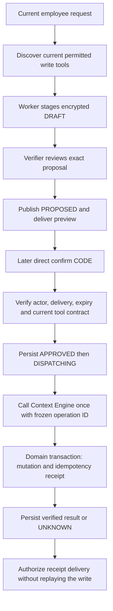

# Audited business writes and compensation

Implemented 3 October 2026. Deployment evidence is recorded separately; the default configuration remains disabled. This supersedes the deferred generic-writer portions of modules 17 and 52. CRM mutations are not enabled by this change.

## Ownership

Ramesh owns proposal review, direct confirmation, durable intent, the employee/chat boundary and outcome presentation. Context Engine owns the dynamically discovered tool catalogue, schemas, permissions and signed domain adapters. The dashboard or future CRM command handler owns validation, transactional mutations, authoritative receipts and domain-specific compensation. A model never receives a database credential, chooses the caller identity, constructs an authorization header or sends arbitrary SQL.

Reads and writes use separate ports. `ContextToolRun`, conversation recall, evidence refresh, verifier checks and outbound delivery preflight never execute a write. `BusinessWriteRun.execute` only stages a proposal. The only business dispatch path is `BusinessWriteService.recover`, called before model execution for an exact direct confirmation command.

## Flow

The user receives exact material fields and `confirm CODE` / `cancel CODE`. The proposal lasts one hour. The runtime requires a later, standalone, directly typed command in the same private conversation, from the same currently active employee and phone binding. The original proposal must already be recorded as sent, with an encrypted delivery receipt naming this operation and its published version, and the actual reply containing the confirmation code. A sent fallback or stale draft does not satisfy this proof. Forwarded text, image captions, quoted instructions, native-location labels and transcribed confirmations cannot execute a business write. Direct voice requests may provide proposal context; the final confirmation must be typed.

A draft can be revised during verifier repair; every revision is audited and invalidates its earlier unpublished code. Once published, its payload is immutable. A changed request needs a new reviewed operation. No capture queue or playground identity has production journal access, and the live-data playground does not compose the writer.

## Storage and audit coverage

Supabase migration `202610030009_write_journal.sql` adds:

| Table                     | Purpose                                                                                                                                                                                   |
| ------------------------- | ----------------------------------------------------------------------------------------------------------------------------------------------------------------------------------------- |
| `ramesh-write-operations` | Current operation state, employee/phone/chat/run binding, encrypted frozen arguments and source evidence, confirmation hash, dispatch lease, result and optional parent operation/version |
| `ramesh-write-events`     | Append-only encrypted before/after snapshots of each operation transition and each personal task/reminder command                                                                         |

Business arguments, descriptions, source messages, confirmation codes and receipts are envelope-encrypted with the worker's existing encryption key. Operational actor and lifecycle columns remain queryable. The runtime can append events but cannot update or delete them; it also cannot delete operation rows. Public API roles and the capture role receive no journal grants. Audit rows have no cascading inbox foreign key, so normal message cleanup cannot erase business history. Proposal expiry prevents new authorization; it does not erase audit data. There is currently no automatic journal deletion policy. Source evidence deliberately frozen into a proposal remains part of that audit after the 24-hour source lookup window closes.

Personal task/reminder mutations keep their existing request-driven behavior. Their exact before/after task, reminder and affected occurrence snapshots are appended inside the same transaction as the command and its existing receipt. Audit insertion failure aborts the mutation. Scheduler occurrence and delivery events continue in their existing durable tables; queue lease housekeeping is not a new user write. This does not retroactively reconstruct writes made before migration.

Backend business state and Ramesh's journal cannot share one SQL transaction across HTTP. The domain handler must atomically commit its mutation and authoritative idempotency receipt. Ramesh persists intent before dispatch and the result afterwards. A crash between those steps leaves an explicit uncertain state, rather than pretending the remote transaction was rolled back.

## Recovery and undo

An operation uses one server-generated UUID for its lifetime. Unknown results retain their exact arguments and ID. `retry CODE` resumes that same approved operation; it cannot create a second operation or change the payload. Uncertain approved operations remain recoverable after the original proposal deadline. The durable approved transition preserves the verified delivery proof, so later inbox cleanup does not strand a pending outcome. A later permission failure does not establish that an earlier uncertain request never committed. There is no autonomous retry loop or LLM-controlled retry budget.

Undo is a new audited **compensating action**, linked to the original operation. It does not delete or rewrite the original audit record. The worker first reads `write_history`, then may stage a currently advertised tool whose contract explicitly declares which action it compensates. The owned original must have a successful authoritative receipt. The compensation gets its own confirmation, operation ID and result.

The initial `rollback_gis_poi` tool compensates an employee's own `create_gis_poi`. The dashboard locks the point and compares its current fields and update timestamp with the creation receipt. It removes only an unchanged point and atomically stores a separate compensation receipt, including before/after state. It refuses edited records and arbitrary point IDs. Repeating the original create after a rollback returns its historical creation receipt; it cannot resurrect the point.

This follows the [Compensating Transaction pattern](https://learn.microsoft.com/en-us/azure/architecture/patterns/compensating-transaction): undo rules belong to the business operation and must account for later changes. Stable intent identifiers follow [AWS's idempotent API guidance](https://aws.amazon.com/builders-library/making-retries-safe-with-idempotent-APIs/). Sending a message and similar external effects may be irreversible. Ramesh must say so, rather than inventing an undo.

## Future CRM tools

No GIS branch is required in the graph or writer to add a CRM action. A new Context Engine tool must provide:

1. A closed, bounded input schema, a required UUID idempotency argument and a concrete output receipt schema.
2. `wareongo/context-write-v1` metadata with required scopes, source family and effect (`create`, `update`, `delete` or `compensate`). Current employee permissions and platform configuration determine discovery on every request. Historical arguments/results may be redisclosed only when the current tool explicitly declares `auditHistory: actor_scoped` (the GIS policy). The default is closed. A future CRM integration with record-level permissions must add current per-record authorization before enabling audit history or compensation previews; the existence of a write scope is insufficient.
3. A source-system handler that rechecks employee access and commits the mutation and receipt together. Do not write Twenty's replicated CRM tables as a shortcut.
4. For updates and deletes, expected record version or equivalent preconditions checked inside the mutation transaction. Record the exact prior value, resulting value and authoritative revision. A CRM mirror's delay is not evidence that a write failed.
5. If reversible, a separately advertised compensation tool with `compensates` and `originalOperationArgument`. It must verify that the current record still matches the result of the original action. Restore only affected fields and refuse intervening edits. Noncompensable actions must remain explicitly noncompensable.
6. Contract tests for duplicates, wrong employee, changed arguments, stale version, lost response after commit, replay after restart and rollback conflicts.

Examples include adding a CRM note, assigning a lead or changing a follow-up date. Each needs its own domain permission and semantics. The generic writer does not grant these capabilities merely because it supports the protocol. Multi-action workflows are not one atomic cross-service transaction; define partial-success and compensation semantics before exposing them.

## Locations and provenance

`write_sources` can retrieve at most 32 original messages / 32 KB from the same account and private conversation within 24 hours, at or before the current request. Structured native pins survive raw-protocol cleanup. Historical messages have unknown forwarding status and cannot authorize a new action. A selected source ID is stored alongside the exact proposal. For tools declaring `coordinateArguments`, selected native coordinates must match the proposed coordinates exactly.

Google Maps links and raw coordinates are resolved through Context Engine's read-only `resolve_location`. It preserves ambiguity and provenance. It does not silently choose a viewport, geocode an unsupported address or treat a user-supplied URL as a trusted WhatsApp pin. The confirmation preview displays the final coordinates regardless of origin.

## Configuration and rollout

`BUSINESS_WRITES_ENABLED=true` additionally requires signed business access, the assistant and Supabase message storage. The worker signing key and Context Engine registry must both grant `gis:write`; Context Engine independently checks current dashboard eligibility and tool platform settings. The dashboard's dedicated Context Engine public key needs `geo:points:create` and `geo:points:rollback`. The public key belongs in the dashboard; the separate private key stays in Context Engine/SSM. Existing read scopes and Claude OAuth remain unchanged.

Apply the bot journal migration and additive dashboard compensation migration before the code that requires them. Run local synthetic PostgreSQL, HTTP-signature, transport and graph tests. Deployment probes may inspect identity, catalogue admission, schema health and invalid requests; they must not create production business records or send test WhatsApp messages. No paid model evaluation is needed for these boundaries.

Disabling new writes does not undo existing writes. Keep the journal and authoritative receipts, inspect any uncertain operations, and preserve the delivery authorization fence. Never rotate operation IDs to get past a failed or timed-out request.
