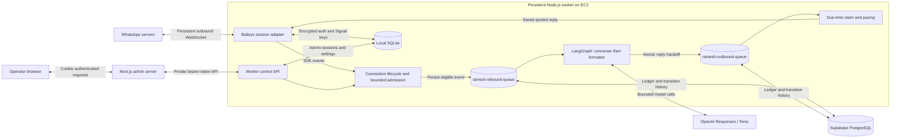

# WareOnGo WhatsApp bot: current implementation and architecture

Current local increment (2 October 2026): separate converser → planner → worker/tool-executor → formatter → verifier roles; ordinary chat skips planning. Images, PDFs and voice notes use encrypted owner-scoped media records with 24-hour expiry. Forwarded messages and media use durable sliding inbound batching (1-second ordinary text, 3-second burst window, 8-second cap). The capture GUI accepts attachments and overlapping messages, with one response per batch. See [module specifications](agent-modules/README.md) for current contracts and deployment prerequisites. Real-data private outcome cases and transcripts remain only under gitignored `.local/private-evals/`; `npm run eval:private` refuses CI.

Reviewed: **2026-10-02, Asia/Kolkata**, through the personal-assistant tool loop and real-data capture playground. Production business-read activation remains separate.

This reference describes ordinary two-node OpenAI Terra chat, the opt-in personal-assistant tool loop, separate Supabase queues, trusted identity and signed request adapters, optional legacy OAuth adapter, and independent pairing admin. The read loop handles the full employee-permitted CRM, supply, knowledge and analytics catalogue. The [architecture plan](assistant-architecture-plan.md) records future agents and workflows.

The linked WhatsApp session belongs to EC2; the earlier local pairing is retired. Supabase migrations `202610010001` and `202610010002` are provisioned. CI and EC2 deployment succeeded for the conversational, queue-split, and MCP scaffold changes. The EC2 API remains private; the Caddy/Vercel network rollout is not implied by those deployments. Local playground/evaluation replies use fake delivery and never go to WhatsApp.

## Contents

- [Purpose and scope](#purpose-and-scope)
- [System topology](#system-topology)
- [Technology and repository boundaries](#technology-and-repository-boundaries)
- [Worker module map](#worker-module-map)
- [Startup and process lifecycle](#startup-and-process-lifecycle)
- [WhatsApp connection and pairing](#whatsapp-connection-and-pairing)
- [Incoming message and reply pipeline](#incoming-message-and-reply-pipeline)
- [Conversational graph and local playground](#conversational-graph-and-local-playground)
- [Context Engine service scaffold](#context-engine-service-scaffold)
- [Reply pacing and cancellation](#reply-pacing-and-cancellation)
- [Persistence and delivery semantics](#persistence-and-delivery-semantics)
- [Admin application and authentication](#admin-application-and-authentication)
- [HTTP contracts](#http-contracts)
- [Configuration reference](#configuration-reference)
- [Operational behavior and diagnostics](#operational-behavior-and-diagnostics)
- [Deployment and recovery assets](#deployment-and-recovery-assets)
- [Tests and verification](#tests-and-verification)
- [Current limitations and extension boundaries](#current-limitations-and-extension-boundaries)

## Purpose and scope

The current product is a personal assistant for WareOnGo employees on WhatsApp. It responds conversationally to qualifying text DMs and actual group mentions of the linked account. OpenAI Responses with `gpt-5.6-terra` powers a LangGraph converser and formatter; `hello` remains the fallback when no API key is configured.

The implementation already includes:

- A persistent WhatsApp connection through Baileys.
- QR pairing, encrypted credential persistence, and automatic reconnection for transient failures.
- A bounded admission buffer, separate PostgreSQL inbound/outbound queues, atomic finalized-reply handoff, lease recovery, and persistent duplicate suppression.
- Two thin conversational stages, bounded memory, generation deadlines/cancellation, and reply-style enforcement.
- A real Supabase/Context Engine capture GUI as a server-configured employee, plus optional synthetic SQLite chat and repeated model evaluations.
- Employee-scoped MCP services, a bounded native tool loop across CRM/supply/knowledge/shortlists, deterministic source checks, independent answer review, private delivery rechecks and encrypted Supabase run/event storage, disabled until explicitly configured.
- Trusted phone/LID resolution to an active employee and fresh signed Context Engine requests, with no per-employee OAuth enrollment.
- A configurable random delay before each eligible reply.
- Cancellation of pending timers, recovery of unsent jobs after reconnect, and conservative handling of uncertain sends.
- A separate authenticated admin application for pairing, status, and session controls.
- Local tests, independent CI/CD workflows, and EC2 provisioning, release, and backup assets.

The default graph remains conversational. With BUSINESS_READS_ENABLED, active employee eligibility and signed Supabase/MCP configuration, it exposes the sender’s permitted Context Engine read catalogue in a DM, without a fixed question list or date restriction. Unknown, inactive and ambiguous users can chat but cannot read business data. BUSINESS_READ_EMPLOYEE_IDS defaults to all active employees; an optional explicit list can restrict a staged rollout. A separate planner, native-tool worker, verifier, media ingestion and durable inbound batching are implemented locally. Durable paused workflows, reminders and writes remain deferred. Operator sends remain restricted to existing inbox chats. See [first-read behavior and rollout](first-crm-read.md); this checkout has not been deployed.

## System topology



The two applications have different lifetimes:

| Application | Local default    | Owns                                                                        | Lifetime                                                   |
| ----------- | ---------------- | --------------------------------------------------------------------------- | ---------------------------------------------------------- |
| Worker      | `127.0.0.1:3011` | WhatsApp socket, bot behavior, SQLite state, control API                    | Must remain running to receive and respond to messages     |
| Admin       | `127.0.0.1:3010` | Operator login, dashboard, QR rendering, server-side worker client          | Browser can be closed without stopping the bot             |
| Playground  | `127.0.0.1:3012` | Fake chat UI, real Supabase capture queues or synthetic SQLite, model calls | Optional operator/development process; never owns WhatsApp |

The worker initiates the connection to WhatsApp. Messages arrive through that established connection. There is no inbound WhatsApp HTTP webhook and no application loop that polls WhatsApp for new messages.

The admin browser polls its own Next.js API for worker status. The connected worker also checks its PostgreSQL queue while idle; new work wakes the consumer immediately. Both are separate from WhatsApp. The installed Baileys release also has a 30-second keepalive default; that is connection maintenance rather than message polling, and the application does not override it.

## Technology and repository boundaries

Versions below are pinned in the current package manifests, not a claim about the latest upstream releases.

| Area                   | Current choice                                                                    |
| ---------------------- | --------------------------------------------------------------------------------- |
| Runtime                | Node.js `>=22.16 <23`; TypeScript; ECMAScript modules                             |
| WhatsApp transport     | `@whiskeysockets/baileys` `7.0.0-rc14`                                            |
| Agent runtime          | `@langchain/langgraph` `1.4.18`, typed conversational and general tool graphs     |
| Model client           | `openai` `7.25.0`, Responses API, `gpt-5.6-terra` default                         |
| MCP scaffold           | `@modelcontextprotocol/client` `2.1.0`, Streamable HTTP                           |
| Worker database        | SQLite/Prisma `6.19.3` for auth/admin; PostgreSQL/`pg` `8.16.3` for messages/jobs |
| Worker HTTP server     | Node's built-in `node:http`                                                       |
| Logging                | Pino `9.14.0`                                                                     |
| Admin framework        | Next.js `16.3.7`, React `19.3.0`                                                  |
| Browser QR rendering   | `qrcode` `1.5.4` on a canvas                                                      |
| Unit/integration tests | Node's test runner with `tsx`                                                     |
| Browser tests          | Playwright `1.63.0`                                                               |

Sources: [worker package](../package.json), [admin package](../../baileys-ramesh-admin/package.json).

The repositories install, compile, test, and deploy independently. They have no shared runtime npm package or source import. Their integration boundary is the versioned `/v1` HTTP contract and a matching `WORKER_API_TOKEN`.

The admin deliberately maintains its own API types and validates worker responses at runtime. Compatible API additions should reach the worker before a client depends on them. Incompatible changes require a versioned transition rather than assuming both repositories deploy simultaneously.

## Worker module map

The application follows a layered structure: domain behavior depends on small interfaces, while infrastructure adapters deal with Baileys, HTTP, and Prisma.

| Source                                                                                                        | Responsibility                                                                                           |
| ------------------------------------------------------------------------------------------------------------- | -------------------------------------------------------------------------------------------------------- |
| [`src/index.ts`](../src/index.ts)                                                                             | Loads the worker environment, validates configuration, constructs logging, starts the application        |
| [`src/app/application.ts`](../src/app/application.ts)                                                         | Constructs and connects adapters/services; owns startup, cleanup, and persistent operator intent         |
| [`src/app/process.ts`](../src/app/process.ts)                                                                 | Handles process signals and failures, with a bounded shutdown deadline                                   |
| [`src/config/env.ts`](../src/config/env.ts)                                                                   | Parses and validates runtime settings before resources are opened                                        |
| [`src/modules/assistant/assistant.graph.ts`](../src/modules/assistant/assistant.graph.ts)                     | Converser/formatter graph and fixed execution limits                                                     |
| [`src/modules/assistant/assistant.service.ts`](../src/modules/assistant/assistant.service.ts)                 | Prepares replies, combines cancellation/deadlines, commits accepted conversation turns                   |
| [`src/modules/assistant/conversation-memory.ts`](../src/modules/assistant/conversation-memory.ts)             | Bounded chat-and-sender memory with expiry                                                               |
| [`src/infrastructure/openai/text-model.ts`](../src/infrastructure/openai/text-model.ts)                       | Responses adapter, bounded retries/output, and redacted model failures                                   |
| [`src/app/context-engine.ts`](../src/app/context-engine.ts)                                                   | Reusable signed/OAuth service factories, composed by the opt-in personal-assistant loop                  |
| [`src/modules/context-engine/context.service.ts`](../src/modules/context-engine/context.service.ts)           | Employee-bound CRM, supply, knowledge and analytics read services                                        |
| [`src/infrastructure/context-engine/mcp-client.ts`](../src/infrastructure/context-engine/mcp-client.ts)       | MCP transport, scope/identity checks, and source-evidence envelopes                                      |
| [`src/infrastructure/whatsapp/baileys-session.ts`](../src/infrastructure/whatsapp/baileys-session.ts)         | Creates the real SDK socket; supplies auth storage, reply deadlines, and group metadata caching          |
| [`src/infrastructure/whatsapp/baileys-client.ts`](../src/infrastructure/whatsapp/baileys-client.ts)           | Owns connection state, subscriptions, message admission, cancellation, reconnects, and transient metrics |
| [`src/infrastructure/whatsapp/message.mapper.ts`](../src/infrastructure/whatsapp/message.mapper.ts)           | Converts supported SDK messages into the greeting module's small input contract                          |
| [`src/infrastructure/whatsapp/reconnect.policy.ts`](../src/infrastructure/whatsapp/reconnect.policy.ts)       | Classifies terminal disconnects and computes bounded retry jitter                                        |
| [`src/modules/greetings/greeting.policy.ts`](../src/modules/greetings/greeting.policy.ts)                     | Pure eligibility rules: own-message exclusion, group mentions, timestamp window                          |
| [`src/modules/greetings/greeting.service.ts`](../src/modules/greetings/greeting.service.ts)                   | Coordinates eligibility, durable claims, pacing, sending, and outcome persistence                        |
| [`src/modules/greetings/greeting.types.ts`](../src/modules/greetings/greeting.types.ts)                       | Domain contracts for messages, repository operations, and reply callbacks                                |
| [`src/lib/serial-queue.ts`](../src/lib/serial-queue.ts)                                                       | Bounded in-memory FIFO with synchronous admission and an awaitable drain                                 |
| [`src/lib/reply-delay.ts`](../src/lib/reply-delay.ts)                                                         | Samples a fresh delay and waits using an abortable timer                                                 |
| [`src/infrastructure/database/auth-store.ts`](../src/infrastructure/database/auth-store.ts)                   | Encrypts and persists Baileys credentials and Signal keys                                                |
| [`src/infrastructure/database/greeting.repository.ts`](../src/infrastructure/database/greeting.repository.ts) | Implements atomic claims and greeting status updates through Prisma                                      |
| [`src/infrastructure/database/admin-access.ts`](../src/infrastructure/database/admin-access.ts)               | Persists admin sessions, login limits, and retention cleanup                                             |
| [`src/infrastructure/database/prisma.ts`](../src/infrastructure/database/prisma.ts)                           | Constructs the worker's Prisma client                                                                    |
| [`src/infrastructure/http/admin-server.ts`](../src/infrastructure/http/admin-server.ts)                       | Provides authenticated fixed-purpose HTTP endpoints and local readiness                                  |
| [`src/contracts/admin-api.ts`](../src/contracts/admin-api.ts)                                                 | Defines worker-owned status, event, state, and action types                                              |

With `MESSAGE_DATABASE_URL` configured, the composition root creates a `MessageQueueRepository` and `DurableMessages` consumer and injects them into `BaileysClient`. The client persists incoming candidates and starts the consumer only on an open connection. `message-pool.ts` owns the separate PostgreSQL connection pool. The original `GreetingService` remains available for never-migrated SQLite development databases and isolated browser fixtures; that service receives a reply callback already bound to the triggering message.

Consequently, `GreetingService` does not import Baileys or Prisma. It can be tested with an in-memory repository and a fake reply callback. The SDK-specific types remain inside the WhatsApp infrastructure layer.

## Startup and process lifecycle

### Startup order

1. `src/index.ts` loads the repository-root `.env`. In compiled execution, its relative path still resolves from `dist/index.js` to the repository/release root.
2. `loadConfig()` validates secrets, database URL, numeric limits, and flags.
3. The application constructs Prisma, the configured assistant/model adapter, greeting service, optional PostgreSQL repository/consumer, Baileys client, admin-session storage, and control server. With the business feature enabled it also composes the live roster, signed MCP client and general read gateway; composition itself makes no business request.
4. `start()` verifies local SQLite access and checks the durable-storage activation marker. If enabled, it verifies the PostgreSQL schema/runtime login, imports old greeting claims without jobs, cleans stale work, and records `message-storage=postgres`. Missing Supabase configuration after activation fails startup.
5. Expired admin sessions/login buckets and old greeting claims are cleaned.
6. The worker starts its HTTP listener.
7. It installs hourly maintenance and reads the persistent `whatsapp-enabled` preference.
8. It starts WhatsApp when the stored preference is `true`, or when no preference exists and `WHATSAPP_AUTO_CONNECT=true`.
9. Application readiness is set once this startup sequence completes.

An HTTP readiness success does not require the WhatsApp socket to have reached `connected`. The application can be healthy while stopped, pairing, or reconnecting. Operators must inspect `/v1/status` for WhatsApp state.

### Operator controls and persistence

| Action       | Effect                                                                                                         |
| ------------ | -------------------------------------------------------------------------------------------------------------- |
| `connect`    | Persists `whatsapp-enabled=true`, then starts the client; a running client is not opened again                 |
| `disconnect` | Persists `whatsapp-enabled=false`, cancels pending replies, and closes the socket while preserving credentials |
| `reconnect`  | Executes disconnect followed by connect; reuses saved authentication                                           |

The stored preference overrides `WHATSAPP_AUTO_CONNECT` after the operator has used a control. A manual disconnect therefore survives a process restart or deployment.

Disconnect does not log the device out of WhatsApp or delete its saved keys. There is no implemented HTTP action that deletes/replaces the account's auth state.

### Shutdown

`SIGINT` and `SIGTERM` trigger orderly application shutdown. Uncaught exceptions and unhandled rejections trigger the same cleanup path with a failure exit status.

Application shutdown clears readiness and the maintenance interval, closes the HTTP server and finishes admitted control work, stops the WhatsApp client, awaits database cleanup, and disconnects Prisma. WhatsApp stop cancels reply timers, skips unsent queued work, waits for active work, closes the session, flushes auth state, and removes event listeners. Credential listeners remain attached through socket close because closing can emit a final credential update.

The process-level deadline defaults to 10 seconds. This deadline is a hard upper bound: an active send has a separate default deadline of 15 seconds, so process termination can occur before every in-flight send settles. The implementation aims to finish active work but cannot guarantee an unlimited drain. Systemd's checked-in stop timeout is 20 seconds.

## WhatsApp connection and pairing

### SDK adapter

`createSessionFactory()` loads encrypted authentication and creates `makeWASocket()` with:

| Setting                 | Current behavior                                                          |
| ----------------------- | ------------------------------------------------------------------------- |
| `auth`                  | Custom Prisma-backed credentials and Signal-key store                     |
| `markOnlineOnConnect`   | `false`                                                                   |
| `syncFullHistory`       | `false`                                                                   |
| Initial SDK sync        | Retained, including mappings required for LID addressing                  |
| `connectTimeoutMs`      | 20,000 ms                                                                 |
| `defaultQueryTimeoutMs` | `SEND_TIMEOUT_MS`, default 15,000 ms                                      |
| Group metadata cache    | In-memory, up to 200 entries, five-minute expiry                          |
| Cache invalidation      | Group updates and participant changes invalidate the relevant group entry |

The adapter exposes `botJids`, event registration/unregistration, credential persistence, a quoted reply function, and close. Bot identities are read dynamically from the socket, including its phone-based ID and LID when available.

### Pairing sequence

1. An unpaired socket produces a QR string in `connection.update`.
2. The client enters `pairing`, stores the current QR in memory, and exposes it through authenticated status.
3. The admin renders that string locally on a canvas.
4. The operator scans it using WhatsApp's **Linked devices → Link a device** flow.
5. Baileys supplies credential/key updates, which are persisted in encrypted form.
6. A restart-required disconnect is handled by opening a new socket with the saved state.
7. On the socket's `open` event, the client becomes `connected`, clears the QR, and resets the reconnect-attempt counter.

The browser QR uses four pixels per module, a four-module white margin, and error-correction level `M`. CSS preserves sharp rendering when resized. QR values are not persisted in browser storage or uploaded to an image service. Optional terminal rendering requires `PRINT_QR=true`.

### State model

| State           | Meaning                                                                                |
| --------------- | -------------------------------------------------------------------------------------- |
| `stopped`       | Client is intentionally inactive                                                       |
| `connecting`    | A new WhatsApp session is being opened                                                 |
| `pairing`       | A current QR is available for linking                                                  |
| `connected`     | Baileys reported an open connection                                                    |
| `reconnecting`  | A transient interruption occurred and a retry is scheduled                             |
| `disconnecting` | Stop is cancelling/finishing work and closing the session                              |
| `error`         | Operator action is needed, such as investigating auth storage or a terminal disconnect |

State updates clear any previous QR. A QR event then installs the new QR value. Status responses use defensive copies rather than exposing the mutable internal state object.

### Reconnection policy

The following disconnect reasons are terminal: `loggedOut`, `badSession`, `connectionReplaced`, and `forbidden`. The client stops retrying and reports an error. Clicking connect/reconnect cannot repair revoked or invalid credentials by itself; these cases may require relinking or operator recovery.

`restartRequired` schedules a 500 ms retry. Other failures use equal jitter around a growing retry ceiling:

```text
ceiling = min(30000, 1000 × 2^min(attempt, 5))
delay   = floor(ceiling / 2 + random() × (ceiling / 2 + 1))
```

The first transient retry is therefore 500–1,000 ms; retries at the cap are 15,000–30,000 ms. This avoids identical retry schedules across workers. Manual stop clears scheduled retries. Session creation failures continue through the same retry policy unless auth storage has failed.

## Incoming message and reply pipeline

```mermaid
sequenceDiagram
    participant WA as WhatsApp / Baileys
    participant C as BaileysClient
    participant Q as DurableMessages
    participant PG as Supabase PostgreSQL
    WA->>C: messages.upsert, type notify
    C->>C: Map supported text/caption and actual mentions
    C->>Q: Persist eligible incoming message
    Q->>PG: Atomic dedupe + message and READY inbound insertion
    Note over Q,PG: Pending payload is encrypted; commit establishes durability
    Q->>PG: Claim inbound with a new lease token
    Q->>Q: Decode, check eligibility, run converser and formatter
    Q->>PG: Atomic inbound DONE + saved outbound + READY_TO_SEND
    Q->>PG: Claim due outbound with a new lease token
    Q->>Q: Decode saved reply, random delay
    Q->>PG: Recheck lease/expiry and commit SENDING
    Q->>WA: Saved quoted reply through current connected session
    Q->>PG: SENT, or UNCERTAIN if sending may have occurred
    Note over Q,PG: Terminal payload is cleared; state history remains
```

The SDK listener accepts only `type === 'notify'` from the current running session. It considers every message in each batch. `append` history batches and events from retired sessions are ignored. A small in-memory FIFO bounds admission; its work in Supabase mode is persistence, so reply delays do not block incoming database inserts.

The mapper supports phone DMs (`@s.whatsapp.net`), LID DMs (`@lid`), and groups (`@g.us`). It unwraps content and accepts nonempty conversation/extended text or image/video captions. Reactions and protocol traffic are ignored. Supported captionless media can enter the assistant path when media processing is configured. Real structured bot mentions are required in groups; typing the display name is insufficient. Image/PDF extraction and voice transcription are now available through the private media lifecycle when Supabase and the assistant are configured. Unsupported formats remain unread.

The `GreetingCandidate` contract carries chat/message/sender IDs, text, time, own-message and group/mention flags. In durable mode, the original protobuf message is additionally encrypted and persisted for reconstructing the quoted reply after restart. The sender ID separates conversation context; it does not establish an employee identity or CRM permissions.

Eligible messages are not from the bot itself, meet the group-mention rule, and fall within `MAX_MESSAGE_AGE_SECONDS` (normally five minutes), allowing 60 seconds of forward clock skew. Eligibility is checked again before sending. Recent offline-sync `notify` events can qualify; `notify` alone does not prove real-time arrival.

`ramesh-messages` enforces uniqueness per account/chat/message. Enqueue and the `ramesh-inbound-queue` insertion commit together. The default capacity of 100 bounds active/pending durable jobs as well as the separate admission buffer. Full admission or durable capacity increases `dropped`. An abrupt crash before persistence commits can still lose an incoming event.

One job is leased per account. The consumer starts only after Baileys reports `connected`, wakes on new work, and polls the database every five seconds when idle. The current global ordering across chats remains; a slow job holds up later replies. Database connections are released during pacing and sending.

The agent atomically completes inbound processing and saves its encrypted final text in `ramesh-outbound-queue`. The sender claims that saved reply (or `hello` without an API key), quoting the triggering message. Retries never regenerate saved output. DMs stay in the DM; group replies stay in the group. The authenticated admin can also enqueue manual text to existing received conversations. See [inbox, context, and operator sends](supabase-message-queue.md#inbox-context-and-operator-sends) for migration `202610010003`, retention, the reply-policy toggle, and delivery semantics.

Fresh development databases without `MESSAGE_DATABASE_URL` use the `GreetingService` path: policy → SQLite claim → graph when configured → delay → send. It has no separate durable inbound/outbound tables. An activated production worker cannot silently return to that mode.

## Conversational graph and local playground

The ordinary-chat graph is `START → converser → formatter → END`. Both nodes use the same model adapter. The converser handles the request with recent context; the formatter preserves facts and uncertainty while making the reply suitable for WhatsApp. Prompts prohibit pretending to have business tools or completed actions. A final code guard removes em dashes. The opt-in personal-assistant graph adds native tool selection, schema-checked execution, source verification, formatting and a fresh semantic review. See [the personal-assistant runbook](sales-manager-agent.md) for limits, recovery and actual capabilities. The research graph now separates converser, planner, worker, deterministic executor, formatter and verifier; paused-task checkpoints remain deferred.

Single-message input is capped at 6,000 characters; durable bursts have separate bounded combined-text and media budgets. Output defaults to 800 tokens per model response, and the whole graph has a 45-second deadline with one bounded SDK retry. Generation also observes session cancellation. OpenAI calls use the fixed official endpoint and `store: false`. Ordinary logs record stage timings and token counts, not prompts, responses, or keys.

With Supabase configured, the encrypted inbox supplies the last 32 messages within 48,000 characters of context, selected from up to 40 preceding rows. Participants share their group's history, including untagged messages; other groups and DMs stay separate. Successfully sent replies, including admin messages, enter context; failed/uncertain output does not. Protected replies enter ordinary model history as markers; the local recall tool restores their content only after fresh scoped reads match the saved fingerprints and current employee. Protected replies show only a private placeholder in the admin inbox. History survives restart and expires after 30 days. The isolated SQLite playground still uses bounded process-local memory. Supabase history is not a LangGraph checkpoint. A crash before handoff may repeat generation; saved outbound replies survive restart without another model call.

Run `npm run dev:chat` for the fake chat GUI at `http://127.0.0.1:3012`. It exercises the mapper, SQLite claims, and graph with synthetic identities and a captured sender. `.local/playground.db` is separately migrated on startup. The command ignores production SQLite/Supabase connection settings, never loads linked-device credentials, and creates no WhatsApp socket. **New conversation** clears the selected context's process-local memory. Real OpenAI calls require a local key and incur model usage.

For real business data, use **`npm run dev:chat:live`** at the same port. Its separate private configuration pins Raghav and uses a restricted `ramesh_playground` login, `ramesh-test-inbound-queue`, `ramesh-test-outbound-queue` and encrypted test receipts. It calls the configured signed Context Engine through the shared scoped reader and verifier. A browser capture sink replaces delivery; neither SQLite nor the production queue consumer is constructed. Unknown users and groups cannot read CRM data. Startup checks roster RLS visibility and queue isolation. See the [live harness runbook](live-data-playground.md) for the complete boundary and setup.

## Context Engine service scaffold

`createContextEngineServices(config, credentials)` builds reusable CRM, supply, knowledge and analytics services. The opt-in `createBusinessReads` composition discovers the complete employee-permitted read catalogue; the fixed daily query is only a legacy regression preset. Setting `CONTEXT_MCP_URL` alone does not activate business reads. Apply migration `202610010004`, provide signed credentials and choose all active employees or an optional rollout list before enabling the feature. The playground uses synthetic services only with `PLAYGROUND_CRM_FIXTURES=true`.

`createSignedEmployeeContextAccess` supplies the preferred `ContextCredentialResolver`. It composes trusted phone/reciprocal LID mapping, a live roster, request signer and scoped services. `forMessage()` derives identity from the original Baileys key and each POST rechecks employee binding. Identity and keys are never model arguments. See [signed access](signed-context-auth.md); the earlier OAuth factory remains optional.

Each read uses a fresh MCP connection, verifies `get_context`, and intersects the local allowlist, server read-only annotations and employee scopes. Group reads and writes are denied. Signed credentials require the exact HTTPS `/mcp/ramesh` endpoint; the optional OAuth adapter requires `/mcp`. Redirects are rejected. Calls have bounded duration/response size, cancellation and safe errors; failed calls are not automatically retried.

Results preserve source paths, request IDs, timestamps, cursors, coverage, access scope, uncertainty, and field evidence. The MCP client validates the envelope; the general evidence validator checks tool-specific dates, freshness and coverage, including Google source calendars. A separate model reviews the final answer. One repair can return directly to formatting or to the tool loop; neither resets the budget. See [the full service contract and integration example](assistant-architecture-plan.md#20-context-engine-mcp-service-scaffold).

## Reply pacing and cancellation

Each eligible claimed job samples a fresh delay with `Math.random()`:

```text
delay = minMs + floor(random() × (maxMs - minMs + 1))
```

The default inclusive range is 1,500–4,000 ms. This delays each reply; it does not combine messages into a debounce batch. Total latency also includes preceding queued work. The worker rechecks message age and fenced lease ownership before committing the `SENDING` marker and invoking Baileys.

Each WhatsApp session owns an `AbortController`. Stop, connection loss, and fatal auth-storage errors cancel its consumer/timers. In durable mode, already-admitted events finish their persistence step, and work known not to have been sent is released to `QUEUED` for inbound work or `READY_TO_SEND` for saved outbound replies. A new connection can resume it while it remains eligible. Already-started sends are awaited subject to send/process deadlines; interrupted sends become `UNCERTAIN` and are not retried.

The lease window covers the larger of the generation and business-preflight deadlines, plus maximum reply delay, send timeout and 30 seconds of database margin. Inbound processing and outbound preflight own separate leases. A new UUID token fences each lease; expired pre-send work can be recovered, but an expired `SENDING` marker cannot be automatically replayed. The original SQLite-only development path retains cancelled `CLAIMED` rows instead of requeuing them.

Pacing smooths traffic; it does not guarantee avoidance of platform restrictions. No fake typing, randomized SDK heartbeat, account rotation, or message-polling camouflage is implemented.

## Persistence and delivery semantics

The implementation has two stores with separate responsibilities.

| Store/table                           | Responsibility                                                                                           |
| ------------------------------------- | -------------------------------------------------------------------------------------------------------- |
| Supabase `ramesh-messages`            | Message identity, state, expiry, encrypted pending payload, completion metadata                          |
| Supabase `ramesh-inbound-queue`       | Durable agent-input jobs, leases, attempts, processing outcomes                                          |
| Supabase `ramesh-outbound-queue`      | Encrypted finalized replies, due times, delivery leases and outcomes                                     |
| Supabase `ramesh-message-events`      | Transactional state-transition history                                                                   |
| Supabase `ramesh-agent-runs`          | Fenced run state and atomic output finalization                                                          |
| Supabase `ramesh-agent-events`        | Encrypted append-only tool receipts and finalization history                                             |
| Supabase `ramesh-schema-migrations`   | Version/checksum of the separately provisioned PostgreSQL schema                                         |
| SQLite `WhatsAppAuthEntry`            | Encrypted linked-device credentials and Signal keys                                                      |
| SQLite `ContextOAuthGrant`            | Optional legacy adapter: encrypted employee OAuth tokens/binding, grant state, version and refresh lease |
| SQLite `ContextOAuthEnrollment`       | Optional legacy adapter: encrypted PKCE attempt, target binding, one-use state and expiry                |
| SQLite `ContextOAuthRevocation`       | Optional legacy adapter: encrypted candidate tokens awaiting remote revocation                           |
| SQLite `AdminSession` / `LoginBucket` | Revocable browser sessions and shared login limits                                                       |
| SQLite `BotSetting`                   | Operator connection intent and `message-storage=postgres` activation marker                              |
| SQLite `Greeting`                     | Retained legacy claims; used only by the original development fallback                                   |

Sources: [queue split migration](../supabase/migrations/202610010002_split_queues.sql), [SQLite schema](../prisma/schema.prisma), [queue repository](../src/infrastructure/database/message-queue.repository.ts), [durable consumer](../src/infrastructure/whatsapp/durable-messages.ts).

On startup, local legacy claims are imported idempotently without creating jobs. Old successful claims become `SENT`; other claims become `UNCERTAIN`. The dedupe key includes the stable account namespace. Removing the PostgreSQL configuration after activation fails startup.

The normal state progression is `QUEUED → PROCESSING → READY_TO_SEND → SENDING → SENT`. `EXPIRED` and pre-send `FAILED` are terminal; possible delivery is `UNCERTAIN`. Terminal jobs remain inspectable as `DONE` or `DEAD`. These names describe application state, not WhatsApp delivery/read receipts. The worker does not implement exactly-once delivery or automatically resend uncertain outcomes.

Queued protobuf payloads are encrypted with AES-256-GCM and a fresh 12-byte IV, authenticated against their row UUID and a distinct category. Terminal transitions clear the payload; metadata and event history remain for 30 days. Pending payloads are capped at 256 KiB before encryption. PostgreSQL cleanup never deletes eligible active work merely because a process restarted.

WhatsApp auth records continue to use AES-256-GCM with category/key ID as authenticated data, versioned encrypted strings, and Baileys `BufferJSON` serialization. Credential snapshots are captured before serialized writes; Signal-key batches are atomic, reads await preceding writes, and reads are chunked in groups of 200 IDs. App-state synchronization keys are reconstructed into protobuf form. Invalid/unreadable auth fails closed instead of resetting the account identity.

`AUTH_ENCRYPTION_KEY` is stored separately from the databases. Losing it prevents reuse of linked-device credentials and encrypted message payloads, as well as optional legacy OAuth state. Signed access uses its separate private signing key and creates no OAuth rows. Chat/message IDs and timing/state metadata are not encrypted columns. Legacy OAuth restores may contain consumed refresh tokens and need their separate revocation/re-enrollment procedure.

All new tables enable RLS and deny the browser API roles. The runtime uses a dedicated PostgreSQL login, verified TLS, and a pool of at most two connections. Existing inherited `PUBLIC` extension privileges are described in the [queue security notes](supabase-message-queue.md#authentication-and-configuration); no shared extension grants are changed.

Live sockets, QR strings, the admission buffer, delay timers, dashboard counters, and the 30-item activity list remain transient. Persisted jobs survive a process restart; a live WhatsApp connection is still required to consume them.

## Admin application and authentication

The admin is a separate Next.js application. Its browser UI never connects directly to Baileys or SQLite. Next.js server routes hold the worker token and proxy a fixed set of operations to the worker.

### Admin module map

These links assume the two local repositories remain sibling directories.

| Source in `baileys-ramesh-admin`                                                                  | Responsibility                                                             |
| ------------------------------------------------------------------------------------------------- | -------------------------------------------------------------------------- |
| [`src/app/page.tsx`](../../baileys-ramesh-admin/src/app/page.tsx)                                 | Authenticated dashboard entry                                              |
| [`src/app/login/page.tsx`](../../baileys-ramesh-admin/src/app/login/page.tsx)                     | Login page                                                                 |
| [`src/components/dashboard.tsx`](../../baileys-ramesh-admin/src/components/dashboard.tsx)         | Status polling, controls, metrics, activity, stale-response protection     |
| [`src/components/pairing-code.tsx`](../../baileys-ramesh-admin/src/components/pairing-code.tsx)   | Converts the current pairing payload into a scannable canvas               |
| [`src/app/api/session/route.ts`](../../baileys-ramesh-admin/src/app/api/session/route.ts)         | Login, rate-limit coordination, session creation, logout                   |
| [`src/app/api/bot/status/route.ts`](../../baileys-ramesh-admin/src/app/api/bot/status/route.ts)   | Authenticated status proxy                                                 |
| [`src/app/api/bot/control/route.ts`](../../baileys-ramesh-admin/src/app/api/bot/control/route.ts) | Authenticated and origin-checked control proxy                             |
| [`src/server/auth.ts`](../../baileys-ramesh-admin/src/server/auth.ts)                             | Cookie verification, worker-backed session checks, origin checks           |
| [`src/server/worker-client.ts`](../../baileys-ramesh-admin/src/server/worker-client.ts)           | Fixed worker routes, bearer authentication, deadlines, response validation |
| [`src/server/config.ts`](../../baileys-ramesh-admin/src/server/config.ts)                         | Server-only secrets and origin validation                                  |
| [`src/lib/session.ts`](../../baileys-ramesh-admin/src/lib/session.ts)                             | Cookie signing, hashing, expiry checks, constant-time secret comparison    |
| [`src/lib/json-body.ts`](../../baileys-ramesh-admin/src/lib/json-body.ts)                         | Bounded, timed JSON request parsing                                        |

### Login and session flow

1. The browser sends the operator password to `POST /api/session` on the admin origin.
2. The server checks the request origin and a maximum 2 KiB JSON body.
3. It derives a login-bucket key using HMAC-SHA256 with `ADMIN_SESSION_SECRET`. On Vercel, the input is the first trusted forwarded client IP; outside Vercel, all requests use the shared `local` bucket.
4. The worker atomically records the attempt in SQLite. At most 10 attempts are allowed in a 60-second bucket. Successful attempts count too. The admin returns HTTP 429 with `Retry-After` when the bucket is exhausted.
5. The server compares the password using a constant-time comparison of SHA-256 digests.
6. It creates an eight-hour token of the form `expirySeconds.nonce.signature`. The nonce uses 18 random bytes; the HMAC signature binds the password and token payload to the session secret.
7. It registers only the token's SHA-256 hash and expiry in the worker database, then sets the browser cookie.

The cookie is named `wog_bot_admin`, has `HttpOnly`, `SameSite=Strict`, and `Path=/`, and uses `Secure` when `ADMIN_ORIGIN` is HTTPS. There is no browser-readable worker token or `NEXT_PUBLIC_` secret.

Each protected operation checks both the signed cookie and the worker's active-session record. Logout revokes that record before clearing the cookie, so a copied token stops working. Password or signing-secret rotation also invalidates existing cookies. Worker unavailability prevents successful login/session verification rather than granting access.

This is a shared operator login. It does not identify individual sales employees, implement SSO, or authorize CRM operations.

### Browser polling and request boundaries

The dashboard requests status immediately, then schedules its next request 2.5 seconds after the preceding request completes. Status requests do not overlap. Polling is skipped while a control operation is pending, and active status requests are aborted when the component unmounts. There is currently no hidden-tab pause.

A revision counter prevents a status response started before a connect/disconnect/logout action from overwriting newer state. The UI marks status as stale during transitions and hides obsolete pairing codes.

| Request boundary                  | Current limit                                                      |
| --------------------------------- | ------------------------------------------------------------------ |
| Browser status fetch              | 20 seconds                                                         |
| Browser control fetch             | 35 seconds                                                         |
| Next.js server to worker          | 15 seconds, including response processing through the fetch signal |
| Worker response accepted by admin | 64 KiB                                                             |
| Admin JSON request reader         | 5 seconds, plus route-specific byte limit                          |

The shorter server-to-worker timeout still applies to a browser control request. A timed-out control can have taken effect in the worker; the subsequent status refresh establishes the resulting state.

The server-side client disallows redirects, disables fetch caching with `cache: 'no-store'`, and validates the shape of worker status, counters, and activity events. Status responses use `Cache-Control: private, no-store`. A 401 status response clears dashboard state and redirects to login.

Origin checking accepts the configured origin. For local HTTP development it also recognizes loopback hostname aliases on the same port; public origins must match exactly.

## HTTP contracts

### Worker API

Source: [`admin-server.ts`](../src/infrastructure/http/admin-server.ts), [`admin-api.ts`](../src/contracts/admin-api.ts), and [`json-body.ts`](../src/infrastructure/http/json-body.ts).

All routes except `GET /healthz` require:

```http
Authorization: Bearer <WORKER_API_TOKEN>
```

The worker compares hashed authorization-header values with `timingSafeEqual`. The API deliberately exposes only status, lifecycle controls, and admin-session operations. There is no arbitrary-send, recipient-selection, credential-export, or shell-execution endpoint.

| Method and path          | Request                                                 | Successful response                                                             |
| ------------------------ | ------------------------------------------------------- | ------------------------------------------------------------------------------- |
| `GET /healthz`           | No authentication                                       | `{ "status": "ok", "release": "development" }`, or the deployed full commit SHA |
| `GET /v1/status`         | Bearer token                                            | `BotStatus`                                                                     |
| `POST /v1/control`       | `{ "action": "connect" }`, `disconnect`, or `reconnect` | Current `BotStatus` after the control operation                                 |
| `POST /v1/admin/attempt` | `{ "key": "<64 lowercase hex characters>" }`            | `{ "allowed": true, "retryAfter": 60 }`                                         |
| `POST /v1/admin/session` | `create`, `verify`, or `revoke`; see below              | `{ "ok": true }` or `{ "active": true }`                                        |

`/healthz` checks application readiness, SQLite connectivity, and the configured PostgreSQL schema/runtime login. It can return 200 while WhatsApp is deliberately disconnected. Use `/v1/status` to inspect the WhatsApp connection. The supplied public Caddy route list does not expose `/healthz`.

Control operations are serialized, with at most eight pending/active operations. `reconnect` performs stop followed by start. A successful connect response can report `connecting` or `pairing`; HTTP success does not mean the WhatsApp handshake has finished.

Session requests have these shapes:

```typescript
type SessionRequest =
  | { action: 'create'; tokenHash: string; expiresAt: number }
  | { action: 'verify'; tokenHash: string }
  | { action: 'revoke'; tokenHash: string };
```

`tokenHash` is 64 lowercase hexadecimal characters. `expiresAt` is an integer Unix timestamp in **milliseconds**, greater than now and no more than eight hours plus a one-minute tolerance ahead. The token itself is not sent to the worker.

A synthetic connected status looks like this; these are illustrative values, not a live status capture:

```json
{
  "state": "connected",
  "qr": null,
  "updatedAt": "2026-10-01T08:00:00.000Z",
  "startedAt": "2026-10-01T07:55:00.000Z",
  "metrics": {
    "received": 5,
    "replied": 3,
    "duplicates": 1,
    "errors": 0,
    "dropped": 0
  },
  "events": []
}
```

`events` contains up to 30 records, newest first, with `{ at, level, message }`; `level` is `info` or `error`. `qr` is an active pairing payload or `null`. Treat a live pairing response as sensitive account-linking material.

Request bodies must be JSON objects. The byte limit is 1 KiB for controls and 2 KiB for admin-session/login-bucket operations. Both declared lengths and streamed bytes are bounded. Worker headers are capped at 8 KiB; header timeout is 10 seconds, request timeout is 15 seconds, and each socket is limited to 100 requests.

Application responses include JSON content type, `Cache-Control: private, no-store`, and `X-Content-Type-Options: nosniff`. Typical errors are 400 for invalid input, 401 for absent/incorrect authentication, 404 for an unknown authenticated route, 413 for oversized bodies, 415 for unsupported content type, and 503 for unavailable dependencies or a full control queue. The worker returns a normal 200 response with `allowed: false` for an exhausted login bucket; the admin converts that outcome into HTTP 429.

### Browser-facing admin API

| Method and path         | Authentication and behavior                                                                          |
| ----------------------- | ---------------------------------------------------------------------------------------------------- |
| `POST /api/session`     | Origin check, password verification, worker-backed limit, session issuance                           |
| `DELETE /api/session`   | Origin check, persisted revocation, cookie removal                                                   |
| `GET /api/bot/status`   | Valid signed cookie and active worker session; proxies worker status                                 |
| `POST /api/bot/control` | Valid session, origin check, maximum 1 KiB JSON body; proxies one of the three supported controls    |
| `GET /api/bot/inbox`    | Valid session; lists conversations or messages for `chatId`, with optional pagination `cursor`       |
| `POST /api/bot/inbox`   | Valid session and origin; enqueues text as Ramesh to an existing conversation, with idempotency UUID |

The browser uses a session cookie to reach Next.js. Next.js uses the private bearer token to reach the worker. Those are separate authentication boundaries.

## Configuration reference

### Worker environment

Source: [`src/config/env.ts`](../src/config/env.ts) and [`.env.example`](../.env.example). The entry point loads the worker's `.env`; existing process environment values take precedence.

| Variable                  | Default / requirement                                      | Effect                                                                                  |
| ------------------------- | ---------------------------------------------------------- | --------------------------------------------------------------------------------------- |
| `DATABASE_URL`            | Required SQLite `file:` URL; local example `file:./dev.db` | Bot-owned database; relative local paths resolve against the Prisma schema directory    |
| `AUTH_ENCRYPTION_KEY`     | Required canonical base64url encoding of 32 random bytes   | Encrypts WhatsApp credentials/Signal keys and pending PostgreSQL message/reply payloads |
| `OPENAI_API_KEY`          | Optional secret; configured in production                  | Enables the two-node conversational flow                                                |
| `OPENAI_MODEL`            | `gpt-5.6-terra`                                            | Model for both stages                                                                   |
| `AGENT_TIMEOUT_MS`        | `45000`                                                    | Total generation deadline                                                               |
| `AGENT_MAX_OUTPUT_TOKENS` | `800`                                                      | Maximum output per model response                                                       |
| `PLAYGROUND_PORT`         | `3012`                                                     | Loopback port for the separate fake chat command                                        |
| `WORKER_API_TOKEN`        | Required, at least 32 characters                           | Authenticates server-to-server worker requests                                          |
| `WORKER_HOST`             | `127.0.0.1`                                                | HTTP bind address; other addresses are accepted by the parser                           |
| `WORKER_PORT`             | `3011`, integer 1–65535                                    | HTTP port                                                                               |
| `WHATSAPP_AUTO_CONNECT`   | `false`; literal `true` or `false`                         | Initial startup preference until an operator choice has been saved                      |
| `LOG_LEVEL`               | `info`                                                     | One of `fatal`, `error`, `warn`, `info`, `debug`, `trace`, `silent`                     |
| `MAX_MESSAGE_AGE_SECONDS` | `300`, positive integer, at most 86400                     | Eligibility window for incoming messages                                                |
| `MAX_PENDING_MESSAGES`    | `100`, positive integer, at most 1000                      | Total admitted message work, including the active item                                  |
| `SEND_TIMEOUT_MS`         | `15000`, positive integer, at most 60000                   | Reply send deadline and SDK default query timeout                                       |
| `SHUTDOWN_TIMEOUT_MS`     | `10000`, positive integer, at most 300000                  | Process-level shutdown deadline                                                         |
| `REPLY_DELAY_MIN_MS`      | `1500`, nonnegative integer                                | Lower inclusive reply-delay bound                                                       |
| `REPLY_DELAY_MAX_MS`      | `4000`, nonnegative integer, at most 60000                 | Upper inclusive reply-delay bound; must be at least the minimum                         |
| `PRINT_QR`                | `false`; literal `true` or `false`                         | Optional terminal QR output for local pairing                                           |
| `RELEASE_SHA`             | `development` or a 40-character lowercase hexadecimal SHA  | Release identity returned by readiness checks                                           |

For example, these nonsecret settings select the current pacing behavior:

```dotenv
REPLY_DELAY_MIN_MS=1500
REPLY_DELAY_MAX_MS=4000
MAX_MESSAGE_AGE_SECONDS=300
MAX_PENDING_MESSAGES=100
```

The worker reads configuration once at startup. `npm run dev` runs `tsx src/index.ts` without watch mode; code and environment changes require restarting that process.

The additional message-store variables are `MESSAGE_DATABASE_URL`, `MESSAGE_DB_SSL_CA`, `MESSAGE_ACCOUNT_ID` (default `primary`), and `MESSAGE_QUEUE_POLL_MS` (default 5000, range 250–30000). The connection must use the dedicated `ramesh_worker` login. Keep `DATABASE_URL` as SQLite. Full configuration and migration commands are in the [Supabase queue guide](supabase-message-queue.md#authentication-and-configuration).

For signed access, use `CONTEXT_MCP_URL` and protected `CONTEXT_RAMESH_SIGNING_KEY_JSON`; no OAuth callback is required. `npm run db:identity` provisions SELECT on four roster columns. Context Engine needs its public-key configuration and replay migration. `BUSINESS_READS_ENABLED=true` plus explicit `BUSINESS_READ_EMPLOYEE_IDS` activates the general permitted read catalogue after migration `202610010004`; otherwise these settings do not connect tools. See [signed access configuration](signed-context-auth.md).

The MCP factory accepts `CONTEXT_MCP_URL`, `CONTEXT_MCP_TIMEOUT_MS` (30000; range 1000–60000), and `CONTEXT_MCP_MAX_RESPONSE_BYTES` (1048576; range 16384–4194304). The endpoint is exactly `/mcp/ramesh` for signatures or `/mcp` for optional OAuth, with no user info/query/fragment. `loadContextSigningConfig` reads the strict private-key JSON. The pilot accepts only the signed route. No employee bearer token is shared.

### Admin environment

Source: [`src/server/config.ts`](../../baileys-ramesh-admin/src/server/config.ts).

| Variable               | Requirement                                            | Effect                                                      |
| ---------------------- | ------------------------------------------------------ | ----------------------------------------------------------- |
| `ADMIN_PASSWORD`       | At least 16 characters                                 | Shared operator password; also bound into cookie signatures |
| `ADMIN_SESSION_SECRET` | At least 32 characters                                 | Signs cookies and derives opaque login-bucket keys          |
| `ADMIN_ORIGIN`         | Full origin, such as `http://127.0.0.1:3010` locally   | Origin checks and secure-cookie selection                   |
| `WORKER_API_URL`       | Worker origin, such as `http://127.0.0.1:3011` locally | Server-side API destination                                 |
| `WORKER_API_TOKEN`     | At least 32 characters, matching the worker            | Server-side bearer credential                               |

Both origins require HTTPS except on loopback development hosts. They cannot contain URL credentials, a non-root path, a query, or a fragment. The platform variable `VERCEL=1` enables the trusted forwarded-IP login-bucket behavior; it is not an application secret.

Worker and admin setup scripts create missing local secrets without printing or replacing existing values and restrict environment-file permissions. The admin's worker token must still be configured to match the worker. No secret values belong in this document or in client-visible environment variables.

## Operational behavior and diagnostics

### What “up” means

There are three separate observations:

1. **The admin page loads:** the Next.js process or deployment is responding.
2. **Worker `/healthz` returns 200:** the worker is ready, SQLite responds, and the configured PostgreSQL schema/runtime login is available.
3. **Worker status is `connected`:** the current Baileys session has completed its connection handshake.

A successful real reply verifies an additional part of the path: receipt, eligibility, database claiming, pacing, and the send operation. Loading the admin or scanning a QR alone does not prove that whole path.

The local worker readiness endpoint can be checked without a token:

```sh
curl --fail http://127.0.0.1:3011/healthz
```

Use the authenticated dashboard to inspect connection state and activity. Stopping the admin or closing the browser does not stop the worker. Stopping the worker prevents new application replies even though its linked-device credentials remain saved.

### Dashboard metrics

| Counter      | What it actually counts                                                                                |
| ------------ | ------------------------------------------------------------------------------------------------------ |
| `received`   | Successfully mapped supported messages admitted to processing, before eligibility and duplicate checks |
| `replied`    | Greeting operations that sent successfully and recorded `SENT` successfully                            |
| `duplicates` | Eligible candidates whose database claim already exists                                                |
| `errors`     | Message-processing exceptions and durable queue operation failures                                     |
| `dropped`    | Incoming work rejected by the admission buffer or durable pending-job capacity                         |

`received` includes unmentioned group messages, stale notifications, and media labels saved in the inbox; it excludes own-message echoes and protocol traffic. It is not the number of authorized employee requests. `dropped` is not a total of every ignored or cancelled message. All counters and the activity list reset with the process; the Supabase inbox does not.

`startedAt` records client construction time. `updatedAt` tracks connection-state changes; it is not a timestamp of the last message or a complete heartbeat metric. Status snapshots are copied before being returned so API consumers do not mutate internal state.

### Troubleshooting map

| Symptom                                     | Relevant checks in this implementation                                                                                     |
| ------------------------------------------- | -------------------------------------------------------------------------------------------------------------------------- |
| Admin loads but status/login fails          | Worker readiness, matching API token, correct worker origin, server-to-server network reachability                         |
| Scanner does not recognize a QR             | Current non-stale pairing state, sharp square modules, full quiet zone, no clipped/scaled-down canvas                      |
| QR scanned but replies do not start         | Wait for `connected`; inspect activity for auth-storage errors, replacement, or revoked-session events                     |
| DM receives no reply                        | Supported text/caption, sender is not the bot itself, recent timestamp, connection state, queue saturation, existing claim |
| Group receives no reply                     | A real mention of a normalized bot phone-number/LID identity is required; typing the display name is insufficient          |
| Reply takes longer than four seconds        | Earlier queued work and two model stages add latency before the final randomized delay                                     |
| Repeated message event gets no second reply | Expected: the database claim suppresses repeated attempts, including uncertain sends                                       |
| Restart stays disconnected                  | The persisted operator preference overrides `WHATSAPP_AUTO_CONNECT`                                                        |
| Encrypted auth can no longer be loaded      | Correct database and encryption key must remain paired; malformed/unreadable state fails closed                            |

### Logging and maintenance

Pino provides structured process logs. The logger redacts the configured paths `auth`, `creds`, `token`, `password`, `apiKey`, and `*.authorization`; this is a path-specific safeguard, not arbitrary detection of every possible secret. Application logs and dashboard activity are designed around generic events rather than message bodies.

The Baileys child logger is constrained to `warn` unless logging is entirely silent. Raising the application level to `debug` does not enable unrestricted SDK debug output. Terminal QR output is opt-in through `PRINT_QR`.

Recurring work includes hourly database retention cleanup and the connected consumer's idle PostgreSQL queue polling/recovery. Model generation runs while processing inbound jobs. WhatsApp keepalives belong to the SDK, dashboard status polling belongs to the browser, and reconnection timers belong to the connection manager. There is no CRM polling loop, reminder scheduler, or independently deployed model worker.

## Deployment and recovery assets

This section describes checked-in automation and its assumptions. The conversational flow, split queues, and inactive MCP scaffold have passed CI and deployed to the private EC2 worker. A previous host inspection also confirmed its backup timer was active. See [EC2 operations](ec2-operations.md) for current access/configuration and [Supabase cutover requirements](supabase-message-queue.md#authentication-and-configuration) for the separate queue migrations.

### Hosting split and network assumptions

The worker needs a persistent process, local durable storage, and outbound connectivity to WhatsApp. The admin is independently deployable to Vercel, provided its server-side requests can reach the worker API.

Two different network arrangements appear in the repository:

| Asset                                                                                                  | Network assumption                                                                                                                                            |
| ------------------------------------------------------------------------------------------------------ | ------------------------------------------------------------------------------------------------------------------------------------------------------------- |
| [`deploy/aws/infrastructure.yml`](../deploy/aws/infrastructure.yml)                                    | Private worker access: the EC2 security group has **no inbound rules**, including no SSH, HTTP, HTTPS, or worker-port ingress; management/deployment uses SSM |
| [`deploy/ec2/Caddyfile`](../deploy/ec2/Caddyfile) and the [Vercel/EC2 guide](deployment-vercel-ec2.md) | A separately configured DNS name and reachable HTTPS reverse proxy expose only the four authenticated `/v1` routes                                            |

The CloudFormation template assigns a public address for outbound internet access; that does not open inbound access. Bootstrap does not install or configure Caddy. Deploying that stack alone does **not** make its worker API reachable from Vercel.

A remote admin therefore requires an explicitly configured access path, such as an appropriate private gateway/tunnel or reviewed HTTPS ingress and reverse proxy. An operator can alternatively use a local admin with suitable local forwarding. Those connections are not provisioned automatically by the current template. The worker's bearer-token check remains part of the boundary in either arrangement.

### Provisioning and host layout

The CloudFormation template takes an existing VPC/subnet, a reviewed Ubuntu 24.04 AMD64 image, and a full reviewed bootstrap commit. The default instance type is `t3.micro`, with `t3.small` also allowed. This is a configuration choice, not a measured capacity recommendation.

Provisioned assets include:

- An EC2 instance with an encrypted 20 GiB gp3 root volume, standard CPU credits, and required IMDSv2.
- An instance role limited to SSM management, the designated runtime-secret parameter, and encrypted uploads under the backup bucket's `daily/` prefix.
- A private S3 backup bucket with server-side AES-256 encryption, a policy rejecting non-TLS access, and 14-day expiry for daily backups.
- A fixed SSM deployment document that accepts a validated full commit SHA and invokes a root-owned helper.
- A GitHub OIDC role restricted to the configured repository's production environment and the specified deployment document/instance.

The stack retains the instance and backup bucket on stack deletion/replacement. The root disk still has `DeleteOnTermination=true`; directly terminating the retained instance is a different operation and can remove that disk.

[`bootstrap.sh`](../deploy/ec2/bootstrap.sh) installs Node 22 and host dependencies, separates the `wareongo-build` and `wareongo-bot` users, configures 2 GiB swap, and limits journal retention to 100 MB/seven days. It installs privileged deployment helpers from the reviewed bootstrap commit. Ordinary application releases do not overwrite those root-owned helpers.

| Host path                             | Purpose                                             |
| ------------------------------------- | --------------------------------------------------- |
| `/opt/wareongo-sales-bot/releases/`   | Built application releases                          |
| `/opt/wareongo-sales-bot/current`     | Active release symlink                              |
| `/etc/wareongo-sales-bot/worker.env`  | Root-protected runtime environment                  |
| `/var/lib/wareongo-sales-bot/bot.db`  | Mutable worker database outside release directories |
| `/var/backups/wareongo-sales-bot/`    | Restricted local SQLite snapshots                   |
| `/usr/local/sbin/wareongo-bot-deploy` | Fixed privileged deployment entry point             |

Bootstrap preserves an existing worker environment. For a new environment it obtains or creates `AUTH_ENCRYPTION_KEY` and `WORKER_API_TOKEN` through the SSM SecureString parameter `/ramesh-bot/production/runtime`. It also prepares an SSH deploy key for read-only repository access; registration of that key is an operator setup step.

There is a configuration difference to preserve when reviewing deployment instructions: bootstrap creates `WHATSAPP_AUTO_CONNECT=false`, while [`worker.env.example`](../deploy/ec2/worker.env.example) contains `true`. The application default is `false`, and any saved operator preference takes precedence over both. Missing reply-delay settings use the application's 1.5–4-second defaults.

### Worker process supervision

[`wareongo-bot.service`](../deploy/ec2/wareongo-bot.service) runs one Node process as the runtime user, using the current release and persistent state directory. It restarts failures after five seconds, with at most five starts per 120 seconds.

The unit includes a 600 MB memory-high threshold, 768 MB memory maximum, 1 GiB swap maximum, and a 20-second stop timeout. It uses restricted filesystem/device settings, a private temporary directory, no new privileges, and a restrictive umask. The application service cannot access the IPv4/IPv6 instance-metadata addresses. Logs go to the system journal.

These are service-unit settings; this document does not claim they have been load-tested for a future CRM/LLM workload.

### Release flow and rollback

Worker CI runs schema validation, type checking, tests, build, formatting, production dependency audit, shell checks, and systemd-unit validation. It uses fake sessions and temporary databases, with no WhatsApp credentials.

The [worker deployment workflow](../.github/workflows/deploy.yml) runs after successful trusted main-branch CI when `EC2_DEPLOY_ENABLED=true`. It checks out the tested commit, obtains temporary AWS credentials through OIDC, and invokes the fixed SSM document at a configured numeric version. Production deployments are serialized. The release helper also checks the requested commit against the current main commit.

The release sequence in [`release-core.ts`](../deploy/release-core.ts) and [`ec2-release.ts`](../deploy/ec2-release.ts) is:

1. Prepare dependencies and build as the isolated build user while the old worker stays running. Runtime credentials are not passed to dependency install hooks/build scripts.
2. Verify the target commit and SQLite migration compatibility. Existing migrations are immutable; automatic deployment accepts only conservatively checked Prisma additions. Supabase migrations are provisioned separately before a release requires them.
3. Stop the existing worker and take a consistent SQLite snapshot.
4. Apply SQLite Prisma migrations as the runtime user.
5. Atomically select the new release and start it.
6. Verify readiness for the exact release SHA, the running process/release location, and that unauthenticated status access is still rejected.
7. Record the successful release and retain the current, previous, and one additional older release.

Rollback depends on whether the candidate could have used WhatsApp:

| Failure point                                                 | Recovery behavior                                                     |
| ------------------------------------------------------------- | --------------------------------------------------------------------- |
| Install/build preparation fails                               | Old worker remains running                                            |
| Worker stopped, but candidate has never started               | Restore the database snapshot when one was taken, then roll back code |
| Candidate start was attempted, even if partially unsuccessful | Roll back code while retaining current database state                 |

The last distinction protects advancing WhatsApp/Signal keys and message claims. Restoring an older database after a candidate may have communicated with WhatsApp could rewind live authentication or duplicate-suppression state. Automatic code rollback therefore depends on backward-compatible migrations.

### Backups and restoration

[`sqlite-backup.ts`](../deploy/sqlite-backup.ts) uses SQLite's backup API to capture committed database state, including WAL contents. Copying only a live `.db` file is not the implemented backup method. Snapshots are restricted to mode `0600`.

The separate [backup service](../deploy/ec2/wareongo-bot-backup.service) runs the [backup script](../deploy/ec2/backup.ts), uploads a snapshot with S3 server-side encryption, and only after a successful upload removes matching local snapshots older than seven days. The temporary snapshot for that invocation is removed in a `finally` block, including when upload fails. Off-instance daily backups expire after 14 days under the bucket lifecycle rule.

The [timer](../deploy/ec2/wareongo-bot-backup.timer) specifies 02:30 UTC daily, with up to 15 minutes of randomized delay and persistent catch-up behavior. Bootstrap installs the timer but **does not enable it**; its comment requires first verifying deployment and backup. The release helper also does not enable the timer. A checked-in timer is therefore not evidence that scheduled backups are running.

The EC2 snapshot contains SQLite auth/admin/local state; Supabase message jobs are outside that backup. PostgreSQL backup/PITR settings were not changed or verified by this feature. The database backup and its authentication encryption key must be recoverable together. The checked-in bootstrap keeps runtime secrets in Parameter Store separately from database backups. Database restoration must be coordinated with a stopped worker, with particular care around the rollback boundary described above.

### Admin deployment

The [admin CI workflow](../../baileys-ramesh-admin/.github/workflows/ci.yml) runs its independent checks, production dependency audit, and Playwright browser suite. Its fixture can exercise the HTTP contract without checking out the worker repository.

The [admin deployment workflow](../../baileys-ramesh-admin/.github/workflows/deploy.yml) is gated by `VERCEL_DEPLOY_ENABLED=true` and successful trusted main-branch CI. It verifies the tested commit is still current, then deploys that source using pinned Vercel CLI `61.1.0`. Git-triggered Vercel deployments are disabled in [`vercel.json`](../../baileys-ramesh-admin/vercel.json) so the workflow owns this path.

Admin runtime secrets and the reachable worker URL must be configured in the hosting environment independently of the worker release. Neither deployment automatically publishes the other repository.

## Tests and verification

### Worker coverage

The worker test command includes unit, SQLite/HTTP integration, real PostgreSQL queue integration, and deployment tests. CI starts an isolated PostgreSQL 17 service; local PostgreSQL tests require `TEST_MESSAGE_DATABASE_URL`, as documented in the [Podman instructions](supabase-message-queue.md#verification).

| Area                    | Behaviors covered                                                                                                                      |
| ----------------------- | -------------------------------------------------------------------------------------------------------------------------------------- |
| Message mapping         | Phone/LID addressing, normalized mentions, wrapped content, supported captions, ignored message types                                  |
| Greeting policy/service | Eligibility, deduplication before waiting, expiry after waiting, cancellation without sending, retained claims                         |
| Reply delay             | Inclusive bounds, injected randomness/waiting, cancellation, configuration validation                                                  |
| Client lifecycle        | Ordering, queue overflow, stop/drain behavior, final credential updates, connection loss, auth failures, reconnect cancellation        |
| Database claims         | Concurrent/repeated claims and retention of uncertain send outcomes                                                                    |
| Split queues            | Atomic handoff, saved-reply recovery, due times, encryption, lease fencing, upgrade preservation, and restricted grants                |
| Assistant graph         | Stage order, style guard, cancellation, context isolation, failed generation, and memory after transport acceptance                    |
| MCP services            | Real SDK with fake HTTP: discovery, employee/scope checks, concurrent isolation, evidence, response limits, safe errors, and deadlines |
| Authentication storage  | Binary serialization, encryption, tamper/wrong-key rejection, atomic writes and failure handling                                       |
| HTTP/admin access       | Bearer authentication, bounded requests, controls, persistent sessions, logout, atomic login limits                                    |
| Application lifecycle   | Readiness and persistence of operator connection intent                                                                                |
| Deployment/recovery     | Commit/migration guards, release ordering, rollback before/after candidate start, SQLite snapshots containing WAL state                |

The worker's [`tests/fixtures/simulated-worker.ts`](../tests/fixtures/simulated-worker.ts) uses a fake WhatsApp session with an isolated database. Its reply-delay range is set to zero so browser integration scenarios do not incur real pacing delays; dedicated tests cover the delay behavior itself.

### Admin coverage

Admin unit tests cover cookie signing/expiry/password rotation, allowed origins, and bounded JSON handling. Browser scenarios cover login, pairing/status presentation, lifecycle controls, worker/admin outages and restarts, session revocation, and login limits.

By default the browser suite uses a standalone fake worker implementing the HTTP contract. With `BOT_WORKER_DIR=../baileys-ramesh`, it instead launches the real worker application with an injected fake WhatsApp transport and a temporary database. Neither mode links a real WhatsApp account; the fixture QR is synthetic.

The browser harness uses local ports 4310–4313 for the admin, worker, fake transport controls, and supervisor. It uses one Playwright worker to keep its stateful scenarios ordered.

### Commands

From the worker repository:

```sh
npm run check
```

This expands to Prisma schema validation, TypeScript checking, tests, build, and formatting checks. On a fresh checkout, first install dependencies and generate Prisma as described in the [worker README](../README.md).

From the admin repository:

```sh
npm run check
npm run test:e2e
```

Browser tests require a built admin and an installed compatible Chromium, as described in the [admin README](../../baileys-ramesh-admin/README.md). To use the real worker with its fake transport:

```sh
BOT_WORKER_DIR=../baileys-ramesh npm run test:e2e
```

The scaffold release passed **81 worker tests** and deployed successfully. Subsequent first-read checks passed **123 tests** and **45/45 synthetic business-model trials**. The real-data harness increment passed **131 tests, zero skipped** on 2 October 2026, plus five live Supabase/Context Engine checks as Raghav. A headless Chrome test submitted and displayed a real captured CRM response with no page errors. The earlier conversational evaluation passed **26/26 trials** across 13 synthetic cases. No WhatsApp message was sent by these tests.

For nondeterministic model checks, run `npm run eval:agent -- --trials 3`; a held-out split is available with `--split holdout`. Each trial uses fresh conversation state and isolated SQLite with fake delivery. Mechanical checks cover stage completion, persisted outcomes, length, em dashes, stock phrases, and clarification where required. A schema-validated Terra judge checks relevance, naturalness, fidelity, and capability honesty. Reports under `.local/evals/` retain drafts, final replies, reasons, prompt/dataset hashes, latency, and token usage. Review transcripts as well as scores: synthetic coverage and a same-model judge do not guarantee quality on real tasks. This historical paid suite remains available. The current [multi-turn CI harness](../evals/README.md) covers 74 personal-assistant, CRM, supply, knowledge, analytics and boundary scenarios with repeated real-model trials.

## Current limitations and extension boundaries

The existing split between domain services, transport adapters, and repositories is a useful base for additional sales-team workflows. The following boundaries explain what would have to change; the additions in the right column are **not implemented**.

| Current implementation                                                                              | Extension boundary                                                                                                               |
| --------------------------------------------------------------------------------------------------- | -------------------------------------------------------------------------------------------------------------------------------- |
| Every eligible DM can trigger a conversational reply                                                | Identity resolution is implemented; additional employee login methods need their own trusted adapter                             |
| Distinct converser, planner, worker, executor, formatter and verifier with bounded Supabase history | Add durable intermediate-step checkpoints when paused or write workflows need them                                               |
| General permitted read catalogue implemented, disabled by default                                   | Apply migration 004, verify roster RLS and configure the signed pilot; add durable entity references and paused tasks separately |
| Group replies stay in the triggering group                                                          | Define which information is permitted in shared channels before returning employee-specific CRM results                          |
| One durable leased reply job per account                                                            | Introduce per-conversation ordering and bounded parallelism if slow business operations become common                            |
| Separate inbound/outbound queues preserve final replies and uncertain outcomes                      | Add durable workflow/action state and idempotency for future business side effects                                               |
| Single account/session owner                                                                        | Add account isolation and exclusive session ownership before introducing multiple accounts or replicas                           |
| Shared operator password                                                                            | Introduce named operator identities and roles if the admin needs individual accountability or differentiated permissions         |
| In-memory metrics and 30 recent events                                                              | Add durable operational telemetry and delivery-status tracking if those become product requirements                              |
| Private image/PDF/voice extraction and expiring exact voice quotes                                  | Add richer document-analysis tools with scoped artifacts and supported evidence semantics                                        |
| Outbound due timestamps support immediate quoted replies with incoming expiry                       | Add long-lived reminder intents, cancellation, recipient checks, and due-time business revalidation                              |

The opt-in read route invokes Context Engine through signed MCP. CRM-Automations scheduling remains separate. [`CONTEXT.md`](../CONTEXT.md) preserves the product decisions: employee-scoped CRM reads first, supply next, then reminders/escalation and controlled writes. Escalations go to assignee(s), then existing CRM admins. Dedicated domain-backend read endpoints remain deferred.

The personal-assistant tool loop is implemented with source verification, independent answer review, Supabase run/event storage and delivery reauthorization. No employee enrollment is needed. The real-data playground runs as Raghav with Supabase capture only; CI uses synthetic identities and isolated PostgreSQL. Typed durable entity references and paused-task checkpoints remain extensions; see the [module specifications](agent-modules/README.md) and [old-bot reference](agent-modules/23-context-and-media-reference.md). Multiple workers still lack a distributed linked-device ownership lease.

### Evaluation refinement

The [evaluation refinement contract](agent-modules/33-eval-refinement.md) adds
per-turn external judgments, explicit evidence-backed failure findings, a
contrastive grader-calibration command, complete tool schema context and stable
synthetic clocks. Native-date absence now remains consistent across fixture
search/detail reads; Search Console query/page fixtures preserve their query
subtotals. Query checks compare calendar and date-field meaning while enforcing
assignment scope. Source input changes during a run invalidate the snapshot.

Research now stops before the hard graph deadline, reserving up to 60 seconds
(one quarter of the configured deadline) for a supported reply and verification.
Completed stage metrics survive subsequent errors/timeouts. This does not bypass
authorization or freshness checks, and does not guarantee completion before every
hard deadline.

### Voice display and STT configuration

The transcript is rendered after answer verification and delivery authorization, directly from same-owner unexpired media. It appears in quotes and italics before the common response; a batch preserves receipt order. Version 2 encrypted outbound payloads store the answer and media references, not transcript copies. Inbox history decodes only the answer; business replies retain their protected recall receipts. The capture API exposes quoted display data with no owner key, and the GUI renders it with text nodes inside `em`. Failed/expired notes are explicit, and oversized extracts are labelled as excerpts.

`OPENAI_STT_API_KEY` optionally separates audio credentials from `OPENAI_API_KEY`; `OPENAI_TRANSCRIBE_MODEL` defaults to `gpt-4o-transcribe`. Both the current model and newer `gpt-transcribe` were exercised through the real adapter with the authorized legacy key. See [module 35](agent-modules/35-voice-transcripts.md), [model evaluation](agent-modules/36-transcription-evaluation.md) and the [retained result](../evals/results/2026-10-02-stt-comparison.md).
