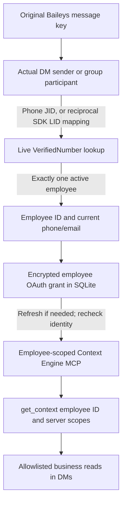

# Employee identity and Context Engine OAuth

Implemented on **1 October 2026**. This is the concrete adapter behind `ContextCredentialResolver`, ready for the future tool worker. The conversational graph still contains only converser and formatter. Unknown users can chat; neither chat text nor phone recognition alone authorizes business reads. No planner, worker, verifier, reminder, or write tools are activated by this increment.

## Trust boundary



`WhatsAppEmployeeResolver` accepts the original transport message key. For DMs it uses `remoteJid`; for groups it uses `participant`. It rejects own-message echoes and unsupported addressing. Device suffixes are normalized. LID resolution requires matching forward and reverse `lid-mapping` entries already persisted by Baileys in encrypted `WhatsAppAuthEntry` rows. Missing or inconsistent mappings do not establish identity. It does not open a socket or learn phone numbers from message bodies, display names, quoted senders, mentions, or alternate sender fields.

`EmployeeIdentityResolver` resolves a country-prefixed phone against exactly one `public."VerifiedNumber"` record. It accepts the roster's existing formatted and legacy Indian national-number forms, while transport phone JIDs must already include a country code. Duplicate canonical matches, inactive records, and malformed identities are denied. Credential use checks the immutable employee ID, current canonical phone, email, and active status again; no cached roster result permanently grants access. Reassigning a number to another employee cannot transfer the old employee's grant.

The PostgreSQL roster adapter selects only `id`, `phone_number`, `email`, and `is_active`. Context Engine remains responsible for current business scopes and record access. Group business reads are denied even for recognized employees. An unknown sender receives no business credential, but the existing conversational flow is unaffected.

## Enrollment and credential lifecycle

Ramesh obtains a separate employee-approved OAuth grant through Context Engine's existing authorization page. It does not import Claude's token, automate consent, or use one admin token for everybody. The employee enters their Context Engine employee key only on that existing consent page, never in WhatsApp or a Ramesh command argument.

1. An operator starts enrollment for an active employee with a valid roster email. The default scope is `crm:read`; `warehouses:read` and `knowledge:read` can be explicitly requested.
2. The adapter registers a public OAuth client and stores an encrypted PKCE verifier, state, redirect URI, target employee binding, and ten-minute expiry. The returned consent URL contains only public OAuth request parameters.
3. Completion verifies the exact callback origin/path, a single matching state, code format, attempt expiry, and current employee binding. The attempt is durably claimed before exchanging its one-use code.
4. The real MCP client calls `get_context` with the candidate access token. Its employee ID must match the enrollment target. Approving with another employee's key fails and queues the candidate for remote revocation.
5. A SQLite transaction consumes the attempt and installs the encrypted grant. An existing active grant cannot be silently overwritten. Revoke it before re-enrollment. A concurrent cancellation/revocation prevents a late callback from restoring access.

Context Engine access tokens last at most 15 minutes. The adapter refreshes before the remaining lifetime falls below the greater of 60 seconds or the configured deadline plus 5 seconds. The local grant-use limit is 30 days from enrollment start and never moves on refresh. The server can expire it sooner with the underlying employee key; its response does not supply a separate refresh expiry. The local limit is conservative, not proof that the remote grant has been revoked.

Refresh rotation uses durable `ACTIVE → REFRESHING → ACTIVE` transitions with compare-and-swap versions and a bounded lease. Competing processes sharing this SQLite database cannot both rotate the same token. Network calls run outside database transactions. If a process dies during refresh, or the token response is ambiguous, the adapter blocks access and requires reconnection; it never retries a possibly consumed refresh token. Context Engine revokes a grant on refresh-token replay. This follows the rotation/replay concerns in [RFC 9700](https://www.rfc-editor.org/rfc/rfc9700.html#section-4.14.2).

Revocation first cancels pending enrollment and durably marks the grant `REVOKE_PENDING`. Local access stops before the remote request. Successful remote revocation clears the ciphertext and sets `REVOKED`; an unavailable server leaves encrypted retry state. A late refresh result cannot undo this. Candidate tokens from failed enrollment or a losing refresh are retained in the encrypted revocation backlog. A received MCP 401 invalidates only the exact access token used by that request, so a stale failure cannot revoke a newer rotation. Remote revocation uses Context Engine's [RFC 7009 endpoint contract](https://www.rfc-editor.org/rfc/rfc7009.html#section-2.1).

Retries are explicit through `retry-revocations`, with at most ten pending employee grants and ten candidate grants per invocation. There is no background credential-maintenance scheduler yet. Offboarding is checked at credential use; proactive offboarding and retry scheduling belong to later worker operations. A changed phone/email, inactive employee, expired grant, unavailable roster, or unreadable encrypted credential never falls back to another employee or a shared token.

## Storage and deployment

Prisma migration `20261001010000_context_credentials` adds three local SQLite tables:

| Table                    | Purpose                                                                                                           |
| ------------------------ | ----------------------------------------------------------------------------------------------------------------- |
| `ContextOAuthGrant`      | One employee grant per linked-account/resource namespace, encrypted tokens/binding, state, version, refresh lease |
| `ContextOAuthEnrollment` | Encrypted PKCE attempt and target binding; one-use state and ten-minute expiry                                    |
| `ContextOAuthRevocation` | Encrypted candidate grants awaiting remote revocation                                                             |

AES-256-GCM uses the existing `AUTH_ENCRYPTION_KEY`, fresh nonces, and separate authenticated categories. Ciphertexts bind the account, resource, row identity and, for grants, version. Tokens, phone/email binding, and PKCE secrets are encrypted. IDs, state, versions, and operational timestamps remain metadata. These are separate from Baileys key rows, inbox/queue payloads, browser sessions, prompts, and logs. Errors expose fixed codes instead of provider responses.

Apply the local schema with the normal `npm run db:migrate` or EC2 release migration. No existing table is rewritten. Keep `DATABASE_URL` as SQLite and `MESSAGE_ACCOUNT_ID` stable. OAuth HTTP requests use the fixed Context Engine origin, refuse redirects, cap responses at 16 KiB, honor cancellation/deadlines, and never automatically retry token requests.

The dedicated `ramesh_worker` database login needs four additional column-level SELECT privileges. Provision once with the separate admin connection file; it is never installed as the runtime credential:

```sh
# Validates in a transaction and rolls back by default.
npm run db:identity -- --env-file /private/admin-connection.env
npm run db:identity -- --env-file /private/admin-connection.env --apply
```

The grant adds no row writes, table-wide SELECT, role membership, or RLS bypass. Existing roster RLS must also permit these reads; the script does not rewrite shared policies. Queue provisioning remains separate. Synthetic PostgreSQL tests verify the real query and column permissions.

Back up the SQLite database and encryption key separately. Restoring an old snapshot can restore an already-consumed refresh token. After such recovery, revoke/re-enroll affected grants rather than replaying old tokens. Changing the account ID, resource URL, or encryption key does not migrate credentials. Do not reset a corrupt grant to an active state or run a second live WhatsApp worker for recovery.

## Operator commands

`npm run context:auth` uses a mode-0600 environment file and an absolute SQLite `file:/...` URL. It requires the dedicated `ramesh_worker` connection, `AUTH_ENCRYPTION_KEY`, and `CONTEXT_MCP_URL`. Run it as the user owning the SQLite database. On EC2, supply a protected enrollment environment file owned by `wareongo-bot`; the normal root-only systemd environment file is not directly readable by that user. Do not run Prisma as root against the live database.

```dotenv
DATABASE_URL=file:/absolute/path/to/bot.db
MESSAGE_ACCOUNT_ID=primary
# Also include the existing protected MESSAGE_DATABASE_URL, CA, and AUTH_ENCRYPTION_KEY.
CONTEXT_MCP_URL=https://your-context-engine.example/mcp
CONTEXT_MCP_TIMEOUT_MS=30000
CONTEXT_MCP_MAX_RESPONSE_BYTES=1048576
CONTEXT_OAUTH_REDIRECT_URI=https://your-owned-callback.example/oauth/callback
```

Before live enrollment, provide an owned HTTPS callback and allowlist its origin in Context Engine's `CONTEXT_MCP_ALLOWED_REDIRECT_ORIGINS`. The callback must safely preserve the response without exposing its code in logs or third-party requests. This increment provides the operator CLI, not a public callback server or admin enrollment UI. The private EC2 worker does not expose one. HTTP loopback is accepted only with a local HTTP Context Engine. The default Claude callback allowlist is not a Ramesh callback.

```sh
npm run context:auth -- begin --env-file /private/ramesh-enrollment.env --employee-id 23
# Optional explicit read scopes: --scopes crm:read,warehouses:read,knowledge:read
```

Open the returned authorization URL and complete employee consent on Context Engine. Within ten minutes, save the full returned callback URL in a mode-0600 file, then complete the saved enrollment:

```sh
npm run context:auth -- complete --env-file /private/ramesh-enrollment.env \
  --enrollment-id THE_RETURNED_ID --callback-file /private/callback.txt
npm run context:auth -- status --env-file /private/ramesh-enrollment.env --employee-id 23
npm run context:auth -- revoke --env-file /private/ramesh-enrollment.env --employee-id 23
npm run context:auth -- retry-revocations --env-file /private/ramesh-enrollment.env
```

Status returns state, scopes, and expiry metadata, never tokens. Clear temporary callback/environment files when finished. Do not pass the callback URL, employee key, access token, or refresh token on a command line. Enrollment commands never create a WhatsApp connection or send a message; they do contact the roster and Context Engine when explicitly run.

Shipping these adapters does not require changing the running conversational bot's environment. Live enrollment needs the callback setup and explicit employee consent. Business tools still need the future worker integration.

## Future worker composition

```ts
import { createEmployeeContextAccess } from '../src/app/context-engine.js';
import { PostgresEmployeeRoster } from '../src/infrastructure/database/employee-roster.js';

const access = createEmployeeContextAccess(contextConfig, {
  db: sqlite,
  encryptionKey: workerConfig.authEncryptionKey,
  accountId: messageAccountId,
  roster: new PostgresEmployeeRoster(messagePool),
});

// originalMessage is the trusted Baileys event, not model-produced identity data.
const employee = await access.whatsapp.resolve(originalMessage, signal);
const scoped = await access.forMessage(originalMessage, signal);
// A recognized employee may still be unenrolled. Every read resolves the current grant again.
if (scoped) {
  const evidence = await scoped.context(signal);
  // A later worker/verifier can use the same scoped services for approved CRM reads.
}
```

`createEmployeeContextAccess` composes identity, encrypted storage, OAuth, and MCP services without opening a WhatsApp connection. `createContextEngineServices` still defaults to a resolver that grants no access for callers that do not explicitly opt in. The future worker must handle `AUTH_REQUIRED` without disrupting ordinary chat, keep credentials out of the model, and recheck authorization before delayed sensitive delivery. Current encrypted inbox history is available to trusted operators; review that audience before adding personal CRM content to stored replies.

## Verification

The merged worker passed `npm run check`: **104 tests, zero failures or skips**, plus schema validation, TypeScript, build, and formatting. Tests use real temporary SQLite migrations/encryption, an isolated PostgreSQL roster with restricted grants, synthetic OAuth responses, and the actual MCP SDK. They cover sender spoofing, reciprocal LIDs, duplicates, offboarding, number reassignment, PKCE/state replay, wrong-employee consent, encryption tampering, concurrent refresh across SQLite connections, ambiguous rotation, enrollment/revocation races, stale 401s, deadlines, response bounds, and redaction. No real employee was enrolled and no WhatsApp message was sent by these checks.
