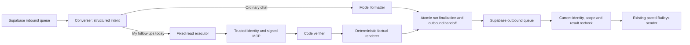

# First CRM read: implementation and rollout

> Historical fixed-preset implementation. The live playground and enabled production composition now use the [general personal-assistant tool loop](sales-manager-agent.md), including all permitted CRM, supply, knowledge and analytics reads plus independent model review. The daily-only routing, deterministic renderer and unsupported-query rules below apply to the retained regression fixture. Persistence, migration and disable/drain guidance remain relevant. Enabling the flag now exposes the general read catalogue.

Implemented in this checkout on **1 October 2026**, after the [module specifications](agent-modules/README.md) were written. Disabled by default. This document describes the bounded first increment, not the entire planned agent system. No production migration, feature activation or deployment was performed as part of implementation.

## Supported behavior

An enabled pilot employee can ask in a DM for their assigned CRM follow-ups due **today in Asia/Kolkata**. The LangGraph converser emits a validated intent and language. Code resolves the original WhatsApp phone/LID to one active `VerifiedNumber` employee, checks pilot membership, then executes exactly:

```json
{ "view": "assigned", "follow_up_status": "today", "sort": "follow_up_asc", "limit": 10 }
```

The employee-bound MCP call uses `search_crm_leads` through `/mcp/ramesh`. The server independently enforces current permissions, including for admins. An admin's `access_scope=all` metadata does not widen this fixed assigned view. No model can select an employee, recipient, arbitrary tool, SQL statement or filter.

Unknown, inactive, ambiguous and non-pilot users retain ordinary chat but receive no business facts. Group business requests receive a generic request to use a DM, without a CRM query or automatic private message. Other dates, overdue leads, other assignees, arbitrary details, supply, counts, reminders and writes are unsupported in this increment. Multi-part requests containing unsupported work are not silently narrowed.



The diagram shows logical responsibilities. Verification runs inside the executor service, not as a separate model node. The graph has converser, worker and formatter nodes on the read path; ordinary chat bypasses the worker. The optional general planner and independent semantic verifier are later increments.

## Verification and private delivery

`followups.ts` validates the exact source query, unique lead IDs, same-row/repeatable-read metadata, returned count/cursor consistency, the current IST date window, due dates and source freshness. The opportunity sync must be successful and at most 30 minutes old. Response/as-of timestamps must be within two minutes of the worker clock. Missing/malformed evidence cannot become a successful empty list. A valid empty page is reported as empty; a failed or stale source produces a temporary-unavailability reply.

The renderer uses only projected name, ID, stage, date and verification metadata, never raw notes or source instructions. It preserves the per-lead verification caveat and warns about incomplete activity streams. It states when more results exist; only the first ten are connected and interactive pagination is deferred. English, Hindi and Roman-script Hinglish are supported. Business facts never enter a formatter model call.

Protected reply metadata binds the employee, local date, evidence fingerprint and expiry, authenticated with the message UUID under `AUTH_ENCRYPTION_KEY`. Before sending, the worker resolves authority again, repeats the same scoped query and compares the verified result. Revocation, reassignment, changed results, expired evidence, source failure or disabled business configuration suppresses the saved reply as `EXPIRED`. A preflight timeout follows bounded pre-send retry handling. The first increment does not regenerate changed business content automatically. The evidence deadline is five minutes or IST midnight, whichever comes first, further bounded by the incoming message expiry.

There remains a small interval between the final read and WhatsApp accepting a message; this is not an atomic transaction across CRM and WhatsApp. Existing `SENDING`/`UNCERTAIN` handling prevents blind retries after possible delivery.

## Persistence and restart behavior

Migration [202610010004_agent_reads.sql](../supabase/migrations/202610010004_agent_reads.sql) adds:

| Object                                        | Ownership                                                                                           |
| --------------------------------------------- | --------------------------------------------------------------------------------------------------- |
| `ramesh-agent-runs`                           | One run per inbound message, contract version, attempt, lease owner, running/finalized/failed state |
| `ramesh-agent-events`                         | Append-only tool start/success/failure receipts and finalization; business bodies encrypted         |
| `ramesh-messages.reply_kind`                  | Conversation or protected business reply                                                            |
| `ramesh-messages.business_evidence_encrypted` | Employee binding, date, expiry and verified-result fingerprint for delivery                         |

Finalizing a run, saving its reply and delivery evidence, finishing inbound processing and creating the outbound row happen in one fenced transaction. A stale lease cannot record a tool completion or finalize a reply. A crash before that transaction can repeat the bounded model/read workflow, which has no business side effect. A crash afterward reuses the exact saved reply and runs the delivery check without calling the model again. Account-wide serialization is retained.

This journal is **not a LangGraph checkpointer**. It implements durable task admission, receipts and final output for the fixed read. Paused tasks, human interrupts, arbitrary multi-step resumption, plans and corrective passes require the richer contracts and Postgres checkpoints described in the specifications. Those remain future work, and must precede workflows that rely on resuming intermediate steps. A full checkpointer is not required to safely restart this side-effect-free preset from its beginning.

The restricted `ramesh_worker` role receives only the necessary explicit grants on the new tables. RLS is enabled and browser/API roles receive none. Existing shared PostgreSQL `PUBLIC` extension grants remain as documented in the queue runbook; this migration does not claim to remove them.

The authenticated admin inbox and conversation previews display the stored business reply text. `InboxRepository.messages` and `conversations` retain an explicit `redacted` visibility option for future role rules; the admin default is `full`. Ordinary Supabase model history and the process-local memory fallback still use protected reply markers, with fresh authorization required for business recall. Encrypted receipts and protected content follow the existing 30-day message retention cascade, accessible to trusted database/host operators holding the encryption key. No raw business content or credentials enter normal trace logs. Delivery-time reads are not added to the finalized execution receipt log; their failure reason is recorded on the message.

## Enablement

1. Run the normal message-schema provisioner in dry-run mode, then apply migrations through `202610010004` using the separate administrative connection. The new worker checks this version even while the feature is disabled.
2. Ensure the runtime login has the narrow four-column roster SELECT grant, a matching SELECT policy if the roster has RLS enabled, and can actually resolve the pilot employee. Context Engine's signed route, public verification key and replay cache must be provisioned. Keep the Claude OAuth connector unchanged.
3. Configure the worker's existing OpenAI, Supabase and signed-context settings. Set an explicit comma-separated list of active employee IDs in `BUSINESS_READ_EMPLOYEE_IDS` and set `BUSINESS_READS_ENABLED=true`. These settings are deployment configuration, never values accepted from chat. Missing dependencies fail startup validation.
4. Use the existing EC2 environment/SSM synchronization procedure and deploy the tested release. Validate health, run correlation, private inbox behavior and an authorized pilot request before broadening the employee list.

See [signed access](signed-context-auth.md), [queue provisioning](supabase-message-queue.md) and [EC2 operations](ec2-operations.md). The first implementation does not set production pilot IDs or alter any runtime environment.

Disable the feature and restart the worker to stop new reads and reject pending business delivery. Keep migration `004`; do not drop the new columns/tables or move saved output back into inbound processing. Protected replies use an encrypted versioned object while older workers expect a string, so older senders fail closed rather than sending without the new authorization check. An older inbox may show an unreadable payload; use the current worker for orderly draining and diagnosis.

## Validation and local use

`npm run dev:chat:live` now exercises the shared graph and verifier against real Supabase and signed Context Engine as the server-configured Raghav. It uses physically separate `ramesh-test-inbound-queue` and `ramesh-test-outbound-queue` tables, a restricted login and browser capture, with no Baileys session or SQLite. See the [live-data playground runbook](live-data-playground.md) for setup and the `smoke:chat:live` command. Its separate schema does not apply production migration `004` or enable the production pilot.

`PLAYGROUND_CRM_FIXTURES=true npm run dev:chat` enables synthetic follow-ups in the existing loopback GUI. It uses isolated SQLite claims, the actual LangGraph route and a captured reply callback. It ignores production database settings and never opens a WhatsApp socket or Context Engine connection. This is a UI/model test, not a substitute for Postgres persistence tests.

`npm run eval:business -- --trials 3` performs repeated paid OpenAI calls against synthetic identities and records. Cases cover three language variants, unknown users, groups, empty/stale/partial pages, ordinary chat, other assignees, unsupported writes/dates, multi-part requests and prompt injection. Reports retain every result and prompt/dataset hashes under `.local/business-evals/`.

Unit tests validate source contracts, employee changes during reads, expiry, group/pilot denial and factual rendering. Real PostgreSQL integration tests validate migration privileges, atomic rollback, duplicate input, stale leases, restart after finalization, revocation/change/disable suppression, private history and retention. Run them against the isolated local database described in the [queue test instructions](supabase-message-queue.md#verification); the fixtures reject remote database URLs. Production identity/signature adapters have their existing synthetic MCP-server tests.

Validation on 1 October 2026: the full repository check passed with **123 tests, zero skipped**, including PostgreSQL 17 in an isolated Podman container. Schema validation, typechecking, build and formatting passed. The new business model eval passed **45/45** trials on `gpt-5.6-terra`; run `2026-10-01T18-15-13.676Z-cc7999f3` is retained locally. This validates the synthetic pilot cases and does not establish live source availability or guarantee future model behavior. No WhatsApp message was sent.

Validation on 2 October 2026: the extended check passed **131 tests, zero skipped**. The real-data smoke passed **five checks**, covering a live assigned-follow-ups read, replay authorization, unknown/group denial and Supabase capture. Raghav's current-day query returned a verified empty result; the test does not assume any fixed live lead count. No WhatsApp session was created.
