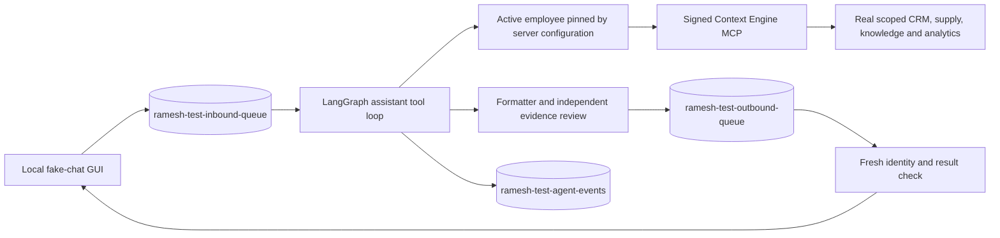

# Real company-data playground with captured delivery

Current local increment (2 October 2026): separate converser → planner → worker/tool-executor → formatter → verifier roles; ordinary chat skips planning. Images, PDFs and voice notes use encrypted owner-scoped media records with 24-hour expiry. Forwarded messages and media use durable sliding inbound batching (1-second ordinary text, 3-second burst window, 8-second cap). The capture GUI accepts attachments and overlapping messages, with one response per batch. See [module specifications](agent-modules/README.md) for current contracts and deployment prerequisites. Real-data private outcome cases and transcripts remain only under gitignored `.local/private-evals/`; `npm run eval:private` refuses CI.

Implemented and checked on **2 October 2026**. This is a local operator harness using the real OpenAI model, real Supabase and the configured actual Context Engine. It is configured as **Raghav (`VerifiedNumber.id = 1`)**. WhatsApp delivery is replaced by a separate capture sink.

## Run it

From `baileys-ramesh`, use the current four-scope local profile after starting the configured Context Engine:

```sh
PLAYGROUND_ENV_FILE=.local/live-playground-sol-eval.env PLAYGROUND_PORT=3012 npm run dev:chat:live
```

Open **http://127.0.0.1:3012** and refresh an already-open tab. Try **All my follow-ups**, overdue or next-week follow-ups, pipeline totals, warehouse searches, lead notes, shortlist assessment company knowledge, GA4 or Search Console. The [personal assistant](sales-manager-agent.md) discovers all employee-permitted read tools and chooses the appropriate sequence. Pages remain bounded and source caveats are preserved. HRMS, reminder scheduling and business writes remain unconnected. Attachments can be uploaded and discussed through the private 24-hour media pipeline.

Without the explicit profile, the server defaults to `.local/live-playground.env`, the earlier deployed-endpoint profile. `PLAYGROUND_ENV_FILE` can select another explicitly prepared file; `PLAYGROUND_PORT` overrides the port. The command does not load the worker `.env` or fall back to its database connection. Stop the synthetic playground before using the same port.

Select **Unknown user (no business access)** or **Group @mention** to test denied CRM access. These controls cannot choose another employee, phone number, credential or destination. **New conversation** removes the current test conversation, including its captured replies and receipts. Reloading the page creates a new conversation ID; it does not redisplay previous browser chats.

This GUI is for a trusted operator on this machine. Its configured employee identity is an explicit test authorization, not evidence of an actual WhatsApp message. It binds to loopback and uses Host/Origin checks, a random request token, no-store responses and text-only rendering. It is not a public employee login surface. Keep the private configuration and signing key server-side.

## Data and delivery flow



| Resource                        | Purpose                                                                                                                 |
| ------------------------------- | ----------------------------------------------------------------------------------------------------------------------- |
| `ramesh-test-inbound-queue`     | Encrypted test input, namespace, configured employee, simulated actor/audience, request hash, attempts and fenced lease |
| `ramesh-test-outbound-queue`    | One encrypted final result per input, `transport = 'capture'`, `CAPTURED` or `SUPPRESSED` state                         |
| `ramesh-test-agent-events`      | Encrypted append-only tool start/success/failure receipts tied to the current attempt                                   |
| `ramesh-test-schema-migrations` | Independent capture-schema version and checksum                                                                         |
| `ramesh_playground`             | Dedicated PostgreSQL login for these tables and four identity columns                                                   |

The test outbound table has no WhatsApp destination column and a database constraint permitting only `capture` transport. The harness never constructs the production application, sender or Baileys session. It does not load linked-device credentials or use SQLite. There is no switch or endpoint that promotes a test row to a real send.

The `ramesh_playground` login cannot read or write production `ramesh-*` queues. Conversely, `ramesh_worker` cannot read or write the test tables. Startup checks the actual role, privilege drift, required schema and identity. The test login receives only `id`, `phone_number`, `email` and `is_active` SELECT access on `VerifiedNumber`, with a SELECT policy scoped to that role so the live roster's RLS permits identity resolution. It receives no roster writes. Existing database-wide PUBLIC extension grants remain outside this application-table boundary.

Real employee authority follows the existing signed MCP path. The server resolves one active employee with a unique canonical phone, binds the credential resolver to that employee and retains the registered key's `crm:read`, `warehouses:read` and `knowledge:read` scopes. Context Engine independently checks the current employee and permissions. No employee OAuth grant or shared owner API key is used for CRM requests.

At the user's request, the duplicated phone was cleared from `support@wareongo.com` (`id = 24`) so Raghav resolves uniquely. The phone column is NOT NULL, so the cleared value is an empty string. No other support-account field was intentionally changed. The exact original row is backed up in the local private setup directory; no full phone is recorded in these docs.

## Execution, recovery and privacy

The browser's request UUID is idempotent only for identical input, namespace, employee, conversation and audience. A conflicting reuse is rejected. The harness processes a bounded serial queue, claims each SQL row with a lease and atomically completes the inbound row with its saved output. A finalized request reuses that output and its trace instead of regenerating it.

Claimed work can recover after lease expiry, within a fifteen-minute input expiry and three-attempt bound. Processing is request-driven: a caller must retry the same UUID. The harness does not automatically drain abandoned browser requests after restart; the current GUI creates a new UUID for each submission. This is a capture harness, not a full simulation of the production queue consumer.

Before displaying a CRM result, including on saved-output replay, the harness repeats the shared employee, scope, freshness and result-fingerprint check. Changed, revoked or expired output is suppressed. Source failure is distinct from a verified empty result. The last 32 messages are retained within a 48,000-character text budget. Ordinary model history uses a private completion marker; `recall_business_context` restores a protected answer and its order only after current-employee scoped reads match its saved fingerprints. Changed/revoked data never replays the old body. Ordinary history is scoped to the namespace, configured employee, simulated actor, audience and conversation.

Test input, output and receipts use AES-256-GCM with a separate playground key and authenticated record identities. Row metadata is visible to trusted database operators. Old test rows are deleted after 24 hours **when startup or another request runs cleanup**; there is no independent cleanup daemon. Deleting inbound rows cascades to output and receipt rows. Normal terminal output and smoke summaries contain status/counts rather than CRM bodies, phone numbers or secrets.

## Provisioning another checkout

Use explicit protected source files. The admin env must contain `MESSAGE_ADMIN_DATABASE_URL` or `DATABASE_URL`, plus `MESSAGE_DB_SSL_CA` or `PG_SSL_CA` for the Supabase CA. The model file supplies `OPENAI_API_KEY` and optional model limits. The signing file must contain a registered Ed25519 worker key. Never paste these values into a command or commit them.

```sh
# Dry run: the DDL transaction is rolled back.
npm run db:playground -- \
  --env-file /private/operator.env \
  --model-env-file /private/model.env \
  --signing-key-file /private/worker-signing.json \
  --context-url https://context-wareongo.vercel.app/mcp/ramesh \
  --employee-id 1 --employee-label Raghav

# Repeat the same command with --apply to provision.
```

Provisioning creates a random test-login password, namespace and encryption key, and saves a recovery configuration before committing. The output defaults to gitignored `.local/live-playground.env`, mode `0600`. It copies only the required model and signing settings, preserving multiline certificates and JSON exactly. It neither copies production message/auth credentials nor changes the main worker environment.

Existing roles require their existing runtime file; rerunning setup checks the configuration and schema checksum. Do not discard this file and reprovision blindly. Keep a protected backup of its encryption key while test ciphertext exists. Setup verifies the dedicated runtime login can resolve the employee after commit.

The independently versioned SQL is [202610020001_capture.sql](../supabase/playground/202610020001_capture.sql) followed by [202610020002_media_and_batches.sql](../supabase/playground/202610020002_media_and_batches.sql). Both capture migrations are applied to the test namespace. Setup does **not** run pending production migration `202610010004`, enable the production CRM pilot or deploy code. The current Supabase changes are the isolated test schema/login, capture batching/media migration, roster SELECT policy and explicitly requested support-phone correction.

## Checks

The general sales expansion passed **9 live smoke checks**, **51/51 repeated model trials**, and the Chrome today → all-follow-ups sequence. The repository checks passed **145 tests with zero skipped**. The [evaluation record](../evals/README.md) records exact scope, reports, earlier failures and limitations. The earlier first-preset results below are historical evidence.

```sh
# Paid model calls + real Context Engine + Supabase capture. No WhatsApp.
npm run smoke:chat:live

# Repeatable local regression checks; PostgreSQL tests need the isolated test URL.
npm run check
```

The live smoke command checks today → all-date assigned follow-ups, CRM totals, warehouse totals, knowledge browsing, saved-output replay with fresh authorization, unknown-user denial, group denial and capture-table completion. The all-date query must omit all date-window fields, including `date_field`. No fixed live count is asserted. It prints only counts/status and queue IDs. It asserts no fixed lead count because live CRM data changes. It leaves encrypted test rows for inspection and normal retention. A stale source, changed result or revoked identity can correctly fail this smoke check.

Before the general-tool expansion, on 2 October 2026 all **five initial live checks passed** using `gpt-5.6-terra`. Raghav's query returned **zero follow-ups for that day**, with successful, fresh source evidence and no further page. That is a checked empty result, not synthetic data. The repository check passed **131 tests, zero skipped**, including PostgreSQL 17 in Podman, schema validation, typechecking, build and formatting. Coverage includes RLS-visible identity, cross-queue denial, encryption, idempotency, stale leases, atomic rollback, access revocation, private history, retention, HTTP boundaries and private-config serialization.

The deterministic fixture suites and repeated synthetic model evals remain useful for controlled empty/stale/partial cases. `dev:chat` and `eval:business` retain that separate SQLite/fixture path; `dev:chat:live` and `smoke:chat:live` use real Supabase and Context Engine.

The initial headless Chrome check also submitted the GUI's **My follow-ups today** request, received HTTP 200 with a captured queue ID, rendered the returned text and confirmed the live Raghav banner with zero browser errors.

## Why a capture adapter and separate queues

Durable output and delivery are separate responsibilities. An outbox lets the producer commit its result before a delivery consumer acts, with idempotency handled at the boundary. See [AWS transactional outbox guidance](https://docs.aws.amazon.com/prescriptive-guidance/latest/cloud-design-patterns/transactional-outbox.html). Supabase likewise documents distinct queues, consumers and [queue permissions](https://supabase.com/docs/guides/queues/quickstart).

For Ramesh, separate tables, login and capture-only composition make delivery isolation enforceable beyond a mutable test flag. Provider test credentials are another established option; [Twilio's test credentials](https://www.twilio.com/docs/iam/test-credentials) simulate supported operations without contacting real numbers. This Baileys harness instead replaces the delivery adapter while retaining real authorized reads.

The module contract is [specification 21](agent-modules/21-live-data-playground.md). The current tool-loop behavior is in [module 22](agent-modules/22-sales-manager-tool-loop.md) and the [personal-assistant runbook](sales-manager-agent.md). Production migration and pilot activation remain separate. The local protected configuration now uses a 240-second overall model deadline and 6,000 output tokens per response; this does not change production environment settings.

## Local analytics profile

`PLAYGROUND_ENV_FILE=.local/live-playground-sol-eval.env PLAYGROUND_PORT=3012 npm run dev:chat:live` selects the privately prepared four-scope profile. It calls the actual Context Engine at localhost:3014 against real Supabase and Google sources, with Raghav pinned server-side and capture-only queues. Start the separately configured Context Engine before this profile. The default profile can still target the deployed three-scope registration; changing worker code alone does not add a registered server scope. Neither profile switches on WhatsApp. See [evaluation results](../evals/README.md) for the current live browser checks.

## Voice-note display

Forwarded voice notes use the same durable 3-second sliding burst window as forwarded text; a typed follow-up shortens the remaining quiet period to 1 second, with an 8-second collection cap. Transcription starts while messages collect. The GUI shows each STT result in italic quotation marks, in batch order, followed by one shared answer. Later references can reuse unexpired media without automatically quoting it again. `OPENAI_STT_API_KEY` and `OPENAI_TRANSCRIBE_MODEL` belong in the selected private playground environment file, not browser input. The local profile reuses the authorized logistics-bot OpenAI key.

The [latest validation record](../evals/results/2026-10-02-eval-refinement.md) supersedes historical counts above. Captured results never enter Baileys queues.
