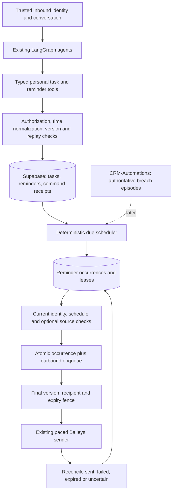

# Reminders and tasks for Ramesh

Updated 3 October 2026. **The personal scheduling slice is implemented; production migration `202610030007` is applied and verified.** See the [implemented behavior and operations](personal-scheduling.md) for the exact shipped scope. The conditional CRM, delegation, import and SLA sections below remain a design contract. The prerequisite outbound API is deployed in `3ad340828ace5519d5f53eac95ee2a3260405b61`; see the [integration guide](outbound-automation.md).

## Intended experience

Ramesh should maintain a person's commitments, remember when to nudge them, and make changes reliably. It should handle “remind me in three weeks” as naturally as “in ten minutes”, survive deployments, and show what remains outstanding without needing the original chat in its last 32 messages.

| User request                                               | Intended result                                                                                            |
| ---------------------------------------------------------- | ---------------------------------------------------------------------------------------------------------- |
| “Add a task to compare the revised warehouse offers.”      | Save a personal task; do not invent a due date or notification.                                            |
| “Remind me on 15 November at 10 am to call the owner.”     | Commit one schedule and confirm the full date, year and time in IST.                                       |
| “Every Monday at 9 am, remind me to review my pipeline.”   | Persist a recurring schedule, materializing occurrences as needed.                                         |
| “Show my pending tasks and this week's reminders.”         | Read the durable task/schedule records with pagination and an explicit IST date range.                     |
| “Move the second reminder to tomorrow at 11.”              | Resolve the previously displayed selection, validate its version, then reschedule it to a precise instant. |
| “I've finished that task.”                                 | Mark the selected task done and cancel its unsent linked reminders atomically. Do not change CRM records.  |
| “Remind me next week if that deal still has no follow-up.” | A later phase: store a typed condition and recheck current CRM state and permissions at due time.          |

Tasks are commitments. Reminders are notification schedules. A delivery is one attempt to notify a person about one occurrence. These records have different lifetimes and must not share a single status field.

## Architecture

Run the scheduler as a small deterministic service in the existing worker initially. Use indexed Supabase queries, short transactions and renewable leases, following the current queue conventions. No in-memory timer per reminder, permanently running agent, new Redis installation or generic workflow platform is needed for the initial feature.

The model interprets the request and uses narrow tools. It does not keep time, hold a future job in memory, choose trusted owners, decide SLA breaches, or assert success before a database commit. Plain reminder notifications use templates and no model calls. Reading a private schedule is also subject to owner authorization, even though it does not read CRM.

## Detailed modules

| Module                                                                                       | Contract                                                                            |
| -------------------------------------------------------------------------------------------- | ----------------------------------------------------------------------------------- |
| [15. Personal reminders](agent-modules/15-reminders.md)                                      | Time interpretation, recurrence, management tools, identity and schedule semantics  |
| [49. Personal tasks](agent-modules/49-personal-tasks.md)                                     | Task ownership, state changes, task/reminder linkage and conversational selection   |
| [50. Scheduler and delivery](agent-modules/50-reminder-scheduler.md)                         | Leases, due processing, atomic enqueue, final cancellation fence and crash recovery |
| [51. Legacy migration and evaluation](agent-modules/51-reminder-migration-and-evaluation.md) | Table reuse assessment, optional import, outcome tests and staged rollout           |
| [16. SLA escalation](agent-modules/16-sla-escalation.md)                                     | CRM domain ownership and assignee(s), then existing CRM admin recipients            |

## Persistence and reuse decision

Migration `202610030007` creates four tables, all prefixed `ramesh-`, under the existing restricted Supabase persistence conventions:

| Table                         | Owns                                                                                                   |
| ----------------------------- | ------------------------------------------------------------------------------------------------------ |
| `ramesh-tasks`                | Personal commitment, owner, state, version, optional due date and encrypted text                       |
| `ramesh-reminders`            | Long-lived schedule intent, owner/recipient, optional task reference, timezone, recurrence and version |
| `ramesh-reminder-occurrences` | Each scheduled occurrence, eligibility/expiry, lease, preparation/retry state and outbound linkage     |
| `ramesh-assistant-commands`   | Durable mutation idempotency, committed result and recovery receipt for task/reminder writes           |

Do not silently repurpose `public.reminder` or `public.task`. They are shared with the old logistics bot and mapped by CRM-Automations. The old reminder poller selects **all** `status='pending'` rows and sends through Twilio, without a bot ownership filter. It also records `sent` before making the send call. New Ramesh rows would not be safely isolated there.

Reuse the old product concepts and, if useful after inventory, import existing user records. Prefer new namespaced tables for this increment. Reusing the physical legacy tables would require a coordinated producer/consumer migration across both repositories, new ownership fields, versioned states, encrypted content and timestamp conversion. That is more coupled than the initial feature needs. The draft does not assume the old deployment is still active; its actual production status must be checked before any import/cutover.

The legacy 24-hour limit lives in application code, not the database. Do not carry that limit into the new schedule model. The old code's comment ties it to its Twilio delivery window; Ramesh's scheduling contract must remain separate from transport-specific policies and from its own short outbound expiry. A future transport migration may require a different delivery adapter without changing when reminders can be scheduled.

## Time and lifecycle choices

- Default interpretation and display use `Asia/Kolkata`. Store due instants as UTC `timestamptz` and retain the timezone and local calendar recurrence rule. Confirm a full date and time, such as `15 November 2026, 10:00 am IST`.
- Keep active tasks and future schedules until the user completes, cancels or ends them. The queue's minutes-long expiry, 24-hour media retention and 30-day message history do not delete a future reminder.
- Proposed initial scheduler cadence: 30 seconds, with at most one hour of lateness for an explicit one-off reminder. This is a starting policy, not a promise of exact-second delivery. Missed occurrences remain visible. Recurring downtime should coalesce missed occurrences instead of flooding the user.
- Explicitly requested nighttime reminders keep the requested time. Quiet hours are an opt-in personal policy; organization-generated reminders need their own approved quiet-hour and catch-up rules.
- Do not infer a time, recurrence, holiday calendar, reminder or CRM mutation when the request does not specify one. Ask only when the missing detail materially changes the action.
- Initial tools are for an active verified employee's own private chat. Recipient delegation, external contacts and group reminders remain separate policies. The generic outbound API credential does not authorize personal task access or CRM reads.

Business-linked reminders need live reads at due time and sensitive-delivery preflight. Ordinary text reminders do not need an OAuth grant or a model running in the background. A saved reference to an image or voice note does not extend its 24-hour media retention; store a user-authorized text instruction or re-fetch an authorized durable business document later.

The unconditional path must preserve provenance. Its content comes from the user's own saved request or existing personal record. A model cannot turn tool-retrieved business facts into unprotected reminder text. In the first slice, use user-message text spans for plain reminder/task content; generated business summaries must remain source-linked and wait for the protected scheduling capability.

## Implementation boundary

Already available: trusted phone/LID identity resolution, employee-scoped Context Engine tools, encrypted Supabase storage, per-chat queue ordering, outbound leases/uncertain-send recovery, dynamic catalogues, capture isolation, and a separately authenticated immediate outbound API.

The implementation now provides typed local tools, atomic task/reminder batches and receipts, persisted list selections, daily/weekly/monthly recurrence, a due scheduler, occurrence leases, atomic outbound admission, private delivery and final cancellation/identity fences. Migration `202610030007` is applied; explicit environment activation follows deployment of a compatible worker. The detailed [operations guide](personal-scheduling.md) distinguishes implemented policies from future extensions.

Still deferred: conditional CRM/SLA reminders, delegated/group recipients, legacy import, capture GUI scheduling, arbitrary custom recurrence and richer scheduling dashboards. The existing real-data capture role has no production scheduling access.

The public API is useful for CRM events that are already ready to send. An internal reminder scheduler should call the shared queue adapter in the same database transaction; it should not make an HTTP request back into its own worker. External producers should use their own transactional outbox and stable event keys. For externally scheduled, cancellable reminders, a future schedule-aware contract is needed in addition to the immediate-send API.

Pending reminder notifications must also yield to later human turns before sending, so a user's cancellation or task completion can actually be processed. This is a narrow implemented exception to queue ordering for `origin='reminder'`, with the reminder's fixed expiry bounding delay. Human turns retain FIFO order. The currently deployed automation endpoint does not offer this behavior or cancellation.

## Boundaries and open policy choices

An explicit “remind me” or “mark this task done” authorizes that scoped action; the assistant should not ask for redundant approval. Ambiguous selection, delegating to someone else or changing a CRM record requires the appropriate separate resolution/policy. Bulk destructive changes should show the actual affected selection/count before acting when the user's scope is ambiguous.

The initial one-hour lateness allowance, recurrence catch-up summary behavior, per-owner active-item limits and organization quiet hours are proposed defaults to settle before activation. Do not invent WhatsApp escalation grace periods from existing email digest timings. Keep SLA conditions in CRM-Automations, including a deliberate decision about its current floored-day boundary behavior and missing-clock handling.

No paid evaluations are needed for database, scheduler or authorization correctness. The first verification uses a fake clock, local PostgreSQL, fake transport and capture queues. Any later model quality checks follow the existing Luna/approval spending policy.

## Reference implementation inspected

- [Legacy reminder service](../../../whatsapp-logistics-bot/src/services/reminderService.js): persisted schedules and boot catch-up, plus the 24-hour restriction, premature `sent` transition and unscoped poller.
- [Legacy task service](../../../whatsapp-logistics-bot/src/services/taskService.js): useful task/reminder distinction and per-user context, with response-directive parsing and swallowed write failures to replace.
- [Legacy Prisma schema](../../../whatsapp-logistics-bot/prisma/schema.prisma): existing shared table mappings and phone-based foreign keys.
- [CRM SLA rules](../../../CRM-Automations/src/lib/sla.js) and [recipient resolution](../../../CRM-Automations/src/lib/recipients.js): domain rules and existing admin recipients, not an implicit WhatsApp delegation grant.

These sibling-repository links refer to the inspected WareOnGo workspace layout. The migration module records the limitations of the local schema evidence; no live legacy records were changed or copied into this design.
