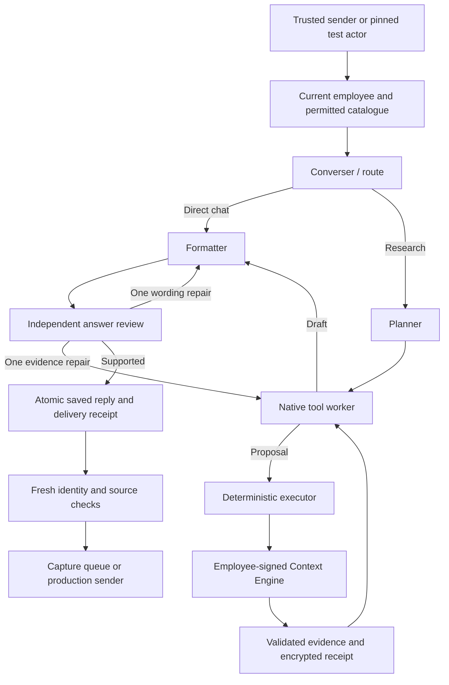

# Ramesh personal assistant and employee tool loop

Current implementation (2 October 2026): separate converser → planner → worker/tool-executor → formatter → verifier roles; ordinary chat skips planning. Images, PDFs and voice notes use encrypted owner-scoped media records with 24-hour expiry. Forwarded messages and media use durable sliding inbound batching (1-second ordinary text, 3-second burst window, 8-second cap). The capture GUI accepts attachments and overlapping messages, with one response per batch. See [module specifications](agent-modules/README.md) for current contracts and deployment prerequisites. Real-data private outcome cases and transcripts remain only under gitignored `.local/private-evals/`; `npm run eval:private` refuses CI.

Updated **2 October 2026**. Ramesh is a personal chief of staff for the person messaging it. It helps with thinking, planning, prioritization, preparation, drafting and company research. Sales is one capability. Ordinary conversation needs no business lookup; a casual update is not an instruction to invent a work plan.

The general tool loop, media and batching are deployed. Production business reads were enabled on 2 October after fixing the worker roster RLS policy; a real LID, production signing key and captured answer passed delivery authorization. Production uses Sol/medium with a 240-second deadline and 6,000 output tokens per response. The older filename and exported `sales` symbols remain for compatibility. See the [production capability review](capability-review-2026-10-02.md).

## Capabilities and identity

The graph receives every implemented read tool the Context Engine discovers for the current employee. An admin with all four registered read scopes sees **17 tools**:

Production currently has the three CRM/supply/knowledge scopes and **14 tools**. Analytics works in the full-scope local capture profile; updating its server key registration and deploying the analytics auth changes remains necessary for production.

| Domain       | Tools                                                                                                      |
| ------------ | ---------------------------------------------------------------------------------------------------------- |
| Context      | `get_context`                                                                                              |
| Knowledge    | `search_knowledge`, `read_knowledge`                                                                       |
| CRM          | `crm_filters`, `search_crm_leads`, `crm_summary`, `read_crm_lead`, `read_crm_lead_context`, `crm_briefing` |
| Supply       | `warehouse_filters`, `search_warehouses`, `warehouse_summary`, `read_warehouse`                            |
| Shortlisting | `assess_shortlist`                                                                                         |
| Analytics    | `analytics_capabilities`, `ga4_report`, `search_console_report`                                            |

Trusted WhatsApp phone/LID resolves to one active `VerifiedNumber` employee. Unknown users still get ordinary chat and drafting. Business tools are DM-only. A typed name, phone or claimed admin role never changes identity. The Context Engine intersects current employee permissions with the registered signing key and requested scopes. Analytics needs Analyst access, which includes admins. All current MCP tools are reads. HRMS, calendars, reminder scheduling, business writes and user-requested sending are not connected. Private attachment extraction is supplied separately by the media service.

When production business reads are enabled, `BUSINESS_READ_EMPLOYEE_IDS=all` is the default. A numeric list remains an optional rollout control. This removes the additional bot-specific employee restriction, without granting roles or exposing private data to groups. The operator playground stays pinned to Raghav in server configuration.

Personal follow-ups use `view=assigned`. A later “all follow-ups” removes date restrictions, including `date_field`, while retaining that personal scope. A general accessible request uses the employee's permitted accessible view. Search pages are not totals; use summaries and preserve cursors. No today-only restriction exists.

## Graph and prompts



The planner produces a validated task plan from the permitted live schemas, Context Engine guidance and protected history. The worker owns a separate native Responses tool session, including continuation items and correlated outputs. The deterministic executor validates schemas, rejects identity/destination arguments, checks authority and budgets, executes reads and registers evidence. Paused-task checkpointing remains deferred. See [the role contract](agent-modules/29-planner-worker-verifier.md).

Editable role instructions live in [`src/prompts/`](../src/prompts/):

- `router.md`, `planner.md` and `worker.md`: routing, outcome planning and native tool research.
- `chief-of-staff.md`: shared personal-assistant role and domain guidance.
- `media-extractor.md`: bounded untrusted attachment extraction.
- `converser.md`: ordinary chat when business features are disabled.
- `formatter.md` and `business-formatter.md`: natural chat wording, deal cards, comparisons, analytics and personal drafts.
- `verifier.md`: grounding, continuity, capability honesty and structured repair routing.
- `evidence-policy.md`: shared contract for retrieved facts, user reports, requested actions, recommendations and untrusted source text.
- `planning-reference.md`: source map, dependencies and completion criteria shared by the dedicated planner and worker.
- `legacy-read-converser.md`: the historical daily-query regression preset.

Prompts load from an explicit allowlist, independent of the working directory. Missing/empty assets fail startup. Build copies them to `dist/prompts`; editing requires restart. Eval manifests hash all twelve files. Authority, schemas and budgets remain code, not editable prose. Native tool decisions and semantic review use medium reasoning; business formatting uses low reasoning, while ordinary formatting uses none.

The formatter receives the current request, relevant history, clock, trusted access state, draft, successful evidence, bounded failure/recovery metadata and recalled selection. A repair also receives the actual previous answer, so it can fix the identified wording rather than regenerate from a different draft. Formatting-only feedback goes directly to it; missing evidence returns to the tool session. There is one repair and at most two reviews, within the original budgets. Code denies stale or unauthorized data independently of model review. A user-requested fallback can use a successful source when the original report failed; advertised capabilities alone do not prove that a report worked.

| Limit                       | Current value                                             |
| --------------------------- | --------------------------------------------------------- |
| Logical source reads        | 24; failed/duplicate proposals count                      |
| Tool/recall steps           | 28                                                        |
| Tool arguments              | 16 KiB                                                    |
| One result / total evidence | 80,000 / 200,000 bytes                                    |
| Catalogue / server guidance | 32 tools, 200,000 bytes / 32,000 bytes                    |
| Final reply                 | 12,000 characters for large multi-deal requests           |
| History                     | Last 32 messages within 48,000 characters                 |
| Protected recall            | 24 hours and 96 KiB of envelopes                          |
| Local live graph            | 240 seconds, 6,000 output tokens per response             |
| Production runtime          | Sol/medium; 240 seconds, 6,000 output tokens per response |

OpenAI uses `store=false`, `parallel_tool_calls=false` and local schema validation with MCP optional arguments preserved. One SDK retry and up to 90 seconds per HTTP call remain within the overall deadline. Delivery preflight is bounded and checks at most three sources concurrently. Current production processing is serial per account; a long research turn can delay other chats. Unconfigured repository chat defaults remain Terra/45 seconds/800 tokens.

Broad CRM/supply searches prefer pages up to 25. The executor counts unique records, reports overlaps, tracks linked coverage and stops cyclic cursors. Worker, formatter and verifier share that coverage; original source evidence remains unchanged. See [paginated research](agent-modules/39-paginated-research.md). `node --import tsx evals/conversation-run.ts --suite pagination --model gpt-6.1-sol --trials 2` exercises six repeated fictional outcomes, also included in `eval:ci`.

## Context, display and source accuracy

The application owns durable Supabase history. Business bodies do not appear in ordinary history or the admin inbox. Server-only reply/receipt envelopes support `recall_business_context`, which repeats scoped reads and restores original selection/order only if current authority and stable business fingerprints match. A changed result returns fresh evidence and withholds the old text. Recall distinguishes changed results from failed checks and supplies coverage plus exact continuation arguments for bounded recovery. Revocation prevents recall. This supports “the second one” without copying stale private data into every prompt. See [recall recovery and source labels](agent-modules/41-recall-and-source-labels.md): relevant source names/titles/paths remain quotable data even when their wording resembles an instruction.

Deal cards use company/requirement labels, native **Created:** and **Last updated:** dates in IST, and no CRM UUIDs. Warehouse IDs remain useful references. The date guard recognizes headings and inline record lists, adds missing native dates only for unique exact record labels, and checks dates separately per record. It does not overwrite supplied wrong dates, guess duplicate labels or turn ordinary drafts/actions into record cards. Semantic review checks unrecognized layouts. Missing native dates remain Not recorded even if asked to substitute polling time. Numeric ranges retain hyphens instead of being damaged by em-dash cleanup. Shortlists compare the reviewed pool, preserve uncertainty and use one concrete pro/con per option. User corrections guide recommendations without pretending the CRM was updated.

Analytics uses GA4's property timezone and Search Console's America/Los_Angeles calendar, not the CRM clock. Evidence checks source status, dates, bounded page counts, metric shapes, cache/source freshness and comparison components. Retrieval timestamps are excluded from business fingerprints; values, filters and quality flags remain. Capabilities can fail for one source while another succeeds. Structured recovery actions reach the tool loop without exposing upstream secrets. Sessions, clicks, events and unique CRM leads remain distinct measures.

The old logistics bot has separate raw message, conversation and expiring attachment stores. Its checked-out conversation implementation caps **16 messages**, not 32. Ramesh retains 32 with encrypted queue history and fresh business recall. Attachment captions/type markers do not imply vision, OCR or transcription. See [context/media reference](agent-modules/23-context-and-media-reference.md) and [coworker design review](agent-modules/26-coworker-loop-and-context.md).

`claudeconvo.md` illustrates useful continuity: carry selected deals forward, complete dependent research, adjust to corrected use, and prepare targeted questions. It also contains unsupported assumptions; long confident answers are not the quality target. This is not a controlled model comparison. The concrete antipatterns fixed here were missing protected recall, discarding MCP guidance, a narrow sales persona, excessive intake, and sending wording repairs through more research. Coarse whole-answer revalidation and multiple model passes still add latency; narrower entity memory and per-run MCP connection reuse need separate design and tests.

## Run, test and roll out

```sh
PLAYGROUND_ENV_FILE=.local/live-playground-sol-eval.env PLAYGROUND_PORT=3012 npm run dev:chat:live
# http://127.0.0.1:3012
npm run eval:ci
npm run check
```

The [real-data playground](live-data-playground.md) uses the configured actual Context Engine and Supabase as the pinned employee. The private analytics profile points to the locally running Context Engine with real source credentials and a four-scope registration. Both inbound and outbound tables are separate `ramesh-test-*` queues; outbound transport is constrained to capture. No WhatsApp session is created. `npm run smoke:chat:live` covers delivery replay and access boundaries too.

The [evaluation guide](../evals/README.md) explains 85 repeated multi-turn scenarios, fictional datasets, protected CI, all-trial reporting and measured results. Real business samples informed field semantics and process expectations; customer records are not committed as eval fixtures. Local real-source artifacts stay private under `.local` and are never uploaded by the CI workflow.

For production, apply migration `202610010004`, keep restricted roster access, configure signed credentials/model limits and explicitly enable business reads. Existing three-scope keys do not gain analytics: deploy the Context Engine scope update and add `analytics:read` to both the public registration and worker's private configuration. Claude OAuth remains separate and unchanged. See [signed access](signed-context-auth.md) and [operations](ec2-operations.md). The 2 October production access, pagination and voice release is documented in the [release evidence](../evals/results/2026-10-02-production-pagination.md).

Earlier validation remains historical evidence: the sales-manager-v2 single-request suite passed 51/51 trials, and its live smoke passed 9/9 checks. Those figures do not describe the newer chief-of-staff prompt. Current full-suite results are recorded separately in the evaluation guide.

## Adversarial refinement and reasoning

The planner is a separate model node with a structured outcome/dependency contract. The worker owns the native tool session. Its editable reference maps company knowledge, CRM, supply and analytics to relevant reads and dependencies. The application also supplies a runtime planning context derived only from the current permitted catalogue, trusted audience and available protected recall. The actual live function definitions and Context Engine guidance remain authoritative. No company-data read is mandatory for ordinary personal help.

Identical successful reads reuse registered in-run evidence after identity and freshness checks. A retryable failed query permits one identical retry under the original budget and Retry-After. Source cooldowns cover query variations. Nonretryable configuration/access failures stop that affected tool; another source or a supported alternative report can still work. Every proposed call still consumes budget, and delivery reauthorizes sources.

The reviewer sees code-detected presentation problems, its review-pass number and previous feedback. It checks material correctness and completion without introducing cosmetic requirements after repair. Stock-phrase guards also run before delivery. Native date semantics cannot be overridden by a user request or model review. A shared verification caveat must survive shortening; a requested change cannot become a confirmed fact inside a draft.

The OpenAI adapter uses Responses with store=false and full encrypted-reasoning/function-output continuation. `AGENT_TOOL_REASONING_EFFORT` accepts low, medium or high and defaults to medium. The runtime verifier remains medium, business formatting low and simple formatting none on Terra. GPT-6.1 Sol uses low for that final case because it does not support none. Returned reasoning/cache token counts are recorded without logging private reasoning. Model/effort comparisons use a fixed external judge; see [the eval guide](../evals/README.md).

The [adversarial review](agent-modules/27-adversarial-review-and-response-contracts.md) records findings, fixes and remaining limits. The [model experiment](agent-modules/28-model-and-effort-comparison.md) defines the controlled screen before a complete suite. Neither changes production by itself.

## Private outcomes and media/burst checks

`npm run eval:private` uses the loopback capture API and real employee-scoped data. Author cases under `.local/private-evals/cases.json`; do not commit them. Each case declares turns, observable outcomes, private as-of reference facts and an opaque ID, without prescribing tool calls. The runner refuses CI and verifies capture-only delivery before testing. Failed answers and judge reviews remain private.

Production requires migration `202610020005` before replacing the worker. Accepted audio bytes go directly to STT; no host `ffmpeg` dependency is required. Capture setup applies only its own `202610020002` migration. Use the GUI attachment selector for images/PDFs/voice notes and the Forwarded message checkbox for simulated forwards. You can keep sending while a turn is pending. Private media bytes and extracted text expire after 24 hours; reset removes that conversation's media.

Debounce collection is partitioned by trusted conversation/sender. The existing consumer still serializes processing; collection does not itself add a global debounce, but concurrent-chat throughput remains bounded by the worker. Later arrivals after a claim enter a new turn, with previous media still available within retention.
